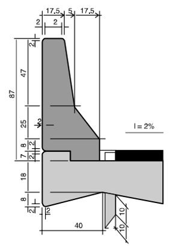
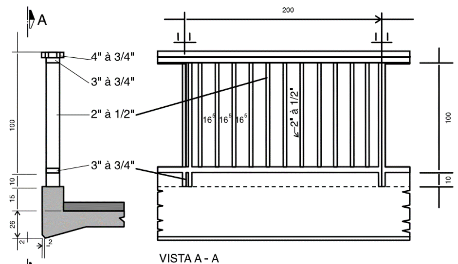
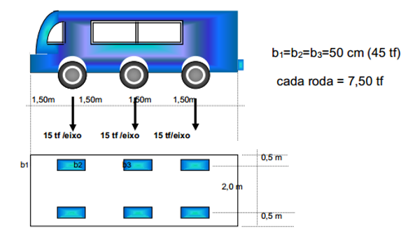
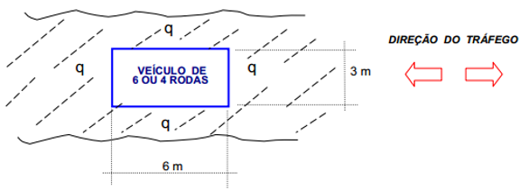
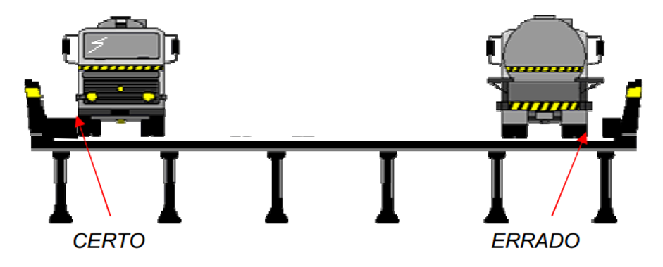
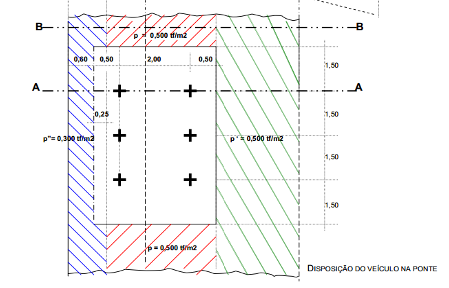
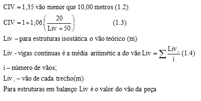

<!--Don't delete this script-->

<!--Don't delete this script-->

<h1>Generalidades das ações na superestrutura</h1> 

  Definida a geometria da ponte o primeiro passo é verificar as ações que essa estrutura estará submetida.

  De forma geral as ações são subdivididas em:
  
  a) Ações Permanentes Diretas e Indiretas; 
  b) Ações Variáveis Diretas e Indiretas; 
  c) Ações Dinâmicas; 
  d) Ações Excepcionais. 

  O peso próprio da estrutura está classificado nos seguintes elementos:
  
  a) Peso próprio dos elementos estruturais; 
  b) Peso próprio da pavimentação; 
  c) Peso próprio das barreiras; 
  d) Peso próprio dos guarda–corpos. 
  
  A quatro normas base para a estimativa do carregamento durante o procedimento cálculo são a NBR 6118 (ABNT, 2014), NBR 7187 (ABNT, 2003),  NBR 7188 (ABNT, 2012) e NBR 6120 (ABNT, 1980).
  <a href="#ref1">[1]</a>.

<h2>AÇÃO PERMANENTE</h2> 

    A NBR 7187 (ABNT, 2003) define nos itens 7.1.1 ao item 7.1.9 os itens referentes as ações permanentes.
      
    Para o exemplo que será realizado em casa vale destacar alguns itens.
      
    O item 7.1.1 define o peso específico mínimo dos elementos em concreto armado, sendo o valor mínimo de 24  𝑘𝑁⁄𝑚3  para o concreto simples e 25  𝑘𝑁⁄𝑚3  para o concreto armado ou protendido.
      
    No item 7.1.2 é definido o valor do peso específico para os elementos de pavimentação, que é de o valor mínimo de 24  𝑘𝑁⁄𝑚3 , podendo ser acrescido um valor de 2  𝑘𝑁⁄𝑚2  para atender uma possível situação de recapeamento.
      
    Nesse curso não será abordado a questão das cargas para ponte ferroviária mais fica a leitura do item 7.1.3 que aborda os carregamentos relativo a esse tipo.
      
    O item 7.1.4 específica que o peso específico do solo úmido deve ser considerado no mínimo igual a 18  𝑘𝑁⁄𝑚3  e o ângulo de atrito interno no máximo igual a 30º.
      
    As barreiras de concreto são definidas no item 2.4.3.3.1 do manual 698 (DNIT, 1996). Essas barreiras são padronizadas no padrão New Jersey do modelo americano e são feitas em concreto armado. A Fig. 1.1 apresenta os detalhes geométricos desse tipo de seção transversal.
      
    No caso de guarda-corpo para as pontes deve-se usar a referência do item 2.4.3.3.2 do manual 698 (DNIT, 1996). Seguindo as especificações da NBR 6120 (ABNT, 1980) que diz que: Ao longo dos parapeitos e balcões devem ser consideradas aplicadas, uma carga horizontal de 0,8 kN/m na altura do corrimão e uma carga vertical mínima de 2 kN/m. 
      
    A carga horizontal de 0,8 kN/m é satisfatória para passeios exclusivamente de pedestres, devendo, porém, ser aumentada para 1,5 kN/m quando se tratar de passeios mistos, para pedestres e ciclistas. 
      
    A Fig. 2 apresenta o detalhe geométrico de um guarda-corpo metálico para ponte rodoviárias. Para o cálculo da carga considerar uma base de concreto de 15 x 10 cm em concreto armado mais o peso indicado na NBR 6120 (ABNT, 1980) .
      
    A bibliografias recomendam que entre o pré-dimensionamento e projeto executivo a carga permanente não pode variar mais que 5% do valor.
      
    A Figura <a href="#fig1">1</a> apresenta a seção de uma barreira de concreto

<b>Figura 1.</b> Seção transversal da barreira de concreto padrão New Jersey <a href="#ref2">[2]</a>.

  A Figura <a href="#fig2">2</a> apresenta uma das vistas da seção da barreira de concreto 

<b>Figura 2.</b> Seção transversal da barreira de concreto padrão New Jersey <a href="#ref2">[2]</a>.

<h2>Ação Variável</h2>

  A NBR 7187 (ABNT, 2003) define no item 7.2 as ações vaiáveis da ponte, são elas:
      
    a) As cargas móveis; 
    b) As cargas de construção; 
    c) As cargas de vento; 
    d) O empuxo de terra provocado por cargas móveis; 
    e) A pressão da água em movimento; 
    f) O efeito dinâmico do movimento das águas; 
    g) As variações de temperatura.
      
    Sobre o item a vale ressaltar que existem duas normas para avaliação da carga móvel em pontes e viadutos, são elas:
      
     NBR 7188 (ABNT, 2012): Carga  móvel  em  ponte  rodoviária  e  passarela de pedestres; 
     NBR 7189 (ABNT, 1989): Cargas  móveis para  projeto  estrutural de  obras ferroviárias. 
      
    Nessa seção serão apresentados detalhes de cálculo com enfoque na NBR 7188 (ABNT, 2012).

<h3>Carga Móvel</h3>

  A intenção da colocação da carga em mobilidade é simular o efeito de trânsito sobre a estrutura e assim gerar uma envoltória de esforços nas peças estruturais.
    
  As cargas móveis são aqueles tipos de cargas em que os esforços internos gerados não variam apenas com a magnitude das cargas, mas também com a posição ocupada pela carga. No caso de vigas, é necessário a determinação das posições que geram os maiores esforços em seções pré-determinadas do elemento.
    
  A Fig. 1.4 abaixo define o tipo da carga móvel para pontes rodoviária. Esse veículo tipo é chamado de veículo tipo TB-450. Esse veículo tipo se divide em dois tipos de carga, uma caga Q distribuída e uma carga P concentrada (eixo do veículo).
    
  A Fig. 1.5 apresenta algumas características geométricas (tamanho total e distância entre eixos) do veículo tipo padrão TB-450.
    
  A NBR 7188 (ABNT, 2012) admite que esse veículo tipo pode ocupar qualquer posição no tabuleiro da superestrutura, porém o mesmo deve ser colocado na posição mais desfavorável afim de gerar a situação mais desfavorável para a estrutura.
    
  A Figura <a href="#fig1">3</a> apresenta um esquema de carregamento em planta. E em complemento a Figura <a href="#fig1">4</a> apresenta um detalhamento da geometriado veiculo.

<b>Figura 1.</b> Esquema de carregamento em planta do veiculo tipo TB-450 <a href="#ref2">[2]</a>.

  

<b>Figura 4.</b> Detalhes da geometria e carga do veiculo tipo TB-450 <a href="#ref2">[2]</a>.

 
 

  A Fig. <a href="#fig5">5</a> apresenta os cortes A e B da Fig. <a href="#fig6">6</a> apresentada anteriormente, onde são representadas as cargas do eixo padrão (P) que transita sobre a rodovia e a carga de multidão (q) dos veículos de passeio, de menor peso, que transitam sobre a estrutura.

 

<b>Figura 5.</b> Seção A e B da carga móvel do veículo tipo TB-450 <a href="#ref2">[2]</a>.

 

  Essa carga móvel TB-450 tem o total de 450 kN sendo que cada roda tem o peso de 75 kN, circundado por uma carga uniforme distribuída de 5  𝑘𝑁⁄𝑚2 . No item NBR 7188 (ABNT, 2012) ainda são indicados outros tipos de veículos tipo, como por exemplo o TB-240 para estradas vicinais. Essa carga móvel TB-240 tem o total de 240 kN sendo que cada roda tem o peso de 40 kN, circundado por uma carga uniforme distribuída de 4  𝑘𝑁⁄𝑚2
	  
	No caso de passeios para pedestres das pontes rodoviárias e viadutos, A NBR 7188 (ABNT, 2012) indica o uso de uma carga uniformemente distribuída de 3 kN/m na posição mais desfavorável concomitante com a carga móvel rodoviária, para verificações e dimensionamento dos diversos elementos estruturais, assim como para verificações globais. O elemento estrutural do passeio deve ser dimensionado com uma carga de 5  𝑘𝑁⁄𝑚2 .

 

<h4>Possição do veículo tipo no tabuleiro</h4>

  O veículo-tipo ou trem-tipo caminha conforme descrição da Fig. <a href="#fig6">6</a> Sobre a sua posição na seção: a posição mais desfavorável no tabuleiro é quando o veículo-tipo ocupa a lateral da pista, no bordo  encostado no guarda rodas, conforme mostrado na Fig. <a href="#fig7">7</a>

 

<b>Figura 6.</b> Sentido do trafego do trem-tipo no eixo da pista <a href="#ref2">[2]</a>.

 

<b>Figura 7.</b> Posição na seção do veiculo tipo TB-450 no tabuleiro <a href="#ref2">[2]</a>.

 

  De maneira geral o veículo-tipo caminha no sentido do eixo da ponte e sua carga é transferida para longarina através da consideração de uma linha de influência de reações de apoio. Logo a frente será apresentado um exemplo da ponto do Rio Pau Seco. A Fig. <a href="#fig8">8</a> expõe uma vista em planta da posição do veículo na pista e a representação das suas cargas.

 

<b>Figura 8.</b> Posição em planta do veiculo tipo TB-450 <a href="#ref2">[2]</a>.

 

  Araújo (2010) faz as seguintes considerações sobre a posição do veículo tipo:
	  
	a) Se o veículo tipo está na posição mais desfavorável ele gerara os maiores esforços solicitantes nas longarinas; 
	b) O lado direito do tabuleiro não foi carregado pois assim geraria um alívio de uma das longarinas; 
	c) Como os valores dos esforços são determinados para as situações mais desfavoráveis, logo se a longarina for dimensionada para  a envoltória de esforços, a segurança fica garantida para qualquer posição da carga móvel.

 

<h4>Coeficiente de impacto</h4>

  O coeficiente de impacto é um fator que procura levar em conta esse conjunto de influências que tornam a carga acidental uma carga dinâmica. 
	  
	O estudo dessas causas é extremamente difícil; na prática, levamos em conta o impacto, dando às cargas móveis um acréscimo e considerando-se  como  se fossem aplicadas estaticamente. Esse Acréscimo é o chamado coeficiente de impacto ( ϕ) pelo qual são multiplicadas as cargas acidentais com a ação dinâmica.
	  
 	A Equação. <a href="#equa1">1</a> apresenta a correção dos valores das ações com a consideração dos efeitos dinâmicos.

<table style = "width:100%" align = "center">
    <tr>
        <td style="width: 90%;">Fdinâmico = ϕ . Festático</td>
        <td style="width: 10%;">
(1)
</td>
    </tr>
</table>
 

<h4>Considerações da NBR 7188 (ABNT, 2012)</h4>

  A NBR 7188 (ABNT, 2012) faz algumas considerações para o cálculo da carga final atuante em estrutura de ponte rodoviária. Ver equação (1.2) a (1.9).
	  
	Para a definição do valor do trem tipo final atuante em uma estrutura considera-se as seguintes correções da carga:
	 
	<ol type = "a">
		<li>CIV (Coeficiente de impacto vertical): Majora os valores do trem tipo estático simulando o efeito dinâmico da carga;</li>
		<li>CNF (Coeficiente de número de faixas): Probabilidade da carga móvel ocorrer em função do número de faixas;</li>
		<li>CIA (Coeficiente de impacto adicional): Majora o valor do trem tipo considerando uma imperfeição e/ou descontinuidade na pista de rolamento; </li>
	</ol>

<b>Cálculo co CIV:</b>

 

<b>Cálculo co CNF:</b>

 

<b>Cálculo co CIA:</b>

 

<b>Cálculo co CIA:</b>

<h4>Metodologia básica para consideração do trem-tipo</h4>

  Colocação do veículo tipo padrão na posição mais desfavorável do tabuleiro de forma gerar os maiores esforços;
	  
	a) Escolha do TB (Trem tipo rodoviário brasileiro) a ser determinado: Trem tipo para flexão e cisalhamento ou trem tipo para torção; 
	b) Utilizar metodologia de equilíbrio de esforços nas seções ou Linha de influência; 
	c) Determinação do trem – tipo para seção com carga do veículo + carga de multidão e seção com apenas carga de multidão; 
	d) Majoração dos valores do trem tipo obtido para obtenção do trem tipo final com a consideração dos coeficientes descritos abaixo: 
	d.1) CIV (Coeficiente de Impacto Vertical); 
	d.2) CNF (Coeficiente do Número de Faixas); 
	d.3) CIA (Coeficiente de impacto adicional);

<h3>Bibliografia</h3>

<table>
    <thead>
        <tr>
            <th>ID</th>
            <th>Referências</th>
        </tr>
    </thead>
    <tbody>
        <tr>
            <td>
[1]
</td>
            <td>
ASSOCIAÇÃO BRASILEIRA DE NORMAS TÉCNICAS. NBR 6122: Projeto e execução de fundações. Rio de Janeiro: ABNT, 2022.
</td>
        </tr>
        <tr>
            <td>
[2]
</td>
            <td>
VELLOSO, Dirceu de Alencar; LOPES, Francisco de Rezende. Fundações. São Paulo: Oficina de Textos, 2010.
</td>
        </tr>
        <tr>
            <td>
[3]
</td>
            <td>
Você conhece o tubulão a ar comprimido? Silvio de Andrade, Engenharia de fundações. Youtube, 12 set. 2019.
</td>
        </tr>
        <tr>
            <td>
[4]
</td>
            <td>
Tubulão em água. Jefferson Porfirio. Youtube, 16 jul. 2011.
</td>
        </tr>
        <tr>
            <td>
[5]
</td>
            <td>
BRASIL. Manual de projeto de obras-de-arte especiais. Rio de Janeiro: Departamento Nacional de Estradas de Rodagem (DNER), 1996.
</td>
        </tr>
        <tr>
            <td>
[6]
</td>
            <td>
Fôrmas deslizantes. M.Roscoe e Brasilos S/A Construções. YouTube, 16 out. 2015.
</td>
        </tr>
        <tr>
            <td>
[7]
</td>
            <td>
Fôrmas trepantes. Ulma Construction. YouTube, 15 jan. 2015.
</td>
        </tr>
        <tr>
            <td>
[8]
</td>
            <td>
LEONHARDT, Fritz. Princípios Básicos da Construção de Pontes de Concreto. Rio de Janeiro: Interciência, 1983. v. 5. . Acesso em: 30 set. 2020. (Construções em concreto).
</td>
        </tr>
    </tbody>
</table>
