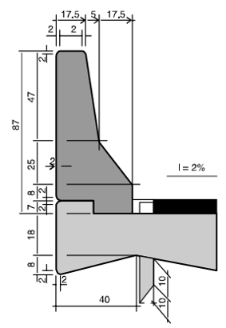

<!--Don't delete this script-->

<!--Don't delete this script-->

<h1>As disciplinas envolvidas</h1> 

  O primeiro  passo  a ser dado  na confecção  do projeto de  uma ponte é definir sua finalidade,  para  consequentemente  se  obter  as  cargas  para  seu  dimensionamento.  Para uma definição acertada da geometria e das cargas úteis que devem ser utilizadas, o projeto de  uma  ponte  exige  levantamentos  topográficos,  hidrológicos  e  geotécnicos.  Outras informações  de  interesse  construtivo  ou  econômico,  notícias  tecnológicas  de  caráter especial, podem ser determinantes na escolha do tipo de obra [1].
	  
	Portanto são elementos necessários em um projeto de ponte:
 	 
  	<ul>
		<li>Elementos topográficos;</li>
		<li>Elementos hidrológicos;</li>
		<li>Elementos geotécnicos;</li>
		<li>Elementos geométricos;</li>
		<li>Outros fatores: Elementos agressivos, informações de interesse construtivo e econômicos.</li>
	</ul>

<h2>Estudos Topográficos</h2>

  Segundo Miller et al. [1] e Pfeil [2] os elementos topográficos necessários ao projeto de uma ponte referem-se aos estudos topográficos tanto do local específico de implantação do  empreendimento, como também da região em torno do mesmo, que possa  a vir influir em fenômenos climáticos sofridos pela obra durante sua construção e vida útil. Este estudo topográfico é normalmente composto pelos seguintes elementos: 
	  
	<ul>
		<li>Planta, em escala de 1:1000 ou 1:2000; </li> 
		<li>Perfil em escala horizontal de 1:1000 ou 1:2000 e escala vertical de 1:100 ou 1:200 do trecho da rodovia em que ocorrerá a implantação da obra em uma extensão tal que ultrapasse seus extremos prováveis de, pelo menos, 1000  m para cada lado;</li> 
		<li>Planta do terreno no qual será implantada a ponte, em uma extensão tal que exceda de 50 m, em cada extremidade, seu comprimento provável e largura de 30 m, desenhada na escala de 1:100 ou 1:200, com curvas de nível de metro em metro, contendo a posição do eixo locado e a indicação de sua esconsidade.</li> 
		<li>Perfil ao longo do eixo locado na escala de 1:100 ou 1:200 e numa extensão tal que exceda de 50 m, em cada extremidade, o comprimento provável da obra; </li> 
		<li>Quando se tratar de transposição de curso d’água, seção do rio segundo o eixo locado, na escala 1:100 ou 1:200, com as cotas de fundo do rio em  pontos distanciados cerca de 5 m. </li>
	</ul>

 

  O projetista deverá ficar atento a dois arquivos:
   	 
    <ul>
      <li>Levantamento do estaqueamento;</li>
      <li>Levantamento do perfil longitudinal.</li>
	</ul>

<h2>Estudos Hidrológicos</h2>

  O elemento hidrológico de maior importância na elaboração do projeto de uma ponte trata-se da determinação da vazão máxima do canal, pois é através desse parâmetro que se determina o gabarito mínimo da ponte e as solicitações máximas de empuxo de água aos quais os pilares estarão sujeitos.
	  
	A grande dificuldade na determinação da vazão máxima em uma pequena bacia está na obtenção de dados confiáveis, visto que raramente se dispõe de séries históricas de vazão, ou chuvas intensas, ou até mesmos dados  topográficos.

 

<b>Figura 1.</b> Exemplo de uma bacia hidrográfica1. <a href="#ref2">[2]</a>.

 
  Araújo [3] exemplifica a determinação da máxima vazão em um canal através do uso da formula de Manning. Tal exemplo se refere ao dimensionamento da ponte sob Rio Pau Seco.
  A Figura. <a href="#fig2">2</a> apresenta dados sobre a seção de um rio, e a Fifura. <a href="#fig3">3</a> apresenta dados sobre a vazão do mesmo rio.

<b>Figura 2.</b> Dados da seção transversal do rio Pau Seco.<a href="#ref2">[2]</a>.

 

<b>Figura 3.</b> Cálculo da máxima cheia de projeto calculada (MCC).<a href="#ref2">[2]</a>.

 

  Com a determinação da MCC é possível determinar a altura da construção conforme será apresentado nas situações de pré-dimensionamento dos elementos, como apresentado na Figura. <a href="#fig4">4</a>

<b>Figura 4.</b> Seção transversal do Rio Pau Seco com a marcação da MCC.<a href="#ref2">[2]</a>.

 

<h2>Estudos Geotécnicos</h2>

  Segundo Pfeil [2] os elementos geotécnicos necessários à elaboração do projeto de uma ponte são: 
	  
	a) Relatório de prospecção de geologia aplicada no local de provável implantação da obra, considerando seu esboço estrutural, e realçando peculiaridades geológicas porventura existentes; 
	  
	b) Relatório de sondagem de  reconhecimento do subsolo;
	  
	c) Estudos geotécnicos especiais que permitam a elaboração de projeto conjunto terreno-aterro-obra de arte, sempre que a estabilidade dos terrenos contíguos à obra possa ser ameaçada pelas solicitações dos aterros de acesso.

 

<b>Figura 5.</b> Marcação em croqui para sondagem de uma ponte2.<a href="#ref2">[2]</a>.

 

<b>Figura 6.</b> Exemplo de sondagem tipo SPT da ponte sobre rio Jequiá2.<a href="#ref2">[2]</a>.

 

<h2>Estudos geométricos</h2>

  Miller et al. [1] afirma que os elementos geométricos determinantes no projeto de uma ponte são consequências das características da via e de seu próprio estrado. Os  elementos geométricos da via dependem das condições técnicas  estabelecidas pelo órgão público competente.

 

<b>Figura 7.</b> Exemplo da influência do traçado da via no modelo geométrico da ponte3.<a href="#ref2">[2]</a>.

 

  A Tabela. <a href="#tab1">1</a> com uma série de características relativa a classe da rodovia.

<b>Tabela 1.</b> Características básicas em função da classe da rodovia [1] apud Lee4.<a href="#ref2">[2]</a>.

<h2>Outros elementos de projeto</h2>

  Miller et al. [1] e Pfeil [2] citam uma série de fatores externos que podem causar influência no projeto de uma ponte. São eles:
	  
	a) Agressividade da água, referida ao pH ou ao teor de substâncias  agressivas aos materiais de construção (água do mar ou acentuadamente salobra, águas sulfatadas ou sulfídricas); 
	  
	b) Materiais de ação destrutiva sobre o concreto; 
	  
	c) Gases tóxicos de terrenos pantanosos, possíveis em cavas de fundação; 
	  
	d) Quando houver a existência de moluscos capazes de perfurar as  madeiras  de escoramento, poderá ser razão determinante da escolha do método construtivo a ser adotado no projeto;
	  
	e) Condições de acesso ao local da obra; 
	  
	f) Procedência dos materiais de construção, custo e confiabilidade do transporte; 
	  
	g) Épocas favoráveis para execução dos serviços, considerando os períodos chuvosos e o regime do rio; 
	  
	h) Possível  interferência  de  serviços  de  terraplanagem  ou  desmonte  de  rocha,  nas proximidades da obra; 
	  
	i) Condições de obtenção de água potável.

<h1>Componentes da Estrutura de uma ponte</h1>

  Nesse texto a abordagem será voltado ao projeto de pontes de concreto armado, portanto as observações relativas a esse modelo serão introduzidas a partir dos componentes de projeto.
	  
	Segundo Vitório [4] a superestrutura de uma ponte rodoviária que é o foco desse texto é dividida nos seguintes elementos:
 	  
  	<ul>
		<li>Lajes do tabuleiro;</li> 
		<li>Vigamento do tabuleiro;</li> 
		<li>Passeios de pedestres, guarda-corpos e barreiras;</li> 
		<li>Cortinas e alas;</li> 
		<li>Placa de transição e juntas de dilatação;</li> 
		<li>Sistema de drenagem;</li> 
		<li>Pista de rolamento.</li> 
	</ul>
 	  
  As lajes e vigas da superestrutura são responsáveis por receber o carregamento e transmitir para a mesoestrutura do sistema. As Figuras. <a href="#fig8">8a e  8b</a> apresentam esse modelos de sistema laje + viga. No caso desse disciplina o modelo utilizado para exemplo será o moldado in loco com duas longarinas. 
    
	Ainda sobre esse sistema é comum o uso de transversinas ligadas ou desligadas das lajes, sendo essas especialmente utilizadas para o contraventamento da estrutura.

 

<b>Figura 8.</b> Lajes e vigas de pontes: (a) Laje concretada no local sobre pré-lajes apoiadas em vigas pré-moldadas; (b) Sistema monolítico Laje + vigas em concreto armado moldado no local [4].<a href="#ref2">[2]</a>.

 

  Segundo Vitório [4] os passeios são as partes do tabuleiro destinadas ao tráfego de pedestres. Têm em geral largura de 1,00m para pontes em áreas rurais e de 1,50 m para pontes nas rodovias em áreas urbanas. Nas obras situadas dentro das cidades a largura dos passeios pode variar de acordo com cada caso específico. 
	  
	A normativa DNIT [5] recomenda para passeios de pedestres larguras de 1,50 m e para ciclovias e passeios em conjunto o total de 3,00 m.
	  
	Já os elementos de proteção da via são dados como as defensas e barreiras. No caso a normativa DNIT [5] tomou como padrão a barreia New Jersey muito utilizada nos EUA. O modelo dessa barreira é apresentando na Figura. <a href="#fig9">9</a>
	  
	Segundo Vitório [4] a placa de transição (Figura <a href="#fig10">10</a>) é constituída de uma laje de concreto armado apoiada, de um lado, numa extremidade da ponte, e do outro lado, apoiada no terrapleno. A finalidade da placa de transição é amenizar a diferença de nível entre o aterro das cabeceiras e o estrado da ponte, provocada por recalques do terrapleno ao longo do tempo.

 

<b>Figura 9.</b> Modelo de barreira New Jersey especificado [5].<a href="#ref2">[2]</a>.

 

<b>Figura 10.</b> Placa de transição entre superestrutura e terrapleno [4].<a href="#ref2">[2]</a>.

 

  Segundo Vitório [4] os pilares são localizados a cada linha de apoio transversal do tabuleiro. Suas quantidades, formas e dimensões dependem de diversos fatores como a altura da obra, a largura da superestrutura e o tipo de fundação.
	  
	Tais modelos de pilares são apresentados na Figura. <a href="#fig11">11</a>

 

<b>Figura 11.</b> PAlgumas soluções para pilares de pontes: (a) Pilar parede (maciços ou celular); (b) dois pilares ligados por uma travessa de topo; (c) Dois pilares com viga de contraventamento; (d) Tubulões de fundação funcionando como pilares; e (e) Três pilares ligados por travessa de topo (Caso de múltiplas vigas no tabuleiro) [4].<a href="#ref2">[2]</a>.

 

<h1>Mesoestrutura</h1>

  El Debs & Takeya [6] afirmam que os aparelhos de apoio vinculam determinadas partes da superestrutura, permitindo ao mesmo tempo, os movimentos previstos no projeto, provocados pelos esforços, podendo ser: protensão, variação de temperatura, retração do concreto e outros o que modificam as dimensões dos elementos. Mason [7] afirma que estes também são responsáveis pela transferência de carregamento aos pilares.
	  
	Os modelos de articulações podem ser fixos ou móveis. As articulações fixas e móveis podem ser metálicas (normalmente de aço), de concreto ou até em borracha sintética no caso especifico para apoios móveis.
	  
	Mason [7] afirma que o aparelho de apoio mais utilizado são os apoios elásticos de borracha fretada (Neoprene), que permitem movimentos em qualquer sentido, limitando-os porém a um valor máximo.
 	    
  	Conforme Vitório [4] os aparelhos fixos permitem movimentos de rotação e impedem os de translação, transmitindo esforços verticais e horizontais. Estes são utilizados na forma de articulações de concreto ou articulações metálicas. 
	  
	No caso as articulações de concreto as mais conhecidas são as articulações Freyssinet. Esta articulação tem a vantagem de ser executado sem a necessidade de materiais adicionais a não ser o concreto e a armação, já empregados na obra [7]. Segundo Batista [8] a primeira aplicação desse modelo de apoio foi registrada em 1923 pelo próprio Freyssinet na construção da ponte Candelier Sur la Sainbre.
	  
	Tal articulação é obtida pelo estrangulamento da seção de concreto da peça através da qual passam apenas as barras de montagem [7]. A Figura. <a href="#fig12">12</a> apresenta um exemplo de articulação do tipo Freyssinet.

 

<b>Figura 12.</b> Exemplo de articulação tipo Freyssinet do viaduto 04-07 da ferrovia do aço<a href="#ref2">[2]</a>.

 

  Já os aparelhos de apoio metálicos podem ser os mais variados possíveis nesse caso será exemplificado aqui o aparelho do tipo Rolete. Tais apoios também permitem apenas a rotação da seção transversal. A Figura. <a href="#fig13">13</a> apresenta um modelo de rolete..

 

<b>Figura 13.</b> Modelo de articulações fixas metálicas [6].<a href="#ref2">[2]</a>.

 

  As articulações móveis permitem tanto a rotação como a translação, gerando no vínculo apenas a reação vertical. Na realidade, surge também a reação horizontal, por causa do atrito que não pode ser totalmente eliminado, mas nos casos usuais ela pode ser desprezada por ter valor relativamente pequeno. Os aparelhos móveis permitem movimento de rotação e translação horizontal, transmitindo apenas esforços verticais. São constituídos por pêndulos de concreto ou rolos metálicos [6]. Conforme apresenta a Figura. <a href="#fig14">14</a>.

 

<b>Figura 14.</b> Modelo de articulações móveis metálicas [6] e LMC USP5.<a href="#ref2">[2]</a>.

 

  As articulações elásticas permitem também os dois movimentos, a rotação e a translação, gerando porém reações vertical e horizontal, esta última, com valor que não pode ser desprezado, ao contrário das articulações móveis.
	  
	Dentre os apoios elásticos mais conhecidos pode-se destacar o apoio elastomérico de Neoprene (Ver Figura. <a href="#fig15">15</a>).
	  
	Os apoios elastoméricos são aparelhos elásticos de borracha fretada (Neoprene) que permitem pequenos movimentos horizontais e rotações. São constituídos de camadas de Neoprene coladas e geralmente com chapas metálicas de pequena espessura. Devido às propriedades de elasticidade, a elevada resistência e a grande durabilidade, os aparelhos de apoio de Neoprene têm-se firmado cada vez mais como a melhor solução para os projetos de pontes rodoviárias [4].
	  
	Segundo Cordeiro [9] as placas de aço inseridas na seção tem como função garantir o correto funcionamento do aparelho. Estas chapas de aço impedem a deformação excessiva que iria provocar o seu “abaulamento”.

 

<b>Figura 15.</b> Modelo genérico e exemplo de apoio elastomérico do tipo Neoprene [6], Diprotec6.<a href="#ref2">[2]</a>.

 
 
 

<h3>Bibliografia</h3>

<table>
    <thead>
        <tr>
            <th>ID</th>
            <th>Referências</th>
        </tr>
    </thead>
    <tbody>
        <tr>
            <td>
[1]
</td>
            <td>
ASSOCIAÇÃO BRASILEIRA DE NORMAS TÉCNICAS. NBR 6122: Projeto e execução de fundações. Rio de Janeiro: ABNT, 2022.
</td>
        </tr>
        <tr>
            <td>
[2]
</td>
            <td>
VELLOSO, Dirceu de Alencar; LOPES, Francisco de Rezende. Fundações. São Paulo: Oficina de Textos, 2010.
</td>
        </tr>
        <tr>
            <td>
[3]
</td>
            <td>
Você conhece o tubulão a ar comprimido? Silvio de Andrade, Engenharia de fundações. Youtube, 12 set. 2019.
</td>
        </tr>
        <tr>
            <td>
[4]
</td>
            <td>
Tubulão em água. Jefferson Porfirio. Youtube, 16 jul. 2011.
</td>
        </tr>
        <tr>
            <td>
[5]
</td>
            <td>
BRASIL. Manual de projeto de obras-de-arte especiais. Rio de Janeiro: Departamento Nacional de Estradas de Rodagem (DNER), 1996.
</td>
        </tr>
        <tr>
            <td>
[6]
</td>
            <td>
Ulma. Catálogo fôrmas trepantes. Disponível em: www.ulmaconstruction.com.br, acessado em 11 nov. 2024.
</td>
        </tr>
        <tr>
            <td>
[7]
</td>
            <td>
Fôrmas deslizantes. M.Roscoe e Brasilos S/A Construções. YouTube, 16 out. 2015.
</td>
        </tr>
        <tr>
            <td>
[8]
</td>
            <td>
Fôrmas trepantes. Ulma. Ulma Construction. YouTube, 15 jan. 2015.
</td>
        </tr>
        <tr>
            <td>
[9]
</td>
            <td>
LEONHARDT, Fritz. Princípios Básicos da Construção de Pontes de Concreto. Rio de Janeiro: Interciência, 1983. v. 5. . Acesso em: 30 set. 2020. (Construções em concreto).
</td>
        </tr>
        <tr>
            <td>
[10]
</td>
            <td>
STUCCHI, Fernando Rebouças. PEF-2404 Pontes e Grandes Estruturas. São Paulo, 2006.
</td>
        </tr>
        <tr>
            <td>
[4]
</td>
            <td>
Ponte Anita Garibaldi Laguna SC. Oscar Machado. Youtube, 15 jul. 2014.
</td>
        </tr>  
    </tbody>
</table>
