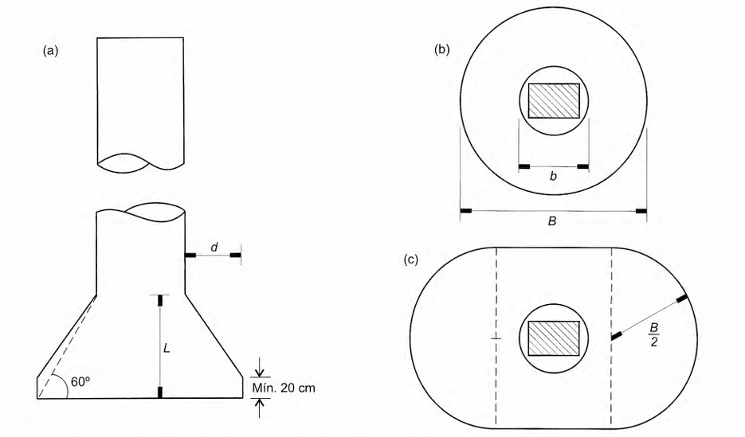
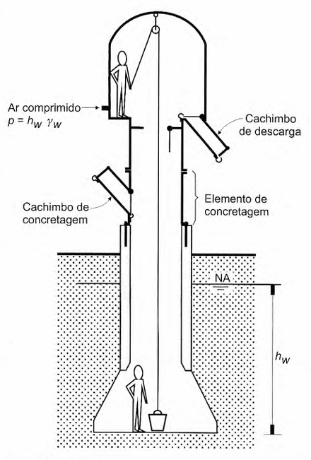

<!--Don't delete this script-->

<!--Don't delete this script-->

<h1>Infraestrutura</h1> 

  Os métodos construtivos dos elementos de infraestrutura para pontes seguem as premissas básicas dos elementos tradicionais de fundações, sejam essas fundações rasas ou profundas. Lembrando que as característica para dimensionamento das fundações são relativos a normativa ABNT NBR 6122 <a href="#ref1">[1]</a>.
    
  <b>fundações rasa ou superficial:</b> Elementos de fundação em que a carga é transmitida ao  terreno, predominantemente pelas pressões distribuídas  sob a base da fundação, e em que a profundidade de as sentamento em relação ao terreno adjacente é inferior a  duas vezes a menor dimensão da fundação. Incluem-se  neste tipo de fundação: (a) sapata, (b) bloco, (c) radier, (d) sapata associada, (e) viga de fundação e (f) sapata corrida.
    
  <b>fundações profunda:</b> Elemento de fundação que transmite a carga ao terreno pela base (resistência de ponta), por sua superfície lateral (resistência de fuste) ou por uma combinação das duas, e que está assente em profundidade superior ao dobro de sua menor dimensão em planta, e no mínimo 3 m, salvo justificativa. Neste tipo de fundação incluem-se: (a) estaca, e (b) tubulão.
    
	Normalmente em pontes são aplicadas fundações profundadas devido a magnitude do carregamento. Portanto estacas e tubulões são os tipos de peças mais empregadas.

<h2>Tubulão</h2> 

  A fundação tipo tubulão é bastante utilizada para aplicações em pontes. Segundo o item 3.49 da ABNT NBR 6122 <a href="#ref1">[1]</a> define-se tubulão como um elemento de fundação profunda em que, pelo menos na etapa final da escavação do terreno, faz-se necessário o trabalho manual em profundidade para executar o alargamento de base ou pelo menos para a limpeza do fundo da escavação, uma vez que neste tipo de fundação as cargas são resistidas preponderantemente pela ponta.
	  
	Os tubulões pode ser de dois tipos:
	 
	<ul>
		<li>Céu aberto;</li>
		<li>Ar comprimido.</li>
	</ul>
  A Figura <a href="#fig1">1</a> apresenta a geometria tradicional de um tubulão.

<b>Figura 1.</b> Tubulões: (a) em perfil, sem e com alargamento de base e formas de base usuais: (b) circular e (c) "falsa elipse" <a href="#ref2">[2]</a>.

O esquema de construção de um tubulão a ceú aberto pode ser visto na Figura <a href="#fig2">2</a>.

<b>Figura 2.</b> Execução de tubulão a céu aberto: (a) escavação, (b) concretagem a seco, (c) tubulão pronto <a href="#ref2">[2]</a>.

O esquema de construção de um tubulão a ar comprimido segue um esquema similar ao processo a ceú aberto. Porém utiliza-se uma campânula. Esse recurso é empregado quando na execução do tubulão atinge-se o lençol d'água, sendo necessário revestir a escavação e também empregar o ar comprimido. O modelo de camânula pode ser visto na Figura <a href="#fig3">3</a>.

<b>Figura 3.</b> Campânula para pressurização do 
tubulão <a href="#ref2">[2]</a>.

 

<iframe width="560" height="315" src="https://www.youtube.com/embed/3qMTjCqUBP8?si=Pt26zy8tfHADHtnu&start=38" title="YouTube video player" frameborder="0" allow="accelerometer; autoplay; clipboard-write; encrypted-media; gyroscope; picture-in-picture; web-share" referrerpolicy="strict-origin-when-cross-origin" allowfullscreen></iframe>

<b>Vídeo 1.</b> Você conhece o tubulão a ar comprimido? <a href="#ref3">[3]</a>.

<h2>Estacas</h2> 

  Segundo o item 3.11 da ABNT NBR 6122 <a href="#ref1">[1]</a> define-se estaca como um elemento de fundação profunda executado inteiramente por equipamentos ou ferramentas, sem que, em qualquer fase de sua execução, haja trabalho manual em profundidade. Os materiais empregados podem ser: madeira, aço, concreto pré-moldado, concreto moldado in loco, argamassa, calda de cimento, ou qualquer combinação dos anteriores.	

 

<iframe width="560" height="315" src="https://www.youtube.com/embed/KKgTq8JievA?si=mFsgijSYmA3e-aBa" title="YouTube video player" frameborder="0" allow="accelerometer; autoplay; clipboard-write; encrypted-media; gyroscope; picture-in-picture; web-share" referrerpolicy="strict-origin-when-cross-origin" allowfullscreen></iframe>

<b>Vídeo 2.</b> Tubulão em água <a href="#ref4">[4]</a>.

<h1>Mesoestrutura</h1> 

	Segundo o antigo DNER <a href="#ref5">[5]</a> o método construtivo da mesoestrutura depende principalmente de sua altura, os pilares podem ser executados, pelo menos, de quatro maneiras distintas: 

<ol type = "a">
  <li>
Através de peças pré-moldadas, em passarelas e obras de pequenos vãos;
</li>
  <li>
Através de concretagem convencional, isto é, executadas as fôrmas completas, concreta-se de baixo para cima, em concretagens contínuas, concreto lançado ou bombeado e vibrado;
</li>
  <li>
Através de fôrmas deslizantes, fôrmas desmontáveis de cerca de 1,0 m de altura, empurradas continuamente para cima, simultaneamente com a concretagem, contínua e vibrada;
</li>
  <li>
Através de fôrmas trepantes, fôrmas desmontáveis de cerca de 3,0 m de altura e concretagem por segmentos, vibrada e interrompida.
</li>
</ol>

  O sistema construtivo da mesoestrutura influi no seu detalhamento; no caso particular de fôrmas deslizantes recomenda-se um cobrimento adicional das armaduras, de 3 a 4 cm, para combater a tendência à fissuração da camada superficial do concreto, provocada pelo arrasto das fôrmas. 

<iframe width="560" height="315" src="https://www.youtube.com/embed/WRPs5EtK8vE?si=TZHuOtbrdSq1PHs5" title="YouTube video player" frameborder="0" allow="accelerometer; autoplay; clipboard-write; encrypted-media; gyroscope; picture-in-picture; web-share" referrerpolicy="strict-origin-when-cross-origin" allowfullscreen></iframe>

<b>Vídeo 3.</b> Fôrmas deslizantes <a href="#ref6">[6]</a>.

<iframe width="560" height="315" src="https://www.youtube.com/embed/uPUsl5_2c14?si=S0OMpDKS3nX7SyL_" title="YouTube video player" frameborder="0" allow="accelerometer; autoplay; clipboard-write; encrypted-media; gyroscope; picture-in-picture; web-share" referrerpolicy="strict-origin-when-cross-origin" allowfullscreen></iframe>

<b>Vídeo 4.</b> Fôrmas trepantes <a href="#ref7">[7]</a>.

<h1>Superestrutura</h1> 

De acordo com Leonhardt <a href="#ref2">[xx]</a> a classificação segundo o processo executivo é dada por três subdivisões, são elas:

<ol type="a">
  <li>Construção com concreto moldado <i>in loco</i>;</li>
  <li>Construção com elementos pré-moldados;</li>
  <li>Construção por deslocamentos progressivos.</li>
</ol>

<h3>Bibliografia</h3>

<table>
    <thead>
        <tr>
            <th>ID</th>
            <th>Referências</th>
        </tr>
    </thead>
    <tbody>
        <tr>
            <td>
[1]
</td>
            <td>
ASSOCIAÇÃO BRASILEIRA DE NORMAS TÉCNICAS. NBR 6122: Projeto e execução de fundações. Rio de Janeiro: ABNT, 2022.
</td>
        </tr>
        <tr>
            <td>
[2]
</td>
            <td>
VELLOSO, Dirceu de Alencar; LOPES, Francisco de Rezende. Fundações. São Paulo: Oficina de Textos, 2010.
</td>
        </tr>
        <tr>
            <td>
[3]
</td>
            <td>
Você conhece o tubulão a ar comprimido? Silvio de Andrade, Engenharia de fundações. Youtube, 12 set. 2019.
</td>
        </tr>
        <tr>
            <td>
[4]
</td>
            <td>
Tubulão em água. Jefferson Porfirio. Youtube, 16 jul. 2011.
</td>
        </tr>
        <tr>
            <td>
[5]
</td>
            <td>
BRASIL. Manual de projeto de obras-de-arte especiais. Rio de Janeiro: Departamento Nacional de Estradas de Rodagem (DNER), 1996.
</td>
        </tr>
        <tr>
            <td>
[6]
</td>
            <td>
Fôrmas deslizantes. M.Roscoe e Brasilos S/A Construções. YouTube, 16 out. 2015
</td>
        </tr>
        <tr>
            <td>
[7]
</td>
            <td>
Fôrmas trepantes. Ulma Construction. YouTube, 15 jan. 2015
</td>
        </tr>
    </tbody>
</table>
