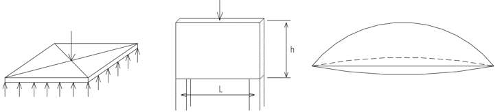
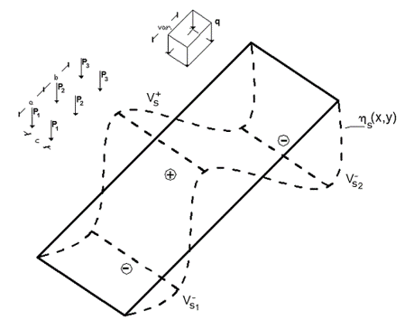
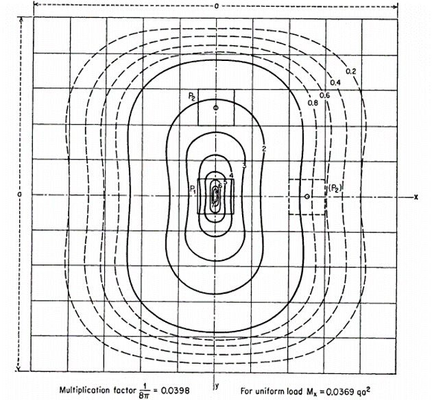
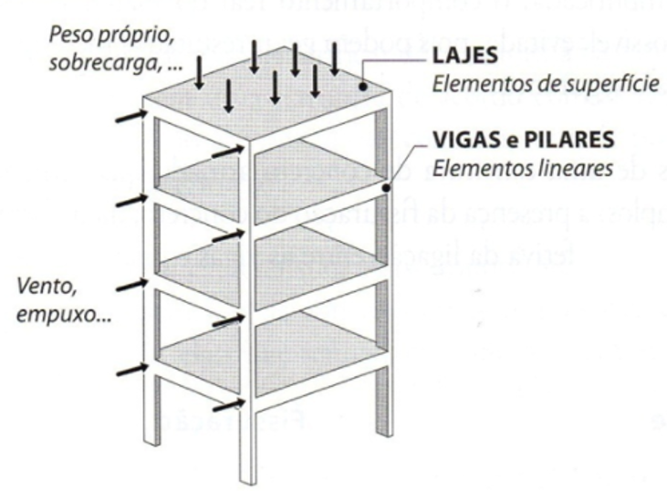
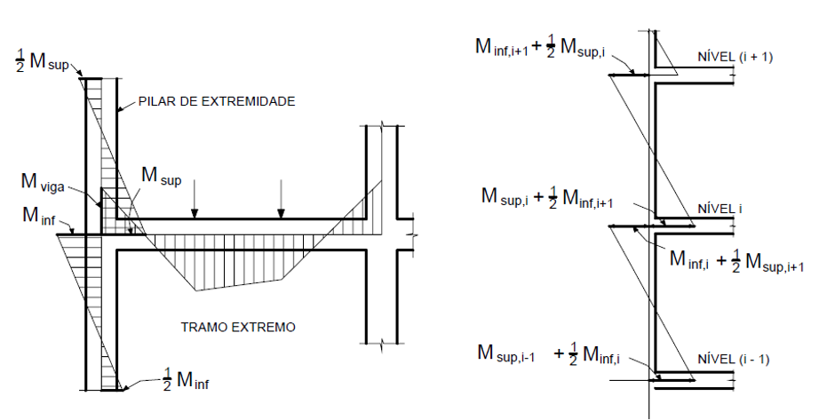

<!--Don't delete this script-->

<!--Don't delete this script-->

<h1>Sistema Estrutural e seu Pré-Dimensionamento</h1> 

  Segundo O’Connor <a href="#ref1">[1]</a> a seleção do material e esquema estrutural é uma tarefa complexa e só pode ser determinado considerando-se todos os fatores que afetam o projeto de cada sistemas estrutural em particular. Para isso o mesmo apresenta a Figura. <a href="#fig1">1</a> algumas estruturas em função do seu material e tipologia do sistema, sendo o destaque dessa tabela o máximo vão em serviço utilizado em cada um dos sistemas.

 

<b>Figura 1.</b> Comprimento de vão para vários tipos de superestruturas <a href="#ref1">[1]</a>.

 

  De acordo com Areias Neto <a href="#ref2">[2]</a>, para a fixação do comprimento da ponte, deve-se levar em conta aspectos relacionados a seção de vazão necessária e ao projeto da estrada (perfil longitudinal).
	  
	Araújo <a href="#ref3">[3]</a> afirma que esse traçado de pontes em pequenos rios é definida pelo projetista da estrada quando da elaboração do traçado da via. Entretanto, quando a via cruza médios ou grandes rios a posição da ponte pode determinar o traçado da via. Nesse caso, segue alguns critérios para a posição da ponte:
	  
	<ul>
		<li>Transpor o canal principal ou vale no local mais estreito possível e mais próximo ao traçado original da via;</li>			 
		<li>O canal principal deve ser transposto, de preferência, perpendicularmente à direção do escoamento do rio;</li> 
		<li>No caso de ponte esconsa deve-se evitar eixos de pilares no meio do rio onde a velocidade de escoamento d’água é maior, diminuindo a erosão localizada na base do pilar (Figura. <a href="#fig2">2</a> );</li> 
		<li>Deve-se evitar transpor um rio logo após a região onde deságua um afluente (Figura. <a href="#fig3">3</a>). A melhor posição para transposição do rio é mais a jusante da região onde deságua seu afluente;</li> 
    <li>Evitar transpor em locais onde possa haver, ao longo da vida útil da estrutura, mudanças na seção transversal do rio;</li> 
    <li>Quando do cruzamento de rios de pequena vazão, é recomendável evitar curvas para transposição desses rio.</li>
	</ul>

 

<b>Figura 2.</b> Erosão localizada na base de um pilar e contato com a água <a href="#ref3">[3]</a>.

 

<b>Figura 3.</b> Transposição de rio com afluente <a href="#ref3">[3]</a>.

 

<h2>Algumas especificações para longarinas</h2>

  Nesse texto iremos abordar os sistemas em Concreto Armado com solução de vigas de eixo reto. Para tanto será necessário algumas proposições de pré-dimensionamento do sistema estrutural. Aqui será apresentado o pré-dimensionamento para soluções em viga apoiada e viga contínua. 
	  
	Areias Neto <a href="#ref2">[2]</a> indica para sistemas simplesmente apoiados o seguinte valor de vão: 
	  
	𑙠≤ 25 𑚠&nbsp;&nbsp;&nbsp;&nbsp;&nbsp;&nbsp;&nbsp;&nbsp;&nbsp;&nbsp;&nbsp;&nbsp;&nbsp;&nbsp;&nbsp;&nbsp;&nbsp;&nbsp;&nbsp;&nbsp; Recomendação para pontes rodoviárias em concreto armado  
	â„ğ‘™ğ‘œğ‘›ğ‘” > 𝑙/14 &nbsp;&nbsp;&nbsp;&nbsp;&nbsp;&nbsp;&nbsp;&nbsp;&nbsp;&nbsp;&nbsp;&nbsp;&nbsp;&nbsp;&nbsp; Manual DNIT <a href="#ref4">[4]</a>
    
 	ğ‘ğ‘¤,𝑙𝑜𝑛𝑔 ≥ 25 𝑐𝑚 &nbsp;&nbsp;&nbsp;&nbsp;&nbsp;&nbsp;&nbsp;&nbsp;&nbsp; Manual DNIT <a href="#ref4">[4]</a> 
	 
 	No caso de soluções isostáticas com balanços (Figura. <a href="#fig4">4</a>) a recomendação de Areias Neto <a href="#ref2">[2]</a> é:
    
  𝑙/5 ≤ 𝑎 ≤ 𝑙/2 &nbsp;&nbsp;&nbsp;&nbsp;&nbsp;&nbsp;&nbsp;&nbsp; Valor similar ao apresentado por DNIT <a href="#ref4">[4]</a>

 

<b>Figura 4.</b> Viga isostática com balanço <a href="#ref2">[2]</a>.

 

  Araújo <a href="#ref3">[3]</a> replica algumas recomendações extras de DNIT <a href="#ref4">[4]</a> para o uso dos balanços:
 	  
    <ul>
      <li>Aterro com altura limitada a oito metros, ou menos;</li> 
      <li>Aterro de acesso executado antes da obra de arte;</li> 
      <li>Balanço (a) com comprimento máximo de 7,5 m e sua flecha deverá ser menor que 2 cm;</li> 
      <li>Deve-se usar laje de transição de comprimento mínimo de 4 m.</li>
	</ul>
	 
 	Em sistema de viga contínua Areias Neto <a href="#ref3">[3]</a> faz as seguintes recomendações:
    
  a) Vigas contínuas com dois vãos:

 

<b>Figura 5.</b> Viga contínua com dois vãos <a href="#ref2">[2]</a>.

  As mediidas da Figura. <a href="#fig5">5</a> são: 
  𝑙1 = 𝑙2  
  ğ‘ = 𝑙1/4

 

<b>
  b)  Vigas contínuas com três e quatro vãos:
</b>

 

<b>Figura 6.</b> Geometria da viga contínua <a href="#ref2">[2]</a>.

  As mediidas da Figura. <a href="#fig6">6</a> são:  
  0,60.𝑙2≤  𝑙1 ≤ 0,80.𝑙2 
  ğ‘ = 𝑙1/4

 

<h2>Algumas especificações para tabuleiro e lajes em balanço</h2>

  Quanto a seção transversal de lajes o manual do DNIT <a href="#ref4">[4]</a> de obras de arte apresenta a Tabela. <a href="#tab1">1</a>.

 

<table>
    <tr>
        <th colspan = "">
          &nbsp;&nbsp;&nbsp;&nbsp;&nbsp;&nbsp;&nbsp;&nbsp;&nbsp;&nbsp;&nbsp;&nbsp;&nbsp;&nbsp;&nbsp;&nbsp;&nbsp;&nbsp;&nbsp;&nbsp;&nbsp;Vão da Laje (m)&nbsp;&nbsp;&nbsp;&nbsp;&nbsp;&nbsp;&nbsp;&nbsp;&nbsp;&nbsp;&nbsp;&nbsp;&nbsp;&nbsp;&nbsp;&nbsp;&nbsp;&nbsp;&nbsp;
         </th> 
         <th colspan = "">
           &nbsp;&nbsp;&nbsp;&nbsp;&nbsp;&nbsp;&nbsp;&nbsp;&nbsp;&nbsp;&nbsp;&nbsp;&nbsp;&nbsp;&nbsp;&nbsp;&nbsp;&nbsp;&nbsp;&nbsp;&nbsp;&nbsp;Espessura da Laje (cm)&nbsp;&nbsp;&nbsp;&nbsp;&nbsp;&nbsp;&nbsp;&nbsp;&nbsp;&nbsp;&nbsp;&nbsp;&nbsp;&nbsp;&nbsp;&nbsp;&nbsp;&nbsp;&nbsp;&nbsp;&nbsp;
         </th> 
    </tr>  
     <tr>
        <th coslpan = "">
           2
         </th>  
         <th>
           15
         </th>
    </tr>  
     <tr>
        <th >
           3
         </th>       
         <th>
           18
         </th>
    </tr> 
     <tr>
        <th >
          4
         </th>    
         <th>
           20
         </th>
    </tr> 
    <tr>
        <th >
           5
         </th>    
         <th>
          22
         </th>
    </tr> 
    <tr>
        <th >
        6
         </th>    
         <th>
          25
         </th>
    </tr> 
</table>

<b>Tabela 1.</b> Espessura da laje [4].<a href="#ref2">[2]</a>.

 

  DNIT <a href="#ref4">[4]</a> afirma que em concreto armado convencional as lajes são utilizadas para vãos até 15 metros, com relação altura/vão da ordem de 1/15, em vãos isostáticos, e 1/20 e 1/24, em vãos contínuos.
    
  A norma regulamentadora NBR 7187 <a href="#ref5">[5]</a>, traz as seguintes exigências quanto as dimensões dos elementos estruturais nas pontes:
	  
	Nas lajes maciças as dimensões mínimas são:
	  
	<ul>
		<li>Lajes destinadas à passagem de tráfego ferroviário: h ≥20 cm;</li>
		<li>Lajes destinadas à passagem de tráfego rodoviário: h ≥15 cm;</li>
		<li>Demais casos: h ≥12 cm.</li>
	</ul>

 

<h2>O gabarito da pontes</h2>

  De acordo com Pfeil <a href="#ref6">[6]</a>, os gabaritos são denominados os conjuntos de espaços livres que deve apresentar o projeto de uma ponte para atender o seu intuito. De uma forma geral, pode-se especificar os gabaritos quanto a finalidade de implantação da estrutura, tais como:
	  
	(a) Estruturas construídas sobre rodovias: Devem respeitar espaços livres, necessário para tráfego de caminhões (Figura. <a href="#fig7">7</a>).

 

<b>Figura 7.</b> Gabarito para obras de arte sobre rodovias – (a) rodovia de pista simples e (b) rodovia de pista dupla <a href="#ref6">[6]</a>.

 

  (a) Estruturas construídas sobre ferrovias: Devem respeitar espaços livres, necessário para tráfego de trens (Figura. <a href="#fig8">8</a> ).

 

<b>Figura 8.</b> Gabarito para obras de arte sobre ferrovias – (a) rodovia de pista simples e (b) rodovia de pista dupla <a href="#ref6">[6]</a>.

 

  (a) Estruturas construídas sobre vias navegáveis: Para vias navegáveis a chatas e rebocadores, é comum prever-se a altura livre de 3,50m a 5,0m acima do nível máximo de cheia. A largura deve atender no mínimo a largura máxima da embarcação mais 1,m (Figura. <a href="#fig9">9</a>).
 	  
  Para estruturas construídas sobre vias não navegáveis normalmente se estabelece uma altura livre de 2 m acima do nível de máxima cheia. 
	  
	Na Figura. <a href="#fig9">9</a> é apresentado o gabarito da ponte sobre o Rio Paraguai em Cáceres-MT, com gabarito de 30 m de largura por 12 m de altura sobre nível máximo de cheia das águas.

 

<b>Figura 9.</b> Exemplo de ponte com gabarito de navegação 35,00m x 12,00m <a href="#ref6">[6]</a>.

 

<h2>Algumas especificações para os pilares e aparelhos de apoio</h2>

  O desenvolvimento do pré-dimensionamento dos pilares e dos aparelhos de apoio para uma ponte é dependente da previsão de cargas nessas estruturas. Após isso as condições de pré-dimensionamento do pilar por exemplo segue as mesmas observações impostas para os elementos de estruturas prediais normalmente estudadas nas disciplinas de concreto armado.
	  
	<b>a) Pré-dimensionamento dos pilares:</b>

<table align = "center" border = "1">
       <tr>
        <th>
	        N*d = 𛼠. N*k
        </th>
        <th rowspan = "2">
	        𛼠= 1,8 – Pilares intermediários;  
          𛼠= 2,2 – Pilares de extremidade;  
          𛼠= 2,5 – Pilares de canto.  
        </th>
    </tr>
    <tr>
        <th >
         𝐴_𝑐=(1,50〖.𝑁〗_𝑑^∗)/(0,50.𝑓_𝑐𝑘+0,42)≥360 〖𝑐𝑚〗^2
         </th>            
    </tr>      
</table>
 

  𝐴_𝑐: Área da seção de concreto do pilar ("cm²");
	  
	𝑁_𝑑: Força normal aproximada de cálculo (kN);
	  
	𝑓_𝑐𝑘: Resistência característica de cálculo ("kN/cm²").
	  
	É recomendável que a verificação das dimensões do pilares sejam verificadas após a previsão das dimensões dos aparelhos de apoio visto que estes devem se encaixar dentro dos pilares
	   
	<b>b) Pré-dimensionamento dos aparelhos de apoio em Neoprene:</b>
	  
	Para o pré-dimensionamento e dimensionamento dos aparelhos de apoio será utilizada a NBR 9062 <a href="#ref7">[7]</a> e descrições do tópico 7.2.1.6 e no Anexo A.
 	<ul>
		<li>Tensão limitante para aparelhos de apoios simples: 𝜎_𝑘=(ğ‘_𝑘^∗)/(ğ‘.ğ‘)≤7 𝑀𝑃𝑎. Onde a (menor dimensão em planta) e b designam as dimensões em planta do aparelho;</li>  
		<li>Tensão limitante para aparelhos de apoios fretados: 
		  
		ğ‘ ≤ 15 𝑐𝑚 reflete ğœğ‘˜ ≤ 8 𝑀𝑃𝑎
		  
		15 𝑐𝑚 < ğ‘ ≤2 0 𝑐𝑚 e ğœğ‘˜ ≤ 11 𝑀𝑃𝑎
		  
		20 𝑐𝑚 <ğ‘ ≤30 𝑐𝑚 e ğœğ‘˜ ≤ 12,5 𝑀𝑃𝑎
		  
		ğ‘ > 30 𝑐𝑚 e ğœğ‘˜ ≤ 15 𝑀𝑃𝑎
		</li>
	</ul>
	 
 	Em relação a altura é necessário estabelecer diversos critérios relativos ao dimensionamento do aparelho, para uma verificação inicial vamos estabelecer a proposição da NBR 9062 <a href="#ref7">[7]</a> que promove a dispensa da verificação de estabilidade da almofada.
    
  â„ğ‘ğ‘™ğ‘šğ‘œğ‘“ğ‘ğ‘‘ğ‘ ≤ ğ‘ / 5

 

<h1>Lançamento Estrutural</h1>

  Para o lançamento estrutural o primeiro dado que o engenheiro estrutural tem acesso é o levantamento topográfico (Figura. <a href="#fig10">10</a>) fornecido pela concessionária responsável pelo projeto. Após a visualização do estaqueamento e do eixo para colocação da ponte é necessário realizar um estudo hidrológico para determinação da Altura de Máxima Cheia.

 

<b>Figura 10.</b> Croqui da trajetória do leito do rio e também marcação do estaqueamento.

 

<b>Tabela 2.</b> Determinação da vazão de projeto e cota referente a máxima cheia <a href="#ref3">[3]</a>. 
  
Dados do projeto de Araújo <a href="#ref3">[3]</a>:
	  
	Q = 691,02 𝑚3/ğ‘ 
	 
	Cota de fundo = 208,678 (m)

 

 Onde: 
           <ul style = "text-align:left">
           		<li>
<b>Q</b> = Vazão (m3 / s);
</li>
                <li>
<b>A</b> = Ãrea da seção molhada (m2;
</li>
                <li>
<b>K</b> = Coeficiente de rugosidade de Strickler;
</li>
                <li>
<b>n</b> = Coeficiente de rugosidade de Manning;
</li>
                <li>
<b>V</b> = CoVelocidade de escoamento (m/s);
</li>
                <li>
<b>R</b> = Raio hidráulico 9m) -> <b>R = A/P</b> (P = Perímetro molhado);
</li>
                <li>
<b>J</b> = Declividade do fundo (m/m).
</li>
           </ul>

 
 

<b>Figura 11.</b> Elevação longitudinal com a marcação do estaqueamento e MCC.

 

<h3>Bibliografia</h3>

<table>
    <thead>
        <tr>
            <th>ID</th>
            <th>Referências</th>
        </tr>
    </thead>
    <tbody>
        <tr>
            <td>
[1]
</td>
            <td>
C. O’Connor, Pontes - Superestruturas, vol. 1, 2 vols. LTC, 1976.
</td>
        </tr>
        <tr>
            <td>
[2]
</td>
            <td>
A. C. de Areias Neto, Projeto e Cálculo de Pontes de Concreto Armado, vol. 1. Rio de Janeiro: IME, 1977.
</td>
        </tr>
        <tr>
            <td>
[3]
</td>
            <td>
D. de L. Araújo, Projeto de ponte em concreto armado com duas longarinas, 2o ed. Goiânia: UFG, 2018.
</td>
        </tr>
        <tr>
            <td>
[4]
</td>
            <td>
Departamento Nacional de Infraestrutura de Transportes (DNIT), Manual de Projeto de Obras de Arte Especiais. Brasília: Ministério da Infraestrutura, 1996.
</td>
        </tr>
        <tr>
            <td>
[5]
</td>
            <td>
Associação Brasileira de Normas Técnicas, NBR 7187: Projeto de pontes de concreto armado e de concreto protendido - Procedimento. Rio de Janeiro: ABNT, 2003.
</td>
        </tr>
        <tr>
            <td>
[6]
</td>
            <td>
W. Pfeil, Pontes Em Concreto Armado: elementos de Projeto, Solicitações e Superestrutura, vol. 1, 2 vols. Rio de Janeiro: LTC, 1990.
</td>
        </tr>
        <tr>
            <td>
[7]
</td>
            <td>
Associação Brasileira de Normas Técnicas, NBR 9062: Projeto e execução de estruturas de concreto pré-moldado. Rio de Janeiro: ABNT, 2017.
</td>
        </tr>
    </tbody>
</table>

--------------------------------------------------------------------------------------------------------------------------------

<h1>Solicitações para o sistema de viga contínua</h1>

<h2>Esforços Horizontais</h2>

  Como o sistema é monolítico os deslocamentos sofridos pelo tabuleiro serão repassados ao topo de cada pilar de concreto da mesoestrutura. Segundo Taguti (2002) os seguintes esforços atuam transversalmente ao pilares:
    
  a) Esforços longitudinais atuantes no tabuleiro
  - Frenagem e aceleração de veículos
  - Empuxo de terra e sobrecarga na cortina
  - Componente longitudinal do vento, calculadas da seguinte forma:
  - vento na superestrutura = 25% do esforço de vento na direção transversal
  - vento no veículo = 40%
    
  b) Esforços transversais atuantes no tabuleiro
  - Vento
  - Força centrífuga (pontes em curva horizontal)
  - Impacto lateral (pontes ferroviárias)
  - Empuxo de terra nas cortinas ( pontes esconsas)
    
  c) Esforços devidos a deformações impostas
  - Efeito da temperatura nas vigas principais
  - Efeito da retração nas vigas principais
    
  d) Esforços que atuam diretamente sobre os pilares
  - Empuxo de terra
  - Pressão do vento
  - Pressão d'água

   

<h1>Determinação das solicitações nos pilares</h1>

<h2>Solicitação para sistema em viga contínua</h2>

  De acordo com Araújo (2010) o sistema formado por vigas contínuas, quando
  a superestrutura sofre um deslocamento horizontal o topo dos pilares sofre o
  mesmo deslocamento por estes estarem ligados à superestrutura. O esforço
  aplicado ao topo de cada pilar é igual ao produto do deslocamento pela
  rigidez do pilar (K). Portando faz-se a equação:

  (a) Estruturas construídas sobre vias navegáveis: Para vias navegáveis a chatas e rebocadores, é comum prever-se a altura livre de 3,50m a 5,0m acima do nível máximo de cheia. A largura deve atender no mínimo a largura máxima da embarcação mais 1,m (Figura. <a href="#fig9">9</a>).
 	  
  Para estruturas construídas sobre vias não navegáveis normalmente se estabelece uma altura livre de 2 m acima do nível de máxima cheia. 
	  
	Na Figura. <a href="#fig9">9</a> é apresentado o gabarito da ponte sobre o Rio Paraguai em Cáceres-MT, com gabarito de 30 m de largura por 12 m de altura sobre nível máximo de cheia das águas.

 

<b>Figura 1.</b> Distribuição das cargas variáveis sobre o tabuleiro da ponte.

 

<h2>Rigidez de pilares Engastado-livre</h2>

  Utilizando-se o modelo para as cargas horizontais, onde os pilares e seus
  respectivos aparelhos de apoio são considerados apoios elásticos, resulta que
  a superestrutura submetida a um esforço horizontal longitudinal F , sofre um
  deslocamento D e, consequentemente, todos os topos dos pilares
  também se deslocarão de D (Fig. <a href="#fig2">2</a>) . Com isso, a solução do
  problema se torna simples, bastando para tanto o cálculo das rigezas dos
  apoios elásticos (formado pelo conjunto: pilar e aparelho de apoio).

 

<b>Figura 2.</b> Modelo de cálculo da distribuição de forças longitudinais entre os apoios elásticos.

 

Verificando o sistema pilar apoio como uma barra engastada livre (Figura. <a href="#fig3">3</a>)
têm-se então o valor da rigidez de cada pilar:

 

<b>Figura 3.</b> Modelo do pilar de concreto armado engastado-livre.

 

  Considerando agora a rigidez do aparelho de apoio têm-se então:

 

<b>Figura 4.</b> Modelo do apoio em neoprene.

 

  Considerando agora a rigidez do conjunto completo tem-se o
  comportamento completo da ligação. A associação do pilar engastado-livre
  e o apoio em neoprene resultará em um elemento de rigidez Ki.

 

<b>Figura 5.</b> Modelo completo do apoio elástico.

<left></left>
 

<h2>Rigidez de pilares biengastados</h2>

  Araújo (2010) cita a rigidez de pilares biengastados. Segundo o mesmo
  quando o pilar é biengastado, o procedimento é análogo, podendo a rigidez
  ser calculada como o inverso da flexibilidade (processo dos esforços) ou
  obtida diretamente de tabelas. Para o caso particular de pilar biengastado
  de inércia constante sua rigidez vale:

 

<b>Figura 6.</b> Modelo do pilar biengastado.

<left></left>
 

  O cálculo da distribuição do esforço longitudinal entre os pilares é geralmente
  feito admitindo que o esforço horizontal seja aplicado no eixo de simetria do
  tabuleiro. No caso de pontes rodoviárias, por exemplo, admite-se que o
  veículo tipo, ao freiar, esteja circulando no centro da pista de rolamento. Esta
  simplificação é admissível considerando que, em geral, a largura das pontes é
  muito menor que o seu comprimento (PFEIL, 1983).

 

<h2>Distribuição dos esforços transversais</h2>

  Devido à grande rigidez que as lajes concedem, no plano horizontal, ao
  tabuleiro da ponte, este pode ser considerado, sob a ação de esforços
  transversais, como uma placa sobre apoios elásticos. Quando esses esforços
  incidem no tabuleiro, este se desloca horizontalmente solicitando os pilares. Se
  o deslocamento for apenas uma translação na direção horizontal, o
  problema é análogo ao de distribuição de esforços longitudinais, ou seja,
  cada eixo recebe um quinhão de carga proporcional à sua rigidez na direção
  transversal (Figura. <a href="#fig7">7</a>). Neste caso, a rigidez transversal de cada pilar (ou eixo) deve ser calculada levando em conta a existência de vigas transversais
  ligando os pilares que formam, assim, pórticos nessa direção. Para tanto, a
  rigidez pode ser calculada como o inverso do deslocamento do topo do
  pórtico quando nesta posição é aplicada uma força unitária (ARAÚJO, 2010).

 

<b>Figura 7.</b> Vista em planta da atuação de esforços transversais no tabuleiro (a); translação horizontal do tabuleiro (b); determinação da rigidez transversal do pórtico (c)
.

 

<b>Figura 8.</b> Vista em planta da atuação de esforços transversais no tabuleiro (a);
translação horizontal do tabuleiro (b); rotação horizontal do tabuleiro em torno do ponto (c).

 

  Quando ocorre a rotação do tabuleiro, cada pilar Pi, distante xi do ponto O,
  sofre um deslocamento horizontal θh xi, perpendicular ao eixo da ponte na
  posição original. Ao deslocamento do pilar corresponde um esforço Ki. θh. xi
  na direção do deslocamento, sendo Ki a rigidez do pilar (ou eixo) na direção
  desse deslocamento (ARAUJO, 2010).

 

 

<h1>Cálculo dos esforços longitudinais e transversais</h1>

<h2>Frenagem ou Aceleração</h2>

  Um veículo qualquer em movimento sobre uma ponte representa, em virtude
  de sua massa, uma certa força-viva de que é possuída. A força resultante é
  chamada frenagem. Do mesmo modo, ao iniciar seu movimento apoia-se
  sobre a estrutura transmitindo à mesma um esforço chamado aceleração.
    
  O item 7.2.1.5 da NBR 7187 (ABNT, 2003) cita as orientações relativas a essa
  carga. No caso são os seguintes valores:
    
  a) Pontes rodoviárias: sem impacto, aplicada na pavimentação:
  Aceleração: 5% da carga móvel aplicada sobre o tabuleiro;
  Frenagem: 30% do peso do veículo-tipo.
    
  Deve-se adotar o valor mais desfavorável segundo Pfeil (1983).

 

<h2>Empuxo de terra</h2>

  O item 7.1.4 da NBR 7187 (ABNT, 2003) apresenta as condições para o cálculo
  dos empuxos de terra atuantes sobre os pilares.
    
  O empuxo de terra nas estruturas é determinado de acordo com os princípios
  da mecânica dos solos, em função de sua natureza (ativo, passivo ou de
  repouso), das características do terreno, assim como das inclinações dos
  taludes e dos paramentos. Como simplificação, pode ser suposto que o solo
  não tenha coesão e que não haja atrito entre o terreno e a estrutura, desde
  que as solicitações assim determinadas estejam a favor da segurança.
    
  O peso específico do solo úmido deve ser considerado no mínimo igual a 18
  kN/m³ e o ângulo de atrito interno no máximo igual a 30º. Os empuxos ativo e
  de repouso devem ser considerados nas situações mais desfavoráveis. A
  atuação do empuxo passivo só pode ser levada em conta quando sua
  ocorrência puder ser garantida ao longo de toda a vida útil da obra.
    
  Quando a superestrutura funciona como arrimo dos aterros de acesso, a
  ação do empuxo de terra proveniente desses aterros pode ser considerada
  simultaneamente em ambas as extremidades somente no caso em que não
  haja juntas intermediárias do tabuleiro e desde que seja feita a verificação
  também para a hipótese de existir a ação em apenas uma das extremidades,
  agindo isoladamente (sem outras forças horizontais) e para o caso de
  estrutura em construção.
    
  Nos casos de tabuleiro em curva ou esconso, deve ser considerada a
  atuação simultânea dos empuxos em ambas as extremidades, quando for
  mais desfavorável.
    
  No caso de pilares implantados em taludes de aterro, deve ser adotada, para
  o cálculo do empuxo de terra, uma largura fictícia igual a três vezes a largura
  do pilar, devendo este valor ficar limitado à largura da plataforma do aterro.

 

<b>Figura 9.</b> Distribuição das cargas variáveis sobre o tabuleiro da ponte.

 

<h2>Deformações internas no estrado</h2>

  Sob a ação da retração do concreto, o tabuleiro se encurta. Sob ação da
  temperatura, o tabuleiro se alonga ou se encurta, conforme a temperatura
  cresça ou decresça. Dada a sua ligação com o tabuleiro, os pilares são
  obrigados a acompanhar esse movimentos, resultando esforços aplicados nos
  topos dos pilares (ARAÚJO, 2010).
    
  O efeito da retração pode ser assimilado a uma variação de temperatura de
  -15C. Quando todos os pilares sobre os quais o estrado se apoia são elásticos,
  os movimentos de alongamento e encurtamento ocorrem nos dois sentidos
  da direção longitudinal do tabuleiro e há, evidentemente, um plano
  perpendicular a essa direção no qual não ocorrem deslocamentos. Esse plano
  fica localizado no “centro de gravidade” das rigezas longitudinais, o qual é
  determinado de forma análoga ao “centro de gravidade” das rigezas
  transversais (ARAÚJO, 2010).
    
  Conhecida a distância x de cada pilar ao ponto indeslocável, o
  deslocamento de seu topo é dado pela expressão αc.ΔT. x , no qual ac é o
  coeficiente de dilatação térmica do concreto armado (10-5/C) e ΔT é a
  variação de temperatura. O esforço aplicado no topo de cada pilar, devido
  à retração e à variação de temperatura, é dado por (ARAÚJO, 2010):

 

<h2> Vento na Estrutura</h2>

  De acordo com a NBR 7187, o vento é considerado uma força horizontal agindo normalmente ao eixo da estrutura e unifimemente distribuído ao longo desse eixo. O valor dessa força é o seguite: (MARCHETTI, 2008)
    
  a)  Ponte descarregada - pv = 1,5 kN / m2 - agindo sobre uma superfície representada pela projeção da estrutura sobre um plano vertical normal à direção do vento.
    
  b)  Ponte carregada: 
   
  para pontes rodovíarias: pv = 1 kN / m2
   
  para passarelas: pv = 0,7 kN / m2

 

<b>Figura 10.</b> Configuração das cargas de vento atuantes considerando a ponte descarregada.

<b>Fvento = 1,50 x (Hguarde-rodas + Hviga) x Lponte</b>

  

<b>Figura 11.</b> – Configuração das cargas de vento atuantes considerando a ponte carregada.

<b>Fvento = 1,00 x (Hviga + epavimentação + 2,0) x Lponte</b>

 

<h2>Pressão da água nos pilares</h2>

  A água correte exerce um esforço na infraestrutura da ponte que pode ser expresso por:  
  p = <i>k</i>v2 (KN / m)
    
  Onde: 
  <i>k</i> é o coeficiente dimensional e  
  <i>v</i> é a velocidade da água corrente

 

  No caso de não existir informação da velocidade da água, adotaremos a velocidade da água v = 2 m/s (adotado), ou então, se não houver medição no local.

 

<h2>Impacto nos Pilares</h2>

  A NBR 7187 estabelece que, no caso da possibilidade desses choques, deverão ser tomadas medidas especiais de proteção dos pilares, as quais podem ser representadas por defensas, "Duques de Alba" (embarcações) etc.

 

 

  A NBR 7187, todavia, não estabelece qual o valor a assumir para a força horizontal devido ao choque dos veículos ou embracações. Outras normas, porém, como a norma alemã (D.I.N), estabelecem para essa força horizontal valores bastante elevados. Por exemplo, na D.I.N:  
   H = 1000 kN no sentido longitudinal 
   H = 500 kN no sentido transversal
     
   aplicados a 1 m de altura

---------------------------------------------------------------------------------------------------------------------------------------------------------------------------------------------------------

aula "determinação dos esforços no tabuleiro"

<h1>Conceitos Iniciais sobre o tabuleiro</h1>
 

<h2>O tabuleiro da Ponte</h2>

  Stucchi (2006) primeiramente classifica geometricamente uma estrutura superficial que forma a ponte. Para o autor os elementos de superfície são  estruturas  que  têm  uma  de  suas  dimensões  bem  menor  que  as  outras  duas.  Ela  é chamada de espessura. 
    
  A superfície média é a definida a meia espessura, perpendicularmente à ela. 
    
  As estruturas de superfície são classificadas em: 
    
  a) Placa: Estrutura de superfície média plana carregada perpendicularmente à ela.
  As placas de concreto armado são chamadas lajes; 
  b) Chapa: Estruturas de superfície média plana carregada paralelamente a ela. As chapas de concreto armado são chamadas vigas parede.  
  c) Casca: Estruturas de superfície média curva.

 

<b>Figura 1.</b> Exemplos de estruturas de superfície.

 

  O tabuleiro das pontes em concreto é constituído por lajes ligadas de diversas
  maneiras aos demais elementos da superestrutura. Esses elementos, que servem de apoio paras as lajes, são as longarinas, as transversinas e as vigas de fechamento. As dimensões e as condições de apoio das lajes são função da distribuição dos demais elementos da superestrutura. A forma mais comum para as lajes de ponte são aquelas em que uma dimensão é muito maior que a outra. Quanto às condições de apoio, as lajes podem ser apoiadas, em balanço ou com engastamento parcial (ARAÚJO, 2010). 
    
  Araújo (2010) apresenta na Figura. <a href="#fig7">7</a> uma seção transversal típica de uma ponte de concreto.

 

<b>Figura 2.</b> Tipos de ciclos de tensão.

 

  Segundo Araújo (2010) o dimensionamento das lajes pode ser feito por métodos elásticos ou métodos baseados nas linhas de ruptura (ou charneiras plásticas). Os métodos elásticos baseiam-se na teoria da elasticidade levando em consideração a forma de distribuição das cargas móveis sobre o tabuleiro. Os métodos baseados nas linhas de ruptura definem uma provável configuração de fissuras na laje e, a partir do equilíbrio estático do painel, fornecem os momentos fletores empregados no dimensionamento da laje. Atualmente tem sido empregados métodos discretos para avaliação dos esforços em lajes de pontes. Dentre esses métodos, destaca-se o método dos elementos finitos que, empregado com o auxílio de microcomputadores, agiliza os cálculos dos esforços além de fornecer uma visão mais completa do comportamento do tabuleiro.
    
  Nesse texto será apresentado o método elástico para determinação dos esforços e superfícies de influência do tabuleiro da ponte. Para tanto será explicado o método do professor Hubert Rush mais conhecidos como tabelas de Rush.

 

<h2>Conceitos Iniciais de Superfície de influência</h2>

  No tabuleiro de pontes os responsáveis por gerar esforços nessa peças, são os veículos tipos que transitam ao longo do eixo da peça. Portanto a análise dos esforços em uma placa seguirá os mesmos conceitos das linhas de influência visto no capitulo anterior, porém agora o conceito terá o nome de superfície de influência, pois será admitido para um elementos de placa.

  Como o método descrito é elástico a sua solução será dada através da solução da equação da placa conforme apresentado nas disciplinas de lajes de concreto armado.

  Admitindo que tem transmite os esforços para a placa são as rodas do veículo tipo o problema será dado em função dessa ordenada. Araújo (2010) afirma que a força se distribuirá em uma certa área – em geral, considera-se o espalhamento da força a 45º até o plano médio da laje, o momento então será dado pela ordenada média da superfície nessa área, cujo valor pode ser calculado numericamente (Ver Figura. <a href="#fig3">3</a>).

 

<b>Figura 3.</b> Superfície média para cálculo de uma distância média.

 

  Como o conceito é estendido do problema unidimensional, têm-se então a versão bi-dimensional da determinação da superfície de influência do sólido, dado pela equação a abaixo:

 

  Logo o efeito que será simulado é dado na Figura. <a href="#fig4">4</a>

 

<b>Figura 4.</b> Superfície de influência para um efeito S específico.

 

  Resolvendo o problema geral dado anteriormente o esforço final em uma placa será dado pela equação abaixo:

  Onde Vi e Ai são, respectivamente, os volumes e as áreas determinadas na superfície de influência pela projeção no plano da laje das áreas ou linhas de atuação das forças, e  δi são as ordenadas dos pontos de atuação das forças concentradas (ARAÚJO, 2010).

  Algumas bibliografias como Timoshenko; Krieger (1987) e Araújo (2010) apresentam exemplos e superfícies de influência. Portanto ver as Figuras. <a href="#fig5">5</a> e <a href="#fig6">6</a>

 

<b>Figura 5.</b> Superfície de influência de uma placa retangular.

 

<b>Figura 6.</b> Superfície de influência do momento fletor na seção do meio do vão de uma
laje retangular apoiada nos quatro lados.

 

<h1>Ações no Tabuleiro</h1>

<h2>Tipo e Cálculo das Ações no Tabuleiro</h2>

  De maneira geral as cargas irão ser divididas em permanentes e variável. A seguir serão listadas algumas cargas que são encontradas comumente em lajes de concreto. 
    
  Carregamentos em lajes maciças são normalmente anotados em função de uma área, portanto na maioria das vezes é dada pelo equacionamento abaixo:

<b>
Gtipo = h . desnsidade
</b>

  O peso próprio da laje é o peso do concreto armado que forma a laje maciça. Para o peso específico do concreto armado a NBR 6118 (ABNT, 2014) indica o valor de 25 kN/m3.
    
  Para as pontes de concreto considera-se o pavimento da pista de rolamento. Essa consideração deve ser feita em função do tipo de material. Para sistemas mais comuns que usam o CBUQ esse valor é de 24 kN/m3 com a possibilidade de consideração do recapeamento sobre o sistema aumentando assim a carga permanente em 2 kN/m3.
    
  A ação variável do sistema é a carga móvel, que irá depender do trem tipo escolhido.
    
  Para a carga variável os valores serão definidas em função da NBR 7188 (ABNT, 2012). O trem tipo padrão estabelecido por essa norma é o TB-450 com carga total de 450 kN e carga por roda de 75 kN. Já a carga de multidão que circunda esse veiculo tipo é de 5 kN/m2.

 

<b>Figura 7.</b> Seção transversal de uma ponte típica de 2 longarinas.

 

<h1>Utilização das Tabelas de RUSCH para Determinação dos Momentos</h1>

<h2>Apresentação da Tabela de RüSCH (1960)</h2>

  As tabelas de Rüsch permitem a determinação das solicitações nas lajes, mediante condições de apoio prefixadas, incluindo apoio simples, engaste perfeito ou bordo livre. Para os diversos tipos de apoios são apresentados diagramas de cobrimento de momentos fletores para toda a superfície da laje a partir de máximos calculados no centro e nos bordos (ARAUJO, 2014).

  Nessa Tabela são fornecidos os valores do momento fletor, Mxm e Mym, no meio do vão da laje devido ao efeito das cargas das rodas do veículo (P = 1 t) e da sobrecarga uniformemente distribuída em volta do veículo (p = p’ = 1 t/m2 ). A direção do tráfego é admitida, nessa tabela, na direção y, sendo a direção y adotada paralela ao maior vão da laje (ARAUJO, 2014).

  Para maiores detalhes é apresentada a tradução de Araújo (2014) referente a Tabela de Rüsch (1960) e o veículo tipo utilizado.

 

<b>Figura 8.</b> Carga móvel da norma alemã DIN-1072 (classe 30 t a 60 t).

 

<b>Tabela 1.</b> –  Tabela de Rüsch (1960) para momentos fletores em laje apoiada com tráfego na direção y (ly / lx = 1) 

 

<h2>Leitura da Tabela de RüSCH (1960)</h2>

  A primeira identificação que deve ser feita é relativo ao tipo de engastamento da laje. Nas Tabelas de Rusch (1960) a identificação desse contorno é feito de acordo com a Figura. <a href="#fig9">9</a>

 

<b>Figura 9.</b> Apresentação dos apoios na Tabela de Rusch

 

  A segunda avaliação deve ser feita em relação a direção do tráfego (palavra Fahrtrichtung na Tabela) em relação ao tipo do engastamento. Veja os exemplos dados na Figura. <a href="#fig10">10</a>
    
  A terceira tarefa se diz a respeito da geometria da laje pelo cálculo do fator 𝜆=𝑙_𝑦/𝑙_𝑥 , muito utilizada nas tabelas de cálculo de lajes em estruturas de concreto armado.

<b>Figura 10.</b> Apresentação dos apoios na Tabela de Rusch

 

  Identificada a Tabela através dessas características iniciais, deve-se então verificar os fatores. O primeiro fator é a relação \[𝑙_𝑥⁄𝑎\]. O fator a se diz respeito a distância adjacente entre as  rodas de um mesmo eixo. No caso do TB 450 o valor de a=200,00 cm ou 2,00 m. O segundo fator é a relação 𝑡⁄𝑎, onde t é a largura de distribuição da pressão da roda. Para maiores detalhes ver a Figura. <a href="#fig11">11</a>

 

<b>Figura 11.</b> Representação das variáveis b e t na planta da laje

 

  A largura t é dada por:
   
  ğ‘¡ğ‘¥ 𝑜𝑢 ğ‘¡ğ‘¦ = ğ‘+2 . â„ğ‘ğ‘ğ‘£ + â„ğ‘™ğ‘ğ‘—ğ‘’
   
  Como a roda tem contato nas duas direções é necessário fazer o valor médio de t, dado pela equação abaixo. Maiores detalhes na Figura. <a href="#fig12">12</a>

  Portanto para finalizar a leitura da tabela de Rusch a mesma fornecerá os fatores de momento k para lançamento na equação de momentos descrita logo abaixo:

 

<b>Figura 11.</b> Exemplo de perfil das rodas nas seções da ponte

 

 

  Para valores intermediários de t/a e l/a deve-se aplicar a interpolação. Para o caso de uma interpolação linear utiliza-se:

 

  Os valores de k são recolhidos na parte superior da Tabela de Rusch (1960) conforme Tabela. <a href="#tab2">2</a> abaixo.

 

<b>Tabela 2.</b> Fatores k da Tabela de Rusch

 

  A escrita Gleichlast über die ganze platte significa carga uniformemente distribuída ao longo de toda a placa.  Ao lado dos valores de k são indicados os momentos a qual se deve usar o fator. Todos aqueles com terminação m são momento relativos ao meio da placa e a terminação e para os engastes.
    
  Os fatores de carga móvel podem ser escolhidos através da visualização na Tabela ou uma interpolação linear simples. Vale salientar que para esses valores é necessário observar a posição da virgula na mesma, para não fazer nenhuma leitura errada.

 

<b>Tabela 3.</b> Fatores de carga móvel da Tabela de Rusch

 

  Os fatores do lado esquerdo são para o peso de cada roda do eixo ou o ğ‘€ğ¿ da equação citada anteriormente enquanto os fatores do lado esquerdo são para as cargas de multidão da pontes (p interna e p’ carga externa) conforme orientação da Tabela. <a href="#tab1">1</a>

 

<h1>Correção da Continuidade da Laje</h1>

<h2>Considerações da Continuidade da Laje</h2>

  Para o emprego das Tabelas de Rüsch (1960) na determinação das solicitações das lajes do tabuleiro de pontes, deve-se estabelecer condições de contorno ideais para os diversos painéis da laje. Esta escolha é, forçosamente, arbitrária dentro de certos limites. Existe ainda a necessidade de levar em conta a continuidade das lajes nos projetos, ao menos de forma aproximada, caso não se deseja fazer um cálculo rigoroso (ARAÚJO, 2010).
    
  Um procedimento simplificado para avaliação da continuidade de lajes contínuas é apresentado pela NB2 (1961) para lajes apoiadas em vigas no contorno e com vãos iguais, ou em que o menor vão não seja inferior a 70% do maior vão. Esse procedimento faz uso de certa liberdade na distribuição dos momentos entre o apoio e o vão das lajes contínuas. Cada painel é calculado isoladamente como simplesmente apoiado no contorno. Para este fim, pode-se empregar qualquer dos métodos já mencionados, dos quais obtêm-se o momento máximo 𝑀(0,𝑚𝑎𝑥) no meio do vão. Adota-se a seguir um valor (ğ‘€ğ‘) para o momento negativo no apoio que deverá estar compreendido entre 2/3 e 1/3 de 𝑀(0,𝑚𝑎𝑥), sem ultrapassar 3/4 do maior momento na direção perpendicular à do momento máximo. Nos trechos em que 𝑀0 < ğ‘€ğ‘, adota-se para o dimensionamento momentos negativos avaliados por: M = 𝑀0 - ğ‘€ğ‘. Nos trechos em que 𝑀0 > 0,6. ğ‘€ğ‘, adota-se para o dimensionamento momentos positivos avaliados por: M = 𝑀0 - 0,6. ğ‘€ğ‘ (ARAÚJO, 2010).
    
  Primeiramente deve-se definir o eixo de continuidade da laje de acordo com a Figura. <a href="#fig13">13</a>

 

<b>Figura 13.</b> Direção de continuidade da laje de tabuleiro

 

  Por causa da preponderância dos momentos devidos à carga móvel frente àqueles devidos à carga permanente, faz-se a correção apenas nos primeiros. A Figura. <a href="#fig14">14</a> apresenta a consideração do tabuleiro como um todo. 

 

<b>Figura 14.</b> Vista do painel de considerando os engastamento

 

<h1>Construção de Envoltória de Esforços</h1>

<h2>Considerações da Continuidade da Laje</h2>

  Após  a  determinação  dos  valores  extremos  dos  momentos  fletores  ,  no
  centro  e  no  engaste  das  lajes    ,  é  necessário  obter  a  envoltória  dos  momentos  das  lajes  ,  para  que  se  possa retratar  as  condições  reais  de  vinculação  das  lajes  e  ,portanto,  possibilitar  um  melhor  detalhamento  das armaduras (TAGUTI, 2002).
    
  Rüsch  fornece  envoltórias  de  momentos  fletores  ,construídas  a  partir  dos
  valores extremos obtidos por meio de suas tabelas ,  para os tipos usuais de vinculação. As envoltórias são fornecidas  para  momentos  devidos  à  carga  permanente  e  à  carga  móvel  (TAGUTI, 2002).

 

------------------------------------------------------------------------------------------------------------------------------------------------

<h1>Detalhamento da Seção Transversal</h1>

<b>Tabela 1.</b> Tabela de aços

 

  Segundo Carvalho e Figueiredo Filho (2014) a armadura mínima deve ser colocada para evitar rupturas bruscas da seção, pois o aço faz com que ela apresente uma deformação razoável antes de entrar em ruína, já os valores máximos decorrem da necessidade de assegurar condições de ductilidade e de respeitar o campo de validade dos ensaios que deram origem as prescrições de funcionamento do conjunto  aço-concreto.

 

  Onde:
   
  Wo = Módulo de resistência da seção transversal bruta de concreto, relativo à fibra mais tracionada 
  f(ctk,sup) = Resistência característica superior do concreto à tração 
  fctm = Resistência característica média do concreto à tração

 

<b>Tabela 2.</b> 

 
 

 

  Segundo Carvalho (2014) as armaduras de pele tem função de mitigar efeitos decorrentes da fissuração, retração e variação da temperatura nas faces de vigas de concreto, servindo também para controlar melhor a abertura de fissuras em vigas.  
  O critério de armadura de pele é aplicado para peças com altura maior ou igual a 60 cm, sendo que a ABNT NBR descreve suas caraterísticas no item 17.3.5.2.3. Sendo a armadura descrita pela equação a seguir:

 

<b>Figura 1.</b> 

 

  Segundo ABNT NBR 6118:2014 não é necessário uma armadura superior a 5 cm²/m por face do elemento.
     
  Alguns projetistas recomendam o uso da armadura de pela para alturas superiores a 40 cm, melhorando assim o controle a fissuração. Bastos (2015) cita para altura maiores que 50 cm por exemplo.
    
  O espaçamento disponível pode ser horizontal ou vertical, são dados através das seguintes equações:

 

  Fusco (1995) recomenda o acréscimo de mossas no cálculo do diâmetro final das barras. Sendo mossa, as saliências da armadura nervurada (CA 50)

 

<b>Tabela 3.</b> 

 
  

<b>Figura 2.</b> Espaçamento armaduras –Armadura simples 
   

<b>Figura 3.</b> Espaçamento entre feixes de armaduras 
 

  Segundo Carvalho (2014) os esforços na armadura só podem ser considerados concentrados no centro de gravidade das barras se a distância deste centro ao ponto de armadura mais afastado da linha neutra(𝑎_𝑡𝑒𝑠𝑡𝑒), medida formalmente a ela, for menor que 10% de h. Já para a armadura concentrada considera-se o cálculo abaixo:

 

 

-----------------------------------------------------------------------------------------------------------------------------------------------------

<h1>Determinação das ações na estrutura</h1>

<table border="1">
    <thead>
        <tr>
            <th colspan = "2">Materiais</th>
            <th>γap (kN/m³)</th>
        </tr>
    </thead>
    <tbody>
        <tr>
            <td rowspan ="5">1 Rochas</td>
            <td>Arenito</td>
            <td>21 a 27 (24)</td>
        </tr>
        <tr>
            <td>Basalto, diorito, gabro</td>
            <td>28</td>
        </tr>
        <tr>
            <td>Gnaisse</td>
            <td>30</td>
        </tr>
        <tr>
            <td>Granito, sienito, pórfiro</td>
            <td>27 a 30 (28,5)</td>
        </tr>
        <tr>
            <td>Mármore e Calcário</td>
            <td>28</td>
        </tr>
        <tr>
            <td rowspan ="6">2 Blocos artificiais e pisos</td>
            <td>Blocos de concreto vazados (função estrutural, classes A e B, ABNT NBR 6136)</td>
            <td>14</td>
        </tr>
        <tr>
            <td>Blocos cerâmicos vazados com paredes vazadas (função estrutural, ABNT NBR 15270-1)</td>
            <td>12</td>
        </tr>
        <tr>
            <td>Blocos cerâmicos vazados com paredes maciças (função estrutural, ABNT NBR 15270-1)</td>
            <td>14</td>
        </tr>
        <tr>
            <td>Blocos cerâmicos maciços</td>
            <td>18</td>
        </tr>
        <tr>
            <td>Lajotas cerâmicas</td>
            <td>18</td>
        </tr>
        <tr>
            <td>Porcelanato</td>
            <td>23</td>
        </tr>
        <tr>
            <td rowspan="6">3 Revestimentos e concretos</td>
            <td>Argamassa de cal, cimento e areia</td>
            <td>19</td>
        </tr>
        <tr>
            <td>Argamassa de cal</td>
            <td>12 a 18 (15)</td>
        </tr>
        <tr>
            <td>Argamassa de cimento e areia</td>
            <td>19 a 23 (21)</td>
        </tr>
        <tr>
            <td>Argamassa de gesso</td>
            <td>12 a 18 (15)</td>
        </tr>
        <tr>
            <td>Concreto simples</td>
            <td>24</td>
        </tr>
        <tr>
            <td>Concreto armado</td>
            <td>25</td>
        </tr>
    </tbody>
</table>

<b>Tabela 1.</b> [NOME A COLOCAR] 

 
 

<table border="1" cellspacing="0" cellpadding="5">
  <thead>
    <tr>
      <th colspan = "2">Local</th>
      <th >Carga uniformemente distribuída (kN/m²)</th>
    </tr>
  </thead>
  <tbody>
    <tr>
      <td rowspan="5">Áreas Técnicas</td>
      <td>Barrilete</td>
      <td>1,501</td>
    </tr>
    <tr>
      <td>Áreas Técnicas em Geral</td>
      <td>3,00</td>
    </tr>
    <tr>
      <td>Casa de máquinas de elevador de passageiros (vel ≤ 1,00 m/s)</td>
      <td>30,002, 3, 4</td>
    </tr>
    <tr>
      <td>Sala de gerador e transformador (sem leiaute)</td>
      <td>10,00</td>
    </tr>
    <tr>
      <td></td>
      <td></td>
    </tr>
    <tr>
      <td rowspan="7">Edifícios residenciais</td>
      <td>Dormitório</td>
      <td>1,50</td>
    </tr>
    <tr>
      <td>Sala, Copa e Cozinha</td>
      <td>1,50</td>
    </tr>
    <tr>
      <td>Despensa, área de serviço e lavanderia</td>
      <td>2,00</td>
    </tr>
    <tr>
      <td>Academia</td>
      <td>3,005</td>
    </tr>
    <tr>
      <td>Salão de festas, salão de jogos</td>
      <td>3,005</td>
    </tr>
    <tr>
      <td>Corredores de uso comum</td>
      <td>3,00</td>
    </tr>
    <tr>
      <td>Corredores dentro de unidades autônomas</td>
      <td>1,50</td>
    </tr>
    <tr>
      <td rowspan="5">Edifícios comerciais</td>
      <td>Salas de uso geral e sanitários</td>
      <td>2,50</td>
    </tr>
    <tr>
      <td>Regiões de arquivos deslizantes</td>
      <td>5,00</td>
    </tr>
    <tr>
      <td><i>Call center</i></td>
      <td>3,00</td>
    </tr>
    <tr>
      <td>Corredores de uso comum</td>
      <td>3,00</td>
    </tr>
    <tr>
      <td>Corredores dentro de unidades autônomas</td>
      <td>2,50</td>
    </tr>
  </tbody>
</table>

<b>Tabela 2.</b> [NOME A COLOCAR] 

 

  Carga para Telhado

 

<table border="1">
    <thead>
        <tr>
            <th rowspan = "2">Alvenaria</th>
            <th rowspan = "2">Espessura nominal do elemento (cm)</th>
            <th colspan="4">Peso - Espessura de revestimento por face (kN/m²)</th>
        </tr>
        <tr>
            <th>0 cm</th>
            <th>1 cm</th>
            <th>2 cm</th>
        </tr>
    </thead>
    <tbody>
        <tr>
            <td colspan="6"><b>ALVENARIA ESTRUTURAL</b></td>
        </tr>
        <tr>
            <td>Bloco de concreto vazado (Classes A e B - ABNT NBR 6136)</td>
            <td style = "text-align:center">
              14 
              19
            </td>
            <td>
              2,0 
              2,7
            </td>
            <td>
              2,3 
              3,0
            </td>
            <td>
              2,7 
              3,4
            </td>
        </tr>
        <tr>
            <td>Bloco cerâmico vazado com paredes maciças (Furo vertical - ABNT NBR 15270-1)</td>
            <td style = "text-align:center">14</td>
            <td>2,0</td>
            <td>2,3</td>
            <td>2,7</td>
        </tr>
        <tr>
            <td>Bloco cerâmico vazado com paredes vazadas (Furo vertical - ABNT NBR 15270-1)</td>
            <td style = "text-align:center">
              9 
              11,5 
              14 
              19
            </td>
            <td style = "text-align:center">
              1,1 
              1,4 
              1,7 
              2,3 
            </td>
            <td style = "text-align:center">
              1,5 
              1,8 
              2,1 
              2,7
            </td>
            <td style = "text-align:center">
              1,9 
              2,2 
              2,5 
              3,1
            </td>
        </tr>
        <tr>
            <td>Tijolo cerâmico maciço (ABNT NBR 15270-1)</td>
            <td style = "text-align:center">
              9 
              11,5 
              14 
              19
            </td>
            <td style = "text-align:center">
              1,6 
              2,1 
              2,5 
              3,4
            </td>
            <td style = "text-align:center">
              2,0 
              2,5 
              2,9 
              3,8
            </td>
            <td style = "text-align:center">
              2,4 
              2,9 
              3,3 
              4,2
            </td>
        </tr>
        <tr>
            <td>Bloco silico-calcário vazado (Classe E - ABNT NBR 14741-1)</td>
            <td style = "text-align:center">
              9 
              14 
              19
            </td>
            <td style = "text-align:center">
              1,1 
              1,5 
              1,9
            </td>
            <td style = "text-align:center">
              1,5 
              1,9 
              2,3
            </td>
            <td style = "text-align:center">
              1,9 
              2,3 
              2,7
            </td>
        </tr>
        <tr>
            <td>Bloco silico-calcário perfurado (Classes F, E, G - ABNT NBR 14741-1)</td>
            <td style = "text-align:center">
              11,5 
              14 
              17,5
            </td>
            <td style = "text-align:center">
              1,9 
              2,1 
              2,8
            </td>
            <td style = "text-align:center">
              2,3 
              2,5 
              3,2
            </td>
            <td style = "text-align:center">
              2,7 
              2,9 
              3,6
            </td>
        </tr>
        <tr>
            <td colspan="6"><b>ALVENARIA DE VEDAÇÃO</b></td>
        </tr>
        <tr>
            <td>Bloco de concreto vazado (Classe C - ABNT NBR 6136)</td>
            <td style = "text-align:center">
              6,5 
              9 
              11,5 
              14 
              19
            </td>
            <td style = "text-align:center">
              1,0 
              1,1 
              1,3 
              1,4 
              1,8
            </td>
            <td style = "text-align:center">
              1,4 
              1,5 
              1,7 
              1,8 
              2,2
            </td>
            <td style = "text-align:center">
              1,8 
              1,9 
              2,1 
              2,2 
              2,6
            </td>
        </tr>
        <tr>
            <td>Bloco cerâmico vazado (Furo horizontal - ABNT NBR 15270-1)</td>
            <td style = "text-align:center">
              9 
              1,5 
              14 
              19
            </td>
            <td style = "text-align:center">
              0,7 
              0,9 
              1,1 
              1,4
            </td>
            <td style = "text-align:center">
              1,1 
              1,3 
              1,5 
              1,8
            </td>
            <td style = "text-align:center">
              1,6 
              1,7 
              1,9 
              2,3
            </td>
        </tr>
        <tr>
            <td>Bloco de concreto celular autoclavado (Classe C25 - ABNT NBR 13438)</td>
            <td style = "text-align:center">
              7,5 
              10 
              12,5 
              15 
              17,5 
              20
            </td>
            <td style = "text-align:center">
              0,5 
              0,6 
              0,8 
              0,9 
              1,1 
              1,2
            </td>
            <td style = "text-align:center">
              0,9 
              1,0 
              1,2 
              1,3 
              1,5 
              1,6
            </td>
            <td style = "text-align:center">
              1,3 
              1,4 
              1,6 
              1,7 
              1,9 
              2,0
            </td>
        </tr>
        <tr>
            <td>Bloco de vidro (decorativo, sem resistência ao fogo)</td>
            <td style = "text-align:center">8</td>
            <td style = "text-align:center">0,8</td>
            <td style = "text-align:center">--</td>
            <td style = "text-align:center">--</td>
        </tr>
    </tbody>
</table>

    <b>NOTA</b>: Na composição de pesos de alvenarias desta Tabela foi considerado o seguinte:
    <ul>
        <li>Argamassa de revestimento vertical e horizontal de cal, cimento e areia com 1 cm de espessura e peso específico de 19 kN/m³;</li>
        <li>Revestimento com peso específico médio de 19 kN/m³;</li>
        <li>Peso equivalente de uma peça para cada dois blocos interiores;</li>
        <li>Sem preenchimento de vazios (com graute etc.).</li>
    </ul>

<b>Tabela 3.</b> [NOME A COLOCAR] 

 

<table border="1">
    <thead>
        <tr>
            <th>Material</th>
            <th>Peso na superfície inclinada (kN/m²)</th>
        </tr>
    </thead>
    <tbody>
        <tr>
            <td>Telha cerâmica em geral (exceto tipo germânica e colonial)</td>
            <td style = "text-align:center">0,45</td>
        </tr>
        <tr>
            <td>Telha cerâmica tipo germânica ou colonial</td>
            <td style = "text-align:center">0,60</td>
        </tr>
        <tr>
            <td>Telha de fibrocimento ondulada com espessura 4 mm</td>
            <td style = "text-align:center">0,14</td>
        </tr>
        <tr>
            <td>Telha de fibrocimento ondulada com espessura 5 mm</td>
            <td style = "text-align:center">0,16</td>
        </tr>
        <tr>
            <td>Telha de fibrocimento ondulada com espessura 6 mm</td>
            <td style = "text-align:center">0,18</td>
        </tr>
        <tr>
            <td>Telha de fibrocimento ondulada com espessura 8 mm</td>
            <td style = "text-align:center">0,24</td>
        </tr>
        <tr>
            <td>Telha de fibrocimento modulada com espessura 8 mm</td>
            <td style = "text-align:center">0,26</td>
        </tr>
        <tr>
            <td>Telha de fibrocimento tipo canalete com espessura 8 mm</td>
            <td style = "text-align:center">0,25</td>
        </tr>
        <tr>
            <td>Telha de alumínio com espessura 0,6 mm</td>
            <td style = "text-align:center">0,025</td>
        </tr>
        <tr>
            <td>Telha de alumínio com espessura 0,8 mm</td>
            <td style = "text-align:center">0,035</td>
        </tr>
        <tr>
            <td>Telha plástica em geral (exceto tipo colonial)</td>
            <td style = "text-align:center">0,05</td>
        </tr>
        <tr>
            <td>Telha plástica tipo colonial</td>
            <td style = "text-align:center">0,15</td>
        </tr>
        <tr>
            <td>Telha de aço ondulada ou trapezoidal com espessura 0,5 mm</td>
            <td style = "text-align:center">0,06</td>
        </tr>
        <tr>
            <td>Telha de aço ondulada ou trapezoidal com espessura 0,8 mm</td>
            <td style = "text-align:center">0,10</td>
        </tr>
        <tr>
            <td>Telha de aço ondulada ou trapezoidal com espessura 1,25 mm</td>
            <td style = "text-align:center">0,14</td>
        </tr>
        <tr>
            <td>Telha de vidro</td>
            <td style = "text-align:center">0,45</td>
        </tr>
    </tbody>
</table>

<b>Tabela 4.</b> [NOME A COLOCAR] 

 

<table border="1">
    <thead>
        <tr>
            <th>Material</th>
            <th>Espessura (cm)</th>
            <th>Peso (kN/m²)</th>
        </tr>
    </thead>
    <tbody>
        <tr>
            <td>Impermeabilização com manta asfáltica simples (apenas manta com 15% de sobreposição e pintura asfáltica, sem camada de regularização nem proteção mecânica)</td>
            <td style = "text-align:center">
              0,3 
              0,4 
              0,5
            </td>
            <td style = "text-align:center">
              0,08 
              0,10 
              0,11
            </td>
        </tr>
        <tr>
            <td>Piso elevado interno com placas de aço, sem revestimento (até 30 cm de altura)</td>
            <td style = "text-align:center">---</td>
            <td style = "text-align:center">0,5</td>
        </tr>
        <tr>
            <td>Piso elevado interno com placas de polipropileno, sem revestimento (até 30 cm de altura)</td>
            <td style = "text-align:center">---</td>
            <td style = "text-align:center">0,15</td>
        </tr>
        <tr>
            <td>Revestimentos de pisos de edifícios residenciais e comerciais (γap-m = 20 kN/m³)</td>
            <td style = "text-align:center">
              5 
              7
            </td>
            <td style = "text-align:center">
              1,0 
              1,4
            </td>
        </tr>
        <tr>
            <td>Revestimentos de pisos de edifícios industriais (γap-m = 34 kN/m³)</td>
            <td style = "text-align:center">
              5 
              7
            </td>
            <td style = "text-align:center">
              1,7 
              2,4
            </td>
        </tr>
        <tr>
            <td>Impermeabilizações em coberturas com manta asfáltica e proteção mecânica, sem revestimento (γap-m = 18 kN/m³)</td>
            <td style = "text-align:center">
              10 
              15
            </td>
            <td style = "text-align:center">
              1,8 
              2,7
            </td>
        </tr>
    </tbody>
</table>

<b>Tabela 5.</b> [NOME A COLOCAR] 

 
 

<b>Figura 1.</b> Laje Maciça
 

<b>Figura 2.</b> Laje Nervurada
 

<h2>Carga de Alvenaria em lajes</h2>
 

<li>Para 𝜆 ≤ 2:

 
 

<li>Para 𝜆 > 2:

 

<b>Figura 3.</b> [A COLOCAR]
 

<b>Figura 4.</b> [A COLOCAR]
   

<h2>Em Vigas</h2>

 

 

<b>Figura 5.</b> [A COLOCAR]
 

-----------------------------------------------------------------------------------------------------------------------------------------------------

<h1>Carga de Vento em Edifícos</h1>

<b>Figura 1.</b> [A COLOCAR]
  

  ğ‘‰ğ‘˜  = 𝑉0 ⋅ 𝑆1 ⋅ 𝑆2 ⋅ 𝑆3
    
  𝑉0 – Velocidade básica;
    
  𝑆1 – Fator topográfico;
    
  𝑆2 – Fator de rugosidade do terreno (dimensões e altura da edificação);
    
  𝑆3 – Fator estatístico.

 

<b>Figura 2.</b> [A COLOCAR]
   

<b>Tabela 1.</b> [A COLOCAR]
 

<table border="1" style="border-collapse: collapse; text-align: left; background-color: #FFFFCC;">
        <tr>
          <th colspan = "2"><b>QUADRO 4: Classes de relevo do terreno</b></th>
        </tr>
        <tr>
            <td>S1</td>
            <td>TIPO DE RELEVO DO TERRENO</td>
        </tr>
    <tbody>
        <tr>
            <td>1,0</td>
            <td>Terreno Plano ou fracamente acidentado</td>
        </tr>
        <tr>
            <td>VARIÁVEL</td>
            <td>Taludes e Morros</td>
        </tr>
        <tr>
            <td>0,9</td>
            <td>Vales Profundos e protegidos de ventos de qualquer direção.</td>
        </tr>
    </tbody>
</table>

<b>Tabela 1.</b> [NOME A COLOCAR] 

 

<b>Figura 3.</b> [A COLOCAR]
   

<b>Figura 4.</b> [A COLOCAR]
   

<table border="1" style="border-collapse: collapse; text-align: left; background-color: #FFFFCC;">
    <tr><th colspan = "2"><b>QUADRO 5: Categorias de Rugosidade do terreno</b></th></tr>
        <tr >
            <th>CATEGORIA</th>
            <th>TIPO DE SUPERFÍCIE DO TERRENO</th>
        </tr>
        <tr>
            <td>I</td>
            <td>Superfícies Lisas de grandes dimensões, com mais de 5 km de extensão, medida na direção e sentido do vento incidente.</td>
        </tr>
        <tr>
            <td>II</td>
            <td>Terrenos abertos em nível ou aproximadamente em nível, com poucos obstáculos isolados, tais como árvores e edificações baixas. Obstáculos com altura média abaixo de 1,0 metros.</td>
        </tr>
        <tr>
            <td>III</td>
            <td>Terrenos planos ou ondulados com obstáculos, tais como sebes e muros, poucos quebra-ventos. Obstáculos com altura média de 3,0 metros.</td>
        </tr>
        <tr>
            <td>IV</td>
            <td>Terrenos cobertos por obstáculos numerosos e pouco espaçados, em zona florestal, industrial ou urbanizada. Altura média dos obstáculos de 10 metros.</td>
        </tr>
        <tr>
            <td>V</td>
            <td>Terrenos cobertos por obstáculos numerosos, grandes, altos e pouco espaçados. Obstáculos com altura média de 25 metros ou mais.</td>
        </tr>
</table>

<b>Tabela 2.</b> [NOME A COLOCAR] 

  

<table border="1" style="border-collapse: collapse; text-align: left; background-color: #FFFFCC;">
    <caption><b>QUADRO 8: Classes de Edifícios em função de suas dimensões.</b></caption>
    <thead>
        <tr>
            <th>CLASSE</th>
            <th>DIMENSÕES DO EDIFÍCIO</th>
        </tr>
    </thead>
    <tbody>
        <tr>
            <td>A</td>
            <td>
                Todas as unidades de vedação, seus elementos de fixação e peças individuais de estruturas sem vedação. 
                Toda edificação na qual a maior dimensão horizontal ou vertical seja inferior a <b>20 metros</b>.
            </td>
        </tr>
        <tr>
            <td>B</td>
            <td>
                Toda edificação ou parte de edificação para a qual a maior dimensão horizontal ou vertical da superfície frontal esteja entre <b>20 e 50 metros</b>.
            </td>
        </tr>
        <tr>
            <td>C</td>
            <td>
                Toda edificação ou parte de edificação para a qual a maior dimensão horizontal ou vertical da superfície frontal exceda <b>50 metros</b>.
            </td>
        </tr>
    </tbody>
</table>

<b>Tabela 3.</b> [NOME A COLOCAR] 

  

   

<table border="1" style="border-collapse: collapse; text-align: left; background-color: #FFFFCC;">
    <caption><b>QUADRO 8: Determinação do Fator Estatístico S3 conforme os Grupos de ocupação.</b></caption>
    <thead>
        <tr>
            <th>GRUPO</th>
            <th>DESCRIÇÃO</th>
            <th>FATOR S3</th>
        </tr>
    </thead>
    <tbody>
        <tr>
            <td>1</td>
            <td>
                Edificações cuja ruína total ou parcial pode afetar a segurança ou possibilidade de socorro a pessoas após uma tempestade destrutiva (hospitais, quartéis de bombeiros e de forças de segurança, centrais de comunicação, etc.)
            </td>
            <td>1,10</td>
        </tr>
        <tr>
            <td>2</td>
            <td>
                Edificações para hotéis e residências. Edificações para comércio e indústria com alto fator de ocupação.
            </td>
            <td>1,00</td>
        </tr>
        <tr>
            <td>3</td>
            <td>
                Edificações e instalações industriais com baixo fator de ocupação (depósitos, silos, construções rurais, etc.)
            </td>
            <td>0,95</td>
        </tr>
        <tr>
            <td>4</td>
            <td>Vedações (telhas, vidros, painéis de vedação, etc.)</td>
            <td>0,88</td>
        </tr>
        <tr>
            <td>5</td>
            <td>
                Edificações temporárias. Estruturas dos grupos 1 a 3 durante a construção.
            </td>
            <td>0,83</td>
        </tr>
    </tbody>
</table>

<b>Tabela 4.</b> [NOME A COLOCAR] 

  

<h2>Força do Vento</h2>

  ğ‘ = 0,613 ∙ ğ‘‰ğ‘˜2 
        
  ğ¹ğ‘ = 𝐶𝑎 ∙ ğ‘ ∙ ğ´ğ‘’

 

<b>Figura 5.</b> [A COLOCAR]
   

<b>Figura 6.</b> [A COLOCAR]
   

  
  

<b>Figura 7.</b> [A COLOCAR]
   

<h3>Conversão de Desaprumo em Força Horizontal no Pavimento</h3>

 

<b>Figura 8.</b> [A COLOCAR]
   

-----------------------------------------------------------------------------------------------------------------------------------------------------------

<h1>Verificaçoes preliminares do Sistema Estrutural</h1> 

  Antes de começar o detalhamento de uma estrutura é essencial que o projetista já tenha uma planta de fôrma pré-executiva para que na fase final do projeto não sejam necessárias grandes modificações.
    
  <li>Verificações de cisalhamento; 
  <li>Verificações de flecha; 
  <li>Verificações de estabilidade.

 

<h2>Verificação de cisalhamento para lajes sem armaduras</h2>

  ğ‘‰ğ‘ ğ‘‘ ≤ ğ‘‰ğ‘…ğ‘‘1 
  ğ‘‰ğ‘…ğ‘‘1 = [ğœğ‘…ğ‘‘ ⋅ 𑘠⋅ (1,2 + 40 ⋅ ğœŒ1) + 0,15 ⋅ ğœğ‘ğ‘] ⋅ ğ‘𑤠⋅ 𝑑

 

<h2>Verificação de Flexa</h2>

<table border = "0">
  <tr>
    <td>ğ¼ğ‘’ğ‘ = ğ¼ğ‘  </td>
    <td>ğ‘€ğ‘ ≤ ğ‘€ğ‘Ÿ </td>
    <td rowspan = "2">ğ‘(𝑡=∞) = ğ‘(𝑡=0) . (1 + ğ›¼ğ‘“)</td>
  </tr>
  <tr>
    <td>ğ¼ğ‘’ğ‘ = 0,30 ⋅ ğ¼ğ‘</td>
    <td>ğ‘€ğ‘ > ğ‘€ğ‘Ÿ</td>
  </tr>
</table>
 

<h2>Verificação de Estabilidade Global</h2>
 
 

<b>Figura 1.</b> [A COLOCAR]
   

<b>Figura 2.</b> Coluna de Euller
   

<b>
  Parâmetro alfa: O termômetro da análise de 2º ordem
</b>

  

<b>Figura 3.</b> [colocar]
   

   

  O coeficiente ğ›¾ğ‘  : Quantifica os esforços de 2º ordem que ocorrem na estrutura

   

<h2>Limitações de Deslocamento</h2>

<b>Figura 4.</b> [colocar]
   

<b>Figura 5.</b> [colocar]
   

--------------------ECA2 - AULA 9 CONSIDERAÇÃO SOBRE O PROJETO DE VIGAS DE CONCRETO ----------------------------------------------------------------------------------------------------------------------------------------

<h1>Revisão sobre o cálculo da área de aço das seções das vigas</h1>

<h2>Introdução</h2>

  Vigas são elementos lineares, em que uma das suas dimensões, isto é, o comprimento (representado pelo vão 𝑙), é muito maior que as outras duas, sendo elas a altura ℎ e largura ğ‘ğ‘¤.
   
  São chamadas de vigas chatas quando apresentam ℠≤ ğ‘ğ‘¤. Normalmente, as vigas são geralmente encontradas apresentando proporções como 2 ≤ ℎ / ğ‘𑤠≤ 5.

 

<b>Figura 1.</b> Dimensões das vigas  <a href="#ref6">[7]</a>
   

  A NBR 6118 (2014) <a href="#ref1">[1]</a> estabelece que, baseando-se na relação 𝑙/ℎ, nota-se que a relação 𝑙/ℎ≥3 referem-se a vigas isostáticas; a relação 𝑙/ℎ≥2 refere-se a vigas contínuas; e a relação 𝑙/ℎ < 2 refere-se a vigas-parede.  
  Sendo: 
  𑙠– Comprimento do vão teórico, (ou o dobro do valor do vão no caso do balanço); 
  ℠–  Altura total da viga. 
  Conforme o item 13.2.2 da NBR 6118 (2014) <a href="#ref1">[1]</a>, vigas não podem apresentar largura menor que 12 cm, e vigas-parede não podem apresentar largura menor que 15 cm.
  Segundo i item 14.6.2.4 da NBR 6118 (2014) <a href="#ref1">[1]</a>, é estabelecido que para os vãos efetivos das vigas, faz-se:
    

  

  <table>
    <tr>
      <td>
        ğ‘™ğ‘’ğ‘“ = ğ‘™ğ‘œ + ğ‘™ğ‘1 + ğ‘™ğ‘2 
      </td>
      <th> 
        Equação 1
      </th>
    </tr>
  </table>
   
  Com ğ‘1 igual ao menor valor entre (𝑡1/2 e 0,3ℎ) e ğ‘2 igual ao menor valor entre (𝑡2/2 e 0,3ℎ). Conforme a Figura. <a href="#fig2">2</a>, expressa a seguir.

 

<b>Figura 2.</b> Vão efetivo   <a href="#ref1">[1]</a>
   

  As vigas podem apresentar diversas configurações quanto sua forma, sendo as mais comuns: 
  <li>Retangular (Figura. <a href="#fig3">3</a>); 
  <li>Seção T (Figura. <a href="#fig4">4</a>) 
  <li>Viga caixão (Figura. <a href="#fig5">5</a>) 
  <li>Duplo T (Figura. <a href="#fig6">6</a>);

    

<b>Figura 3.</b> Seção retangular <a href="#ref7">[8]</a>
   

<b>Figura 4.</b> Seção T <a href="#ref8">[9]</a>
   

<b>Figura 5.</b> Seção caixão  <a href="#ref9">[10]</a>
   

<b>Figura 6.</b> Seção caixão  <a href="#ref10">[11]</a>
   

  Podem ser classificadas também quanto sua fabricação, sendo elas:  
  <li>Moldada in loco (Figura. <a href="#fig7">7</a>);  
  <li>Pré-moldada (Figura. <a href="#fig8">8</a>).

   

<b>Figura 7.</b> Moldada in loco <a href="#ref12">[12]</a>
   

<b>Figura 8.</b> Pré-moldada <a href="#ref13">[13]</a>
   

<h2>Modos de Ruptura</h2>

  Conforme o item 14.4.1.1, vigas são elementos lineares em que a flexão é preponderante. Nesse sentido, são expostas, na Figura. <a href="#fig9">9</a>, uma série de modos de ruptura em que uma viga pode ser submetida:

   

<b>Figura 9.</b> Variedades de situações de modo de ruptura de uma viga (SUSSEKIND, 1981). <a href="#ref6">[6]</a>
   

  Para melhores esclarecimentos, conforme Dumet (2008) <a href="#ref5">[5]</a>, pode-se tomar uma série de medidas preventivas essenciais para o dimensionamento baseado no E.L.U: 
  São elas: 
  Flexão – compressão (A): Categoriza-se no tipo frágil/dúctil, caracterizada pelo avanço da fissura de flexão, fazendo a redução do banzo comprimido até o esmagamento do banzo comprimido do concreto. Conforme Figura. <a href="#fig10">10</a> 

   

<b>Figura 10.</b> Modo de ruptura flexão-compressão (A) (DUMET, 2008). <a href="#ref5">[5]</a>
   

  Cortante – Tração (B): Categoriza-se no tipo dúctil, caracterizada pela ruptura da armadura de cisalhamento por tração. Conforme Figura. <a href="#fig11">11</a>.

   

<b>Figura 11.</b> Modo de ruptura cortante-tração (B) (DUMET, 2008). <a href="#ref5">[5]</a>
   

  Cortante – Flexão (C): Categoriza-se no tipo frágil/dúctil, caracterizada pela interação momento/cortante, juntamente com o avanço da fissura diagonal cortando o banzo comprimido do elemento. Conforme Figura. <a href="#fig12">12</a>.

   

<b>Figura 12.</b> Modo de ruptura cortante-flexão (C) <a href="#ref5">[5]</a>
   

  Rompimento da ligação Aço – Concreto (D): Categoriza-se no tipo frágil, caracterizada pelo fendilhamento do concreto, e o esgotamento da capacidade aderente do elemento estrutural. Conforme Figura. <a href="#fig13">13</a>.

   

<b>Figura 13.</b> Modo de ruptura rompimento da ligação aço-concreto (D) <a href="#ref5">[5]</a>
   

  Cortante – Compressão (E): Categoriza-se no tipo frágil, caracterizada pelo esmagamento da biela comprimida na região junto ao apoio. Conforme Figura. <a href="#fig14">14</a>.

   

<b>Figura 14.</b> Modo de ruptura cortante-compressão (E)  <a href="#ref5">[5]</a>
   

<h2>Flexão Simples na Ruina: Hipóteses</h2>

  Conforme Pinheiro (2007) <a href="#ref4">[4]</a>, fazendo uma análise mais simples, pode-se tomar que os efeitos do esforço cortante são analisados de forma separada. Nessas condições, o foco volta-se à flexão pura, isto é, somente o momento fletor.
   
  Visto que, nessas condições, a tensão no concreto pode ser considerada nula, já que a resistência do concreto à tração é desprezada.
   
  Pautada na Equação. <a href="#Eq2">2</a>, torna-se possível analisar a validade da hipótese de manutenção da forma da planta da seção transversal, visto que os elementos estruturais estão submetidos a solicitações normais. Dessa forma:
   
  

  <table>
    <tr>
      <td>
        𝑙0/𝑑 > 2      
      </td>
      <th> 
        Equação 2
      </th>
    </tr>
  </table>
   
  Onde:
    
  𝑙0 - Distância entre as seções de momento fletor nulo; 
  𝑑 – Altura útil da seção.
   
  Fazendo a conferência e verificando a validade da hipótese, as deformações específicas longitudinais em cada ponto da seção transversal são proporcionais à distância até a linha neutra do elemento estrutural.

  

<h2>Equações de Equilíbrio</h2>

  Conforme a Figura. <a href="#fig15">15</a>, é possível extrair as seguintes análises:

   

<b>Figura 15.</b> [COLOCAR] <a href="#ref5">[5]</a>

   

  As equações de equilíbrio de forças e momentos são: 
   
  

  <table>
    <tr>
      <td>
        ğ‘…ğ‘ + ğ‘…′ğ‘  − ğ‘…ğ‘  = 0       
      </td>
      <th> 
        Equação 3
      </th>
    </tr>
    <tr>
      <td>
        ğ‘€ğ‘‘ = ğ›¾ğ‘“ ∙ ğ‘€ğ‘˜ = ğ‘…ğ‘ (𑑠− 𝑦/2) + ğ‘…′ğ‘  (𑑠− ğ‘‘′)      
      </td>
      <th> 
        Equação 4
      </th>
    </tr>
  </table>
   
  Visto que, as resultantes no concreto ğ‘…ğ‘ e nas armaduras (ğ‘…ğ‘  e ğ‘…′ğ‘ ), são concebidas através das expressões:
   

  

  <table>
  <tr>
      <td>
        ğ‘…ğ‘ = ğ‘ ∙ 𑦠∙ ğœğ‘ğ‘‘ = ğ‘ ∙ 0,8𑥠∙ 0,85 ∙ ğ‘“ğ‘ğ‘‘ = 0,68 ∙ ğ‘ ∙ 𑑠∙ ğ›½ğ‘¥ ∙ ğ‘“ğ‘ğ‘‘   
      </td>
      <th> 
        Equação 5
      </th>
    </tr>
  </table>
   

  

  <table>
  <tr>
      <td>
       ğ‘…ğ‘  = ğ´ğ‘  ∙ ğœğ‘  
      </td>
      <th> 
        Equação 6
      </th>
    </tr>
  </table>
     
  
  

  <table>
  <tr>
      <td>
       ğ‘…′ğ‘  = ğ´â€²ğ‘  ∙ ğœâ€²ğ‘ 
      </td>
      <th> 
        Equação 7
      </th>
    </tr>
  </table>
   
  Tem-se, para diagrama retangular de tensões no concreto:
    

  

  <table>
  <tr>
      <td>
       𑦠= 0,8𑥠→ ğ‘‘− 𝑦/2 = 𝑑(1−0,8𝑥/2𝑑) = 𝑑(1− 0,4 ∙ ğ›½ğ‘¥)      
      </td>
      <th> 
        Equação 8
      </th>
    </tr>
  </table>
   
  Com as análises supramencionadas, tem-se, para armadura simples (ğ´â€²ğ‘  = 0), as seguintes equações:
    

  

  <table>
  <tr>
      <td>
       0,68 ∙ ğ‘ ∙ 𑑠∙ ğ›½ğ‘¥ğ‘“ğ‘ğ‘‘ − ğ´ğ‘  ∙ ğœğ‘  = 0      
      </td>
      <th> 
        Equação 9
      </th>
    </tr>
  </table>
   

  

  <table>
  <tr>
      <td>
       ğ‘€ğ‘‘ = 0,68 ∙ ğ‘ ∙ 𝑑2 ∙ ğ›½ğ‘¥ ∙ ğ‘“ğ‘ğ‘‘ (1 − 0,4 ∙ ğ›½ğ‘¥)       
      </td>
      <th> 
        Equação 10
      </th>
    </tr>
  </table>
   
  E para armadura dupla, tem-se, respectivamente:
    

  

  <table>
  <tr>
      <td>
       0,68 ∙ ğ‘ ∙ 𑑠∙ ğ›½ğ‘¥ğ‘“ğ‘ğ‘‘ + ğ´â€²ğ‘  ∙ ğœâ€²ğ‘  - ğ´ğ‘  ∙ ğœğ‘  = 0
      </td>
      <th> 
        Equação 11
      </th>
    </tr>
  </table>
   

  

  <table>
  <tr>
      <td>
      ğ‘€ğ‘‘ = 0,68 ∙ ğ‘ ∙ 𝑑2 ∙ ğ›½ğ‘¥ ∙ ğ‘“ğ‘ğ‘‘ (1 − 0,4 ∙ ğ›½ğ‘¥) - ğ´â€²ğ‘  ∙ ğœâ€²ğ‘ (𑑠− ğ‘‘′)
      </td>
      <th> 
        Equação 12
      </th>
    </tr>
  </table>

 

<h1>Aproximações Permitidas para Cálculo dos Esforços</h1>
 
<h2>Aproximações Permitidas para Cálculo dos Esforços de Edifícios</h2>

  Conforme o item 14.6.6.1 da ABNT NBR 6118 (2014) <a href="#ref1">[1]</a>, o modelo clássico de viga contínua, simplesmente apoiada nos pilares, pode ser utilizado para o estudo de cargas verticais. Ao considerar o modelo clássico de viga contínua, é necessário que se faça uso das correções adicionais, sendo:
    
  a) Não podem ser considerados momentos positivos menores que os que se obteriam se houvesse engastamento perfeito da viga nos apoios internos;

 

<b>Figura 16.</b> [COLOCAR]  <a href="#ref5">[colocar referencia]</a>
   

  b) Quando a viga for solidária com o pilar intermediário e a largura do apoio, medida na direção do eixo da viga, for maior que a quarta parte da altura do pilar, não pode ser considerado o momento negativo de valor absoluto menor do que o engastamento perfeito nesse apoio;

  

<b>Figura 17.</b> [COLOCAR]  <a href="#ref5">[colocar referencia]</a>
   

  c) Quando não for realizado o cálculo exato da influência da solidariedade dos pilares com a viga, deve ser considerado, nos apoios extremos, momento fletor igual ao momento de engastamento perfeito multiplicado pelos coeficientes estabelecidos conforme as expressões a seguir:

  

<b>Figura 18.</b> [COLOCAR]  <a href="#ref5">[colocar referencia]</a>
   

  Na viga, usa-se: 
   

  

  <table>
  <tr>
      <td>
        
      </td>
      <th> 
        Equação 13
      </th>
    </tr>
  </table>
   
  <li>No tramo inferior do pilar:

  

  <table>
  <tr>
      <td>
        
      </td>
      <th> 
        Equação 14
      </th>
    </tr>
  </table>
   

  <li>No tramo superior do pilar:
   

  <table>
  <tr>
      <td>
        
      </td>
      <th> 
        Equação 15
      </th>
    </tr>
  </table>
   
  Onde
    
  ğ‘€ğ‘’ğ‘›ğ‘” – Momento fletor de ligação entre a viga e o pilar; 
  ğ‘Ÿğ‘–ğ‘›ğ‘“ – Rigidez do lance inferior do pilar; 
  ğ‘Ÿğ‘ ğ‘¢ğ‘ – Rigidez do lance superior do pilar; 
  ğ‘Ÿğ‘£ğ‘–ğ‘” – Rigidez do tramo extremo da viga.  
  ğ‘Ÿğ‘– = ğ¼ğ‘– / ğ‘™ğ‘–  – Corresponde à rigidez do elemento 𝑖 no nó considerado e pode ser calculado através da relação entre o momento de inercia ğ¼ğ‘– e seu comprimento de flambagem do pilar ğ‘™ğ‘–.
    
  A Figura. <a href="#fig19">19</a> demonstra a disposição dos momentos fletores na base e no topo de um pilar:

 

<b>Figura 19.</b> momentos fletores nos pilares provenientes da ligação com as vigas   <a href="#ref13">[13]</a>
   

  A Figura. <a href="#fig20">20</a> dispõe-se para demonstrar que, no caso da rigidez da viga, ğ‘™ğ‘– corresponde ao vão efetivo entre o apoio extremo e o apoio intermediário. Visto que, em pilares, ğ‘™ğ‘– é adotado como metade do comprimento de flambagem do lance do piar.

 

<b>Figura 20.</b> aproximação em apoios extremos <a href="#ref1">[1]</a>
   

  Conforme o item 14.6.6.1 da NBR 6118:2014 <a href="#ref1">[1]</a>, é possível fazer um melhoramento do modelo de viga contínua, fazendo a consideração da solidariedade dos pilares com a viga, com a introdução da rigidez à flexão dos pilares extremos e intermediários. Pautando-se na análise cuidadosa e minuciosa dos resultados obtidos. 
   
  Bastos (2015) <a href="#ref2">[2]</a>, declara que, na intenção de introduzir a rigidez à flexão dos pilares extremos, nota-se que o apoio extremo fica vinculado à viga em função de um engastamento elástico, isto é, uma mola. Sendo então avaliada conforme a Equação. <a href="#Eq16">16</a>, expressa a seguir:
   

  

  <table>
  <tr>
      <td>
        
      </td>
      <th> 
        Equação 16
      </th>
    </tr>
  </table>
   
  Onde:
   
  𝐾(ğ‘.𝑠𝑢𝑝) - Rigidez do lance superior do pilar extremo; 
  𝐾(ğ‘,𝑖𝑛𝑓) - Rigidez do lance inferior do pilar extremo; 
   
   
  Estes, sendo:
  
  

  <table>
  <tr>
      <td>
        
      </td>
      <th> 
        Equação 17
      </th>
    </tr>
  </table>
   

  

  <table>
  <tr>
      <td>
        
      </td>
      <th> 
        Equação 18
      </th>
    </tr>
  </table>
   

  Visto que:
   
  𝐸=𝐸_𝑐𝑠 - Modulo de elasticidade secante do concreto;
  𝐼 – Momento de inércia do lance do pilar;
  𝑙_𝑒 - Comprimento de flambagem do lance inferior ou superior do pilar.
   
  Nota-se há o incremento do coeficiente 4 nas Equações. <a href="#Eq17">17</a> e <a href="#Eq18">18</a>, tal incremento é feito devido ao caso de serem barras com vínculos de apoios simples e engastes perfeitos em suas extremidades. Na condição de ambos os vínculos serem apoiados, o valor do incremento muda-se para o coeficiente de valor 3.
  Bastos( 2015) <a href="#ref2">[2]</a>, afirma, ainda, que para condições em que há uma continuidade do pilar nos pavimentos, típicos de pavimentos tipos em edifícios, tem-se que:
   

  

  <table>
  <tr>
      <td>
        
      </td>
      <th> 
        Equação 19
      </th>
    </tr>
  </table>
   

  

  <table>
  <tr>
      <td>
        
      </td>
      <th> 
        Equação 20
      </th>
    </tr>
  </table>

 
 

<h1>Armadura de Suspensão em Vigas</h1>

<h2>Armadura de Suspensão</h2>

  Conforme o item 18.3.6 da NBR 6118:2014 <a href="#ref1">[1]</a>, é esclarecido que nas proximidades de cargas concentradas transmitidas à viga por outras vigas ou elementos discretos que nela se apoiam ao longo ou em parte de sua altura, ou fiquem pendurados, deve ser colocada armadura de suspensão.
    
  Bastos (2015) <a href="#ref2">[2]</a>, afirma que é necessário fazer a distinção entre os tipos de apoio, sendo apoio direto e apoio indireto. Visto que, no apoio direto, o carregamento é transmitido diretamente para o apoio, por exemplo, um pilar. No apoio indireto, a carga da viga se transfere pelo corpo do elemento estrutural em direção a parte inferior da viga que serve de suporte.

 

<b>Figura 21.</b> apoios indiretos e diretos  <a href="#ref14">[14]</a>

   

  Em uma situação intermediária, Chamberlain (2001) <a href="#ref3">[3]</a>, observa que há a necessidade de suspender apenas parte da reação, uma vez que o restante pode ser transferido para a treliça, através da Figura. <a href="#fig22">22</a>, que simula o elemento estrutural como viga de apoio

 

<b>Figura 22.</b> [colocar]  <a href="#ref3">[3]</a>

   

  Realçando que, a reação de apoio 𝑅𝑑, a força de suspensão pode ser estimada como:
    
  

  <table>
  <tr>
      <td>
        

      </td>
      <th> 
        Equação 21
      </th>
    </tr>
  </table>
   
  Visto que:   
  ℎ - altura da viga apoiada; 
  â„ğ‘ - altura da viga de apoio;
   
   
   
  A equação que expressa a armadura de suspensão, baseando-se na força de suspensão 𝑐𝑑, é:
    

  

  <table>
  <tr>
      <td>
        

      </td>
      <th> 
        Equação 22
      </th>
    </tr>
  </table>
    

  E que, conforme a Figura. <a href="#fig23">23</a>, a armadura de suspensão, estimada a partir da Equação. <a href="#Eq22">22</a>, pode ser atribuída na zona de suspensão, conforme a seguir:
    

  

  

  
<b>Figura 23.</b> Zona de suspensão <a href="#ref3">[3]</a>

     

   

<h3>Bibliografia</h3>

<table>
    <thead>
        <tr>
            <th>ID</th>
            <th>Referências</th>
        </tr>
    </thead>
    <tbody>
        <tr>
            <td>
[1']
</td>
            <td>
Associação Brasileira de Normas Técnicas ABNT 6118. Projeto de Estruturas de Concreto. Rio de Janeiro, 2014.
</td>
        </tr>
        <tr>
            <td>
[2']
</td>
            <td>
Bastos, P. S. dos S. Vigas de Concreto Armado. Bauru: Departamento de engenharia civil, 2015. Apostila.
</td>
        </tr>
        <tr>
            <td>
[3']
</td>
            <td>
Chamberlain, Z. Exemplo de um projeto completo de edifício de concreto armado. capítulo 3 -  Cálculo de Vigas. 2001.
</td>
        </tr>
        <tr>
            <td>
[4']
</td>
            <td>
Pinheiro, L. M. Projeto de Estruturas de Concreto. Departamento de engenharia de Estruturas. EESC-USP. 2007. Apostila. 
</td>
        </tr>
        <tr>
            <td>
[5']
</td>
            <td>
Dumet, T. B. Estruturas de Concreto Armado I, Departamento de Construção e Estruturas. EP-UFBA. 2008. Apostila. 
</td>
        </tr>
        <tr>
            <td>
[6']
</td>
            <td>
SUSSEKIND, 1981 
</td>
        </tr>
        <tr>
            <td>
[7']
</td>
            <td>
http://pt.slideshare.net/mackenzista2/aula-4-vigas.
            
</td>
        </tr>
        <tr>
            <td>
[8']
</td>
            <td>
http://www.scielo.br/scielo.php?pid=S198341952014000500002&script=sci_arttext&tlng=pt.
</td>
        </tr>
        <tr>
            <td>
[9']
</td>
            <td>
http://www.multcalc.com.br/calculos/calculoviga.html.
</td>
        </tr>
        <tr>
            <td>
[10']
</td>
            <td>
http://admportodemanaus.blogspot.com.br/2012/04/cais-das-torres-instalacao-de-viga.html.
</td>
        </tr>
        <tr>
            <td>
[11']
</td>
            <td>
http://www.femco.com.br/solucoes.php?produto=Estrutura+de+Mesanino+em+Duplo+T.
</td>
        </tr>
        <tr>
            <td>
[12']
</td>
            <td>
https://premonta.com.br/montagem-de-vigas-em-premoldados/.http://apstecnologia.eng.br/pre-viga.php.
</td>
        </tr>
        <tr>
            <td>
[13']
</td>
            <td>
FUSCO, 1981
</td>
        </tr>
        <tr>
            <td>
[14']
</td>
            <td>
FUSCOS, 2000.
</td>
        </tr>
    </tbody>
    </tbody>
</table>
 

----------------------------ECA2 aula 10---------------------------------------------------------------------------------------------------------------------------------------------------------------

 

<h1>Detalhamento de peças de concreto: Seção Transversal</h1>

<h2>Características das barras de aço</h2>

  Segundos Bastos (2015a) <a href="#ref2">[2]</a> os aços (vergalhões) utilizados em estruturas de Concreto Armado no Brasil são estabelecidos pela ABNT NBR 7480:1996. São produzidos em usinas siderúrgicas com teores de carbono entre 0,4 e 0,6 %. A ABNT NBR 7480:1996 classifica como barras os vergalhões de diâmetro nominal 5 mm ou superior, obtidos exclusivamente por laminação a quente, e como fios aqueles de diâmetro nominal 10 mm ou inferior, obtidos por trefilação ou processo equivalente, como estiramento e laminação a frio. 
    
  A ABNT NBR 6118:2014 indica os seguintes valores para as características dos aço:  
  a) Massa específica: 7.850 kg/m3;  
  b) Coeficiente de dilatação térmica: 10-5/ºC para intervalos de temperatura entre – 20ºC e 150ºC; 
  c) Módulo de elasticidade longitudinal: 210 GPa ou 210.000 MPa.

 

<b>Figura 1.</b> Formato do aço para construção civil CA-25, CA-50 e CA-60  <a href="#ref8">[8]</a>

   

<table border="0">
    <thead>
        <tr>
            <th>Diâmetro (mm)</th>
            <th>Tipo</th>
            <th>Massa Linear (kg/m)</th>
            <th>Área (cm²)</th>
        </tr>
    </thead>
    <tbody>
        <tr style="background-color: yellow;">
            <td>4,20</td>
            <td>CA 60</td>
            <td>0,109</td>
            <td>0,139</td>
        </tr>
        <tr style="background-color: yellow;">
            <td>5,00</td>
            <td>CA 60</td>
            <td>0,154</td>
            <td>0,196</td>
        </tr>
        <tr>
            <td>6,30</td>
            <td>CA 50</td>
            <td>0,245</td>
            <td>0,312</td>
        </tr>
        <tr>
            <td>8,00</td>
            <td>CA 50</td>
            <td>0,395</td>
            <td>0,503</td>
        </tr>
        <tr>
            <td>10,00</td>
            <td>CA 50</td>
            <td>0,617</td>
            <td>0,785</td>
        </tr>
        <tr>
            <td>12,50</td>
            <td>CA 50</td>
            <td>0,963</td>
            <td>1,227</td>
        </tr>
        <tr>
            <td>16,00</td>
            <td>CA 50</td>
            <td>1,578</td>
            <td>2,011</td>
        </tr>
        <tr>
            <td>20,00</td>
            <td>CA 50</td>
            <td>2,466</td>
            <td>3,142</td>
        </tr>
        <tr>
            <td>25,00</td>
            <td>CA 50</td>
            <td>3,853</td>
            <td>4,909</td>
        </tr>
        <tr>
            <td>32,00</td>
            <td>CA 50</td>
            <td>6,313</td>
            <td>8,042</td>
        </tr>
    </tbody>
</table>

<b>Tabela 1.</b> Características da seção do aço 

 

<h2>Armadura Máxima e Mínima</h2>

  Segundo Carvalho (2014) <a href="#ref4">[4]</a> a armadura mínima deve ser colocada para evitar rupturas bruscas da seção, pois o aço faz com que ela apresente uma deformação razoável antes de entrar em ruína, já os valores máximos decorrem da necessidade de assegurar condições de ductilidade e de respeitar o campo de validade dos ensaios que deram origem as prescrições de funcionamento do conjunto  aço-concreto.
   
  

  <table>
  <tr style = "width=100%">
      <td>
        
      </td>
      <th> 
        Equação 1
      </th>
    </tr>
  </table>
  
  

  <table>
  <tr>
      <td>
        
      </td>
      <th> 
        Equação 2
      </th>
    </tr>
  </table>
  
  

  <table>
  <tr>
      <td>
        
      </td>
      <th> 
        Equação 3
      </th>
    </tr>
  </table>
   
  Onde:
   
  Wo = Módulo de resistência da seção transversal bruta de concreto, relativo à fibra mais tracionada 
  fctk,sup = Resistência característica superior do concreto à tração 
  fctm = Resistência característica média do concreto à tração
   

  

  <table border="0" style = "text-align:center">
    <thead>
        <tr>
            <th rowspan="2">Forma da seção</th>
            <th colspan="10">Valores de pmin* (Asmin/Ac) %</th>
        </tr>
        <tr>
            <td>20</td>
            <td>25</td>
            <td>30</td>
            <td>35</td>
            <td>40</td>
            <td>45</td>
            <td>50</td>
            <td>55</td>
            <td>60</td>
            <td>65</td>
            <td>70</td>
            <td>75</td>
            <td>80</td>
            <td>85</td>
            <td>90</td>
        </tr>
    </thead>
    <tbody>
        <tr>
            <td>Retangular</td>
            <td>0,2</td>
            <td>0,2</td>
            <td>0,2</td>
            <td>0,16</td>
            <td>0,18</td>
            <td>0,19</td>
            <td>0,21</td>
            <td>0,21</td>
            <td>0,22</td>
            <td>0,23</td>
            <td>0,24</td>
            <td>0,25</td>
            <td>0,25</td>
            <td>0,26</td>
        </tr>
        <tr>
          <th colspan = "20" style="text-align: left; font-weight: bold; color: red;">Os valores de pmin estabelecidos nesta tabela pressupõem o uso do aço CA-50, d/h = 0,8 e γc = 1,4 e γs = 1,15. Caso esses fatores sejam diferentes, pmin deve ser recalculado.</th>
        </tr>
    </tbody>
</table>

<b>Tabela 1.</b> Taxa mínima de armadura para vigas de concreto armado <a href="#ref1">[1]</a>

   
  

  <table>
  <tr>
      <td>
        
      </td>
      <th> 
        Equação 4
      </th>
    </tr>
  </table>
   
  Para a armadura máxima o valor respeitado deve ser de no máximo 4% da área de concreto quando somadas todas as armaduras tracionadas e comprimidas da seção, calculada fora da região de emendas.

 

<h2>Armadura de Pele</h2>

  Segundo Carvalho (2014) <a href="#ref4">[4]</a> as armaduras de pele tem função de mitigar efeitos decorrentes da fissuração, retração e variação da temperatura nas faces de vigas de concreto, servindo também para controlar melhor a abertura de fissuras em vigas. 
  O critério de armadura de pele é aplicado para peças com altura maior ou igual a 60 cm, sendo que a ABNT NBR descreve suas caraterísticas no item 17.3.5.2.3. Sendo a armadura descrita pela equação a seguir:
    

  

  <table>
  <tr>
      <td>
        
      </td>
      <th> 
        Equação 5
      </th>
    </tr>
  </table>
   
  Segundo ABNT NBR 6118:2014 <a href="#ref1">[1]</a> não é necessário uma armadura superior a 5 cm²/m por face do elemento.
   
   
  Alguns projetistas recomendam o uso da armadura de pela para alturas superiores a 40 cm, melhorando assim o controle a fissuração. Bastos (2015) cita para altura maiores que 50 cm por exemplo.

   

<b>Figura 2.</b> [COLOCAR]  <a href="#ref2">[2]</a>

   

<h2>Espaçamento Entre Barras Longitudinais</h2>

  O espaçamento disponível tem como função adequar as peças para que as mesmas possibilitem condições de trabalho no momento da concretagem. Como colocação de vibradores de imersão, passagem dos agregados pela armadura, evitando assim problemas de segregação em peças de concreto. 
    
  Vários cuidados sobre segregação são abordados na ABNT NBR 14931:2004. No item 9.5 já é possível perceber algumas recomendações sobre o momento do lançamento e adensamento da armadura

   

<b>Figura 3.</b> Segregação em peças de concreto   <a href="#ref9">[9]</a>

   

  O espaçamento disponível pode ser horizontal ou vertical, são dados através das seguintes equações:
    
  Fusco (1995) recomenda o acréscimo de mossas no cálculo do diâmetro final das barras. Sendo mossa, as saliências da armadura nervurada (CA 50)
    

  

  <table>
  <tr>
      <td>
        
      </td>
      <th> 
        Equação 6
      </th>
    </tr>
  </table>
   

  

  <table>
  <tr>
      <td>
        
      </td>
      <th> 
        Equação 7
      </th>
    </tr>
  </table>
     

  

  <table>
  <tr>
      <td>
        
      </td>
      <th> 
        Equação 8
      </th>
    </tr>
  </table>
   

  

  <table>
  <tr>
      <td>
        
      </td>
      <th> 
        Equação 9
      </th>
    </tr>
  </table>
</table>
 

  

  <table>
  <tr>
      <td>
        
      </td>
      <th> 
        Equação 10
      </th>
    </tr>
  </table>

 

<table>
  <tr>
    <th>Tipo de Brita</th>
    <th>Diamêtro (mm)</th>
  </tr>
  <tr>
    <td>Brita 0</td>
    <td>4,8 a 9,5</td>
  </tr>
  <tr>
    <td>Brita 1</td>
    <td>9,5 a 19</td>
  </tr>
  <tr>
    <td>Brita 2</td>
    <td>19 a 25</td>
  </tr>
  <tr>
    <td>Brita 3</td>
    <td>25 a 38</td>
  </tr>
</table>

<b>Tabela 2.</b> Características dos agregados graúdos  <a href="#ref4">[4]</a>

 
   

<b>Figura 4.</b> Espaçamento armaduras –Armadura simples  <a href="#ref9">[9]</a>

   
   

<b>Figura 5.</b> Espaçamento entre feixes de armaduras  <a href="#ref6">[6]</a>

   

<h2>Proteção das Armaduras</h2>

  O cobrimento das armaduras é um dos principais fatores para a qualidade das estruturas de concreto armado e protendido. Segundo Fusco (2013) <a href="#ref6">[6]</a> é importante ressaltar que a camada de cobrimento deve proteger todas as barras de armadura, devendo por isso ser medida a partir das barras mais próximas à superfície da peça, considerando-se inclusive a presença de estribos ou de barras de armaduras secundárias e mesmo de armaduras construtivas.
  As armaduras de aço dentro da massa de concreto são protegidas contra a corrosão pelo fenômeno de passivação do aço, que ocorre em virtude da grande alcalinidade do meio ambiente, pois o pH da água existente nos poros do concreto atinge valores superiores a 12,5 (FUSCO, 2013) <a href="#ref6">[6]</a>.
    
  A passivação é um fenômeno químico ligado aos metais, que devido a alcalinidade do meio cria uma micro película de óxido de ferro protegendo a mesma da corrosão.

   

<b>Figura 6.</b> Câmara passivadora <a href="#ref5">[5]</a>

   

<table border="1" style = "text-align:center">
    <thead>
        <tr>
            <th rowspan = "3">Tipo de estrutura</th>
            <th rowspan = "3">Componente ou elemento</th>
            <th colspan = "5">Classe de agressividade ambiental (Tabela 6.1)</th>
        </tr>
        <tr>
            <th>I</th>
            <th>II</th>
            <th>III</th>
            <th>IVc</th>
        </tr>
        <tr>
             <th colspan="4">Cobrimento nominal (mm)</th>
        </tr>
    </thead>
    <tbody>
        <tr>
            <td rowspan="3">Concreto armado</td>
            <td>Laje b</td>
            <td>20</td>
            <td>25</td>
            <td>35</td>
            <td>45</td>
        </tr>
        <tr>
            <td>Viga/pilar</td>
            <td>25</td>
            <td>30</td>
            <td>40</td>
            <td>50</td>
        </tr>
        <tr>
            <td>Elementos estruturais em contato com o solo d</td>
            <td colspan = "2">30</td>
            <td>40</td>
            <td>50</td>
        </tr>
        <tr>
            <td rowspan="2">Concreto protendido a</td>
            <td>Laje</td>
            <td>25</td>
            <td>30</td>
            <td>40</td>
            <td>50</td>
        </tr>
        <tr>
            <td>Viga/pilar</td>
            <td>30</td>
            <td>35</td>
            <td>45</td>
            <td>55</td>
        </tr>
    </tbody>
    <tfoot>
        <tr>
            <td colspan="7" align = "left">
                
a Cobrimento nominal da bainha ou dos fios, cabos e cordoalhas. O cobrimento da armadura passiva deve respeitar os cobrimentos para concreto armado.

                
b Para a face superior de lajes e vigas que serão revestidas com argamassa de contrapiso, com revestimentos finais secos tipo carpete e madeira, com argamassa de revestimento e acabamento, como pisos de elevado desempenho, pisos cerâmicos, pisos asfálticos e outros, as exigências desta Tabela podem ser substituídas pelos itens 7.4.7.5, respeitando um cobrimento nominal ≥ 15 mm.

                
c Nas superfícies expostas a ambientes agressivos, como reservatórios, estações de tratamento de água e esgoto, conduções de esgoto, canais de efluentes e outras obras em ambientes químico e intensamente agressivos, devem ser atendidos os cobrimentos da classe de agressividade IV.

                
d No trecho dos pilares em contato com o solo junto aos elementos de fundação, a armadura deve ter...

            </td>
        </tr>
    </tfoot>
</table>

<b>Tabela 2.</b> [COLOCAR] <a href="#ref1">[1]</a>

 
 

<h2>Centro de Gravidade para as Armaduras</h2>

  Segundo Carvalho (2014) <a href="#ref4">[4]</a> os esforços na armadura só podem ser considerados concentrados no centro de gravidade das barras se a distância deste centro ao ponto de armadura mais afastado da linha neutra(ğ‘ğ‘¡ğ‘’ğ‘ ğ‘¡ğ‘’), medida formalmente a ela, for menor que 10% de h. Já para a armadura concentrada considera-se o cálculo abaixo:

 

<h4>centro da primeira barra</h4>

<table>
<tr>
    <td>
      
    </td>
    <th> 
        Equação 11
    </th>
  </tr>
</table>
 

   

<h3>Bibliografia</h3>

<table>
    <thead>
        <tr>
            <th>ID</th>
            <th>Referências</th>
        </tr>
    </thead>
    <tbody>
        <tr>
            <td>
[1]
</td>
            <td>
Associação Brasileira de Normas Técnicas ABNT 6118. Projeto de Estruturas de Concreto. Rio de Janeiro, 2014.
</td>
        </tr>
        <tr>
            <td>
[2]
</td>
            <td>
Bastos, P. S. dos S. Vigas de Concreto Armado. Bauru: Departamento de engenharia civil, 2015. Apostila.
</td>
        </tr>
        <tr>
            <td>
[3]
</td>
            <td>
Bastos, P. S. dos S. Flexão normal simples-vigas. Bauru: Departamento de engenharia civil, 2015b. 78 p. Apostila. 
</td>
        </tr>
        <tr>
            <td>
[4]
</td>
            <td>
Carvalho, R. C.; Figueiredo Filho, J. R. Cálculo e detalhamento de estruturas usuais de concreto armado segundo a NBR 6118:2014. Vol. 1 4. ed. São Carlos: Edufscar, 2014. 415 p.
</td>
        </tr>
        <tr>
            <td>
[5]
</td>
            <td>
Rossi, D. A. Z.; Brito, F. C.; Sperandio, L. S. Recuperação estrutural: estudo de caso de um edifício residencial. Vitória: Centro tecnológico PPGEC, 2010. 48 p. Trabalho de pós graduação.
</td>
        </tr>
        <tr>
            <td>
[6]
</td>
            <td>
Fusco, P. B. Técnica de armar as estruturas de concreto. 2. ed. São Paulo: PINI, 2013. 391 p.
</td>
        </tr>
        <tr>
            <td>
[7]
</td>
            <td>
Leonhardt, F.; Monning, E. Construções de concreto. Vol. 1 4. ed. Stuttgart: Interciência, 2007. 273 p. 
</td>
        </tr>
        <tr>
            <td>
[8]
</td>
            <td>
Disponível em: http://goo.gl/NwVt66, acesso em: 08/05/2016 as 11:31
</td>
        </tr>
        <tr>
            <td>
[9]
</td>
            <td>
Disponível em: http://goo.gl/XzmLxn, acesso em: 08/05/2016 as 11:42
</td>
        </tr>
    </tbody>
    </tbody>
</table>
 