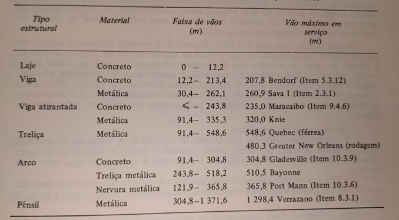

<!--Don't delete this script-->

<!--Don't delete this script-->

<h1>Sistema Estrutural e seu Pré-Dimensionamento</h1> 

  Segundo O’Connor <a href="#ref1">[1]</a> a seleção do material e esquema estrutural é uma tarefa complexa e só pode ser determinado considerando-se todos os fatores que afetam o projeto de cada sistemas estrutural em particular. Para isso o mesmo apresenta a Figura. <a href="#fig1">1</a> algumas estruturas em função do seu material e tipologia do sistema, sendo o destaque dessa tabela o máximo vão em serviço utilizado em cada um dos sistemas.

 

<b>Figura 1.</b> Comprimento de vão para vários tipos de superestruturas <a href="#ref1">[1]</a>.

 

  De acordo com Areias Neto <a href="#ref2">[2]</a>, para a fixação do comprimento da ponte, deve-se levar em conta aspectos relacionados a seção de vazão necessária e ao projeto da estrada (perfil longitudinal).
	  
	Araújo <a href="#ref3">[3]</a> afirma que esse traçado de pontes em pequenos rios é definida pelo projetista da estrada quando da elaboração do traçado da via. Entretanto, quando a via cruza médios ou grandes rios a posição da ponte pode determinar o traçado da via. Nesse caso, segue alguns critérios para a posição da ponte:
	  
	<ul>
		<li>Transpor o canal principal ou vale no local mais estreito possível e mais próximo ao traçado original da via;</li>			 
		<li>O canal principal deve ser transposto, de preferência, perpendicularmente à direção do escoamento do rio;</li> 
		<li>No caso de ponte esconsa deve-se evitar eixos de pilares no meio do rio onde a velocidade de escoamento d’água é maior, diminuindo a erosão localizada na base do pilar (Figura. <a href="#fig2">2</a> );</li> 
		<li>Deve-se evitar transpor um rio logo após a região onde deságua um afluente (Figura. <a href="#fig3">3</a>). A melhor posição para transposição do rio é mais a jusante da região onde deságua seu afluente;</li> 
    <li>Evitar transpor em locais onde possa haver, ao longo da vida útil da estrutura, mudanças na seção transversal do rio;</li> 
    <li>Quando do cruzamento de rios de pequena vazão, é recomendável evitar curvas para transposição desses rio.</li>
	</ul>

 

<b>Figura 2.</b> Erosão localizada na base de um pilar e contato com a água <a href="#ref3">[3]</a>.

 

<b>Figura 3.</b> Transposição de rio com afluente <a href="#ref3">[3]</a>.

 

<h2>Algumas especificações para longarinas</h2>

  Nesse texto iremos abordar os sistemas em Concreto Armado com solução de vigas de eixo reto. Para tanto será necessário algumas proposições de pré-dimensionamento do sistema estrutural. Aqui será apresentado o pré-dimensionamento para soluções em viga apoiada e viga contínua. 
	  
	Areias Neto <a href="#ref2">[2]</a> indica para sistemas simplesmente apoiados o seguinte valor de vão: 
	  
	𑙠≤ 25 𑚠&nbsp;&nbsp;&nbsp;&nbsp;&nbsp;&nbsp;&nbsp;&nbsp;&nbsp;&nbsp;&nbsp;&nbsp;&nbsp;&nbsp;&nbsp;&nbsp;&nbsp;&nbsp;&nbsp;&nbsp; Recomendação para pontes rodoviárias em concreto armado  
	â„ğ‘™ğ‘œğ‘›ğ‘” > 𝑙/14 &nbsp;&nbsp;&nbsp;&nbsp;&nbsp;&nbsp;&nbsp;&nbsp;&nbsp;&nbsp;&nbsp;&nbsp;&nbsp;&nbsp;&nbsp; Manual DNIT <a href="#ref4">[4]</a>
    
 	ğ‘ğ‘¤,𝑙𝑜𝑛𝑔 ≥ 25 𝑐𝑚 &nbsp;&nbsp;&nbsp;&nbsp;&nbsp;&nbsp;&nbsp;&nbsp;&nbsp; Manual DNIT <a href="#ref4">[4]</a> 
	 
 	No caso de soluções isostáticas com balanços (Figura. <a href="#fig4">4</a>) a recomendação de Areias Neto <a href="#ref2">[2]</a> é:
    
  𝑙/5 ≤ 𝑎 ≤ 𝑙/2 &nbsp;&nbsp;&nbsp;&nbsp;&nbsp;&nbsp;&nbsp;&nbsp; Valor similar ao apresentado por DNIT <a href="#ref4">[4]</a>

 

<b>Figura 4.</b> Viga isostática com balanço <a href="#ref2">[2]</a>.

 

  Araújo <a href="#ref3">[3]</a> replica algumas recomendações extras de DNIT <a href="#ref4">[4]</a> para o uso dos balanços:
 	  
    <ul>
      <li>Aterro com altura limitada a oito metros, ou menos;</li> 
      <li>Aterro de acesso executado antes da obra de arte;</li> 
      <li>Balanço (a) com comprimento máximo de 7,5 m e sua flecha deverá ser menor que 2 cm;</li> 
      <li>Deve-se usar laje de transição de comprimento mínimo de 4 m.</li>
	</ul>
	 
 	Em sistema de viga contínua Areias Neto <a href="#ref3">[3]</a> faz as seguintes recomendações:
    
  a) Vigas contínuas com dois vãos:

 

<b>Figura 5.</b> Viga contínua com dois vãos <a href="#ref2">[2]</a>.

  As mediidas da Figura. <a href="#fig5">5</a> são: 
  𝑙1 = 𝑙2  
  ğ‘ = 𝑙1/4

 

<b>
  b)  Vigas contínuas com três e quatro vãos:
</b>

 

<b>Figura 6.</b> Geometria da viga contínua <a href="#ref2">[2]</a>.

  As mediidas da Figura. <a href="#fig6">6</a> são:  
  0,60.𝑙2≤  𝑙1 ≤ 0,80.𝑙2 
  ğ‘ = 𝑙1/4

 

<h2>Algumas especificações para tabuleiro e lajes em balanço</h2>

  Quanto a seção transversal de lajes o manual do DNIT <a href="#ref4">[4]</a> de obras de arte apresenta a Tabela. <a href="#tab1">1</a>.

 

<table>
    <tr>
        <th colspan = "">
          &nbsp;&nbsp;&nbsp;&nbsp;&nbsp;&nbsp;&nbsp;&nbsp;&nbsp;&nbsp;&nbsp;&nbsp;&nbsp;&nbsp;&nbsp;&nbsp;&nbsp;&nbsp;&nbsp;&nbsp;&nbsp;Vão da Laje (m)&nbsp;&nbsp;&nbsp;&nbsp;&nbsp;&nbsp;&nbsp;&nbsp;&nbsp;&nbsp;&nbsp;&nbsp;&nbsp;&nbsp;&nbsp;&nbsp;&nbsp;&nbsp;&nbsp;
         </th> 
         <th colspan = "">
           &nbsp;&nbsp;&nbsp;&nbsp;&nbsp;&nbsp;&nbsp;&nbsp;&nbsp;&nbsp;&nbsp;&nbsp;&nbsp;&nbsp;&nbsp;&nbsp;&nbsp;&nbsp;&nbsp;&nbsp;&nbsp;&nbsp;Espessura da Laje (cm)&nbsp;&nbsp;&nbsp;&nbsp;&nbsp;&nbsp;&nbsp;&nbsp;&nbsp;&nbsp;&nbsp;&nbsp;&nbsp;&nbsp;&nbsp;&nbsp;&nbsp;&nbsp;&nbsp;&nbsp;&nbsp;
         </th> 
    </tr>  
     <tr>
        <th coslpan = "">
           2
         </th>  
         <th>
           15
         </th>
    </tr>  
     <tr>
        <th >
           3
         </th>       
         <th>
           18
         </th>
    </tr> 
     <tr>
        <th >
          4
         </th>    
         <th>
           20
         </th>
    </tr> 
    <tr>
        <th >
           5
         </th>    
         <th>
          22
         </th>
    </tr> 
    <tr>
        <th >
        6
         </th>    
         <th>
          25
         </th>
    </tr> 
</table>

<b>Tabela 1.</b> Espessura da laje [4].<a href="#ref2">[2]</a>.

 

  DNIT <a href="#ref4">[4]</a> afirma que em concreto armado convencional as lajes são utilizadas para vãos até 15 metros, com relação altura/vão da ordem de 1/15, em vãos isostáticos, e 1/20 e 1/24, em vãos contínuos.
    
  A norma regulamentadora NBR 7187 <a href="#ref5">[5]</a>, traz as seguintes exigências quanto as dimensões dos elementos estruturais nas pontes:
	  
	Nas lajes maciças as dimensões mínimas são:
	  
	<ul>
		<li>Lajes destinadas à passagem de tráfego ferroviário: h ≥20 cm;</li>
		<li>Lajes destinadas à passagem de tráfego rodoviário: h ≥15 cm;</li>
		<li>Demais casos: h ≥12 cm.</li>
	</ul>

 

<h2>O gabarito da pontes</h2>

  De acordo com Pfeil <a href="#ref6">[6]</a>, os gabaritos são denominados os conjuntos de espaços livres que deve apresentar o projeto de uma ponte para atender o seu intuito. De uma forma geral, pode-se especificar os gabaritos quanto a finalidade de implantação da estrutura, tais como:
	  
	(a) Estruturas construídas sobre rodovias: Devem respeitar espaços livres, necessário para tráfego de caminhões (Figura. <a href="#fig7">7</a>).

 

<b>Figura 7.</b> Gabarito para obras de arte sobre rodovias – (a) rodovia de pista simples e (b) rodovia de pista dupla <a href="#ref6">[6]</a>.

 

  (a) Estruturas construídas sobre ferrovias: Devem respeitar espaços livres, necessário para tráfego de trens (Figura. <a href="#fig8">8</a> ).

 

<b>Figura 8.</b> Gabarito para obras de arte sobre ferrovias – (a) rodovia de pista simples e (b) rodovia de pista dupla <a href="#ref6">[6]</a>.

 

  (a) Estruturas construídas sobre vias navegáveis: Para vias navegáveis a chatas e rebocadores, é comum prever-se a altura livre de 3,50m a 5,0m acima do nível máximo de cheia. A largura deve atender no mínimo a largura máxima da embarcação mais 1,m (Figura. <a href="#fig9">9</a>).
 	  
  Para estruturas construídas sobre vias não navegáveis normalmente se estabelece uma altura livre de 2 m acima do nível de máxima cheia. 
	  
	Na Figura. <a href="#fig9">9</a> é apresentado o gabarito da ponte sobre o Rio Paraguai em Cáceres-MT, com gabarito de 30 m de largura por 12 m de altura sobre nível máximo de cheia das águas.

 

<b>Figura 9.</b> Exemplo de ponte com gabarito de navegação 35,00m x 12,00m <a href="#ref6">[6]</a>.

 

<h2>Algumas especificações para os pilares e aparelhos de apoio</h2>

  O desenvolvimento do pré-dimensionamento dos pilares e dos aparelhos de apoio para uma ponte é dependente da previsão de cargas nessas estruturas. Após isso as condições de pré-dimensionamento do pilar por exemplo segue as mesmas observações impostas para os elementos de estruturas prediais normalmente estudadas nas disciplinas de concreto armado.
	  
	<b>a) Pré-dimensionamento dos pilares:</b>

<table align = "center" border = "1">
       <tr>
        <th>
	        N*d = 𛼠. N*k
        </th>
        <th rowspan = "2">
	        𛼠= 1,8 – Pilares intermediários;  
          𛼠= 2,2 – Pilares de extremidade;  
          𛼠= 2,5 – Pilares de canto.  
        </th>
    </tr>
    <tr>
        <th >
         𝐴_𝑐=(1,50〖.𝑁〗_𝑑^∗)/(0,50.𝑓_𝑐𝑘+0,42)≥360 〖𝑐𝑚〗^2
         </th>            
    </tr>      
</table>
 

  𝐴_𝑐: Área da seção de concreto do pilar ("cm²");
	  
	𝑁_𝑑: Força normal aproximada de cálculo (kN);
	  
	𝑓_𝑐𝑘: Resistência característica de cálculo ("kN/cm²").
	  
	É recomendável que a verificação das dimensões do pilares sejam verificadas após a previsão das dimensões dos aparelhos de apoio visto que estes devem se encaixar dentro dos pilares
	   
	<b>b) Pré-dimensionamento dos aparelhos de apoio em Neoprene:</b>
	  
	Para o pré-dimensionamento e dimensionamento dos aparelhos de apoio será utilizada a NBR 9062 <a href="#ref7">[7]</a> e descrições do tópico 7.2.1.6 e no Anexo A.
 	<ul>
		<li>Tensão limitante para aparelhos de apoios simples: 𝜎_𝑘=(ğ‘_𝑘^∗)/(ğ‘.ğ‘)≤7 𝑀𝑃𝑎. Onde a (menor dimensão em planta) e b designam as dimensões em planta do aparelho;</li>  
		<li>Tensão limitante para aparelhos de apoios fretados: 
		  
		ğ‘ ≤ 15 𝑐𝑚 reflete ğœğ‘˜ ≤ 8 𝑀𝑃𝑎
		  
		15 𝑐𝑚 < ğ‘ ≤2 0 𝑐𝑚 e ğœğ‘˜ ≤ 11 𝑀𝑃𝑎
		  
		20 𝑐𝑚 <ğ‘ ≤30 𝑐𝑚 e ğœğ‘˜ ≤ 12,5 𝑀𝑃𝑎
		  
		ğ‘ > 30 𝑐𝑚 e ğœğ‘˜ ≤ 15 𝑀𝑃𝑎
		</li>
	</ul>
	 
 	Em relação a altura é necessário estabelecer diversos critérios relativos ao dimensionamento do aparelho, para uma verificação inicial vamos estabelecer a proposição da NBR 9062 <a href="#ref7">[7]</a> que promove a dispensa da verificação de estabilidade da almofada.
    
  â„ğ‘ğ‘™ğ‘šğ‘œğ‘“ğ‘ğ‘‘ğ‘ ≤ ğ‘ / 5

 

<h1>Lançamento Estrutural</h1>

  Para o lançamento estrutural o primeiro dado que o engenheiro estrutural tem acesso é o levantamento topográfico (Figura. <a href="#fig10">10</a>) fornecido pela concessionária responsável pelo projeto. Após a visualização do estaqueamento e do eixo para colocação da ponte é necessário realizar um estudo hidrológico para determinação da Altura de Máxima Cheia.

 

<b>Figura 10.</b> Croqui da trajetória do leito do rio e também marcação do estaqueamento.

 

<b>Tabela 2.</b> Determinação da vazão de projeto e cota referente a máxima cheia <a href="#ref3">[3]</a>. 
  
Dados do projeto de Araújo <a href="#ref3">[3]</a>:
	  
	Q = 691,02 𝑚3/ğ‘ 
	 
	Cota de fundo = 208,678 (m)

 

 Onde: 
           <ul style = "text-align:left">
           		<li>
<b>Q</b> = Vazão (m3 / s);
</li>
                <li>
<b>A</b> = Área da seção molhada (m2;
</li>
                <li>
<b>K</b> = Coeficiente de rugosidade de Strickler;
</li>
                <li>
<b>n</b> = Coeficiente de rugosidade de Manning;
</li>
                <li>
<b>V</b> = CoVelocidade de escoamento (m/s);
</li>
                <li>
<b>R</b> = Raio hidráulico 9m) -> <b>R = A/P</b> (P = Perímetro molhado);
</li>
                <li>
<b>J</b> = Declividade do fundo (m/m).
</li>
           </ul>

 
 

<b>Figura 11.</b> Elevação longitudinal com a marcação do estaqueamento e MCC.

 

<h3>Bibliografia</h3>

<table>
    <thead>
        <tr>
            <th>ID</th>
            <th>Referências</th>
        </tr>
    </thead>
    <tbody>
        <tr>
            <td>
[1]
</td>
            <td>
C. O’Connor, Pontes - Superestruturas, vol. 1, 2 vols. LTC, 1976.
</td>
        </tr>
        <tr>
            <td>
[2]
</td>
            <td>
A. C. de Areias Neto, Projeto e Cálculo de Pontes de Concreto Armado, vol. 1. Rio de Janeiro: IME, 1977.
</td>
        </tr>
        <tr>
            <td>
[3]
</td>
            <td>
D. de L. Araújo, Projeto de ponte em concreto armado com duas longarinas, 2o ed. Goiânia: UFG, 2018.
</td>
        </tr>
        <tr>
            <td>
[4]
</td>
            <td>
Departamento Nacional de Infraestrutura de Transportes (DNIT), Manual de Projeto de Obras de Arte Especiais. Brasília: Ministério da Infraestrutura, 1996.
</td>
        </tr>
        <tr>
            <td>
[5]
</td>
            <td>
Associação Brasileira de Normas Técnicas, NBR 7187: Projeto de pontes de concreto armado e de concreto protendido - Procedimento. Rio de Janeiro: ABNT, 2003.
</td>
        </tr>
        <tr>
            <td>
[6]
</td>
            <td>
W. Pfeil, Pontes Em Concreto Armado: elementos de Projeto, Solicitações e Superestrutura, vol. 1, 2 vols. Rio de Janeiro: LTC, 1990.
</td>
        </tr>
        <tr>
            <td>
[7]
</td>
            <td>
Associação Brasileira de Normas Técnicas, NBR 9062: Projeto e execução de estruturas de concreto pré-moldado. Rio de Janeiro: ABNT, 2017.
</td>
        </tr>
    </tbody>
</table>
