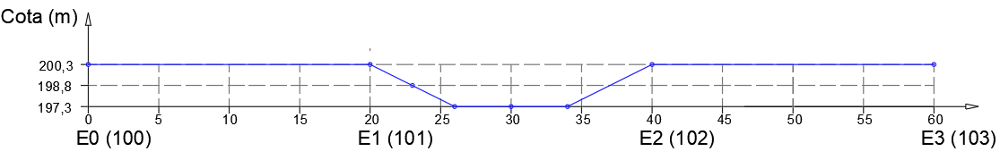

<!--Don't delete this script-->

<!--Don't delete this script-->

<h1>Determinação carregamento variável</h1> 

O carregamento variável que atua sobre a longarina é o carregamento do trem tipo brasileiro (TB-450) conforme descrito na ABNT NBR 7188 (2024). A carga móvel é constituída pelo veículo tipo de 450 kN e carga de multidão de 5 kN/m².
Considerando a seção da ponte exposta anteriormente e que a posição mais desfavorável é encostada na barreira de proteção em concreto armado. A <a href="#fig1">Figura 1</a> demarca a posição do veículo tipo na seção. 

<b><a href="#fig1">Figura 1</a>.</b> Posição do veículo tipo na seção.

De forma a obter as reações provocadas por este veículo na seção transversal da longarina aplica-se o conceito de linha de influência de reação para determinar esse carregamento. Portanto aplicando esse conceito chega-se a seguinte linha de influência:

(a) Linha para seção veículo + carga distribuída.

(b) Linha para seção somente carga distribuída.

<b><a href="#fig2">Figura 2</a>.</b> Linha de influência de reação de apoio na seção transversal da ponte.

Portanto é possível determinar as cargas que formaram o trem tipo atuante sobre a longarina(<i>P</i> pontual e <i>Q</i> distribuída) na seção conforme equações <a href="#eq1">(1)</a> e <a href="#eq2">(2)</a>.

<table style = "width:100%">
    <tr>
        <td style="width: 80%;">\[ P = p \cdot \delta \]</td>
        <td style="width: 10%;">
(1)
</td>
    </tr>
    <tr>
        <td style="width: 90%;">\[ Q = q \cdot A_{dig}\]</td>
        <td style="width: 10%;">
(2)
</td>
    </tr>
</table>

Onde:
<ul>
    <li>\( p \) é a carga pontual que atua na seção;</li>
    <li>\( \delta \) é a ordenada da linha de influência no abscissa da carga \(p\);</li>
    <li>\( q \) é a carga distribuída que atua na seção;</li>
    <li>\( A_{dig} \) é a área do diagrama da linha de influência.</li>
</ul>

Aplicando as equações chega-se então nas seguintes cargas para a seção veículo + carga de multidão e somente multidão:

<table style = "width:100%">
    <tr>
        <td style="width: 80%;">\[ P_{rodas} = 75 \cdot 1,227 + 75 \cdot 0,826 = 153,97 kN \]</td>
        <td style="width: 20%;">carga pontual</td>
    </tr>
    <tr>
        <td style="width: 80%;">\[ Q_{int} = \frac{3,67 \cdot 0,726}{2} \cdot 5 = 6,66 kN/m\]</td>
        <td style="width: 20%;">carga distribuída interna</td>        
    </tr>
    <tr>
        <td style="width: 80%;">\[ Q_{ext} = \frac{6,62 \cdot 1,327}{2} \cdot 5 = 21,96 kN/m\]</td>
        <td style="width: 20%;">carga distribuída externa</td>        
    </tr>
</table>

<b><a href="#fig3">Figura 3</a>.</b> Carga móvel que será aplicada na longarina.

Determinada a carga móvel que atuará na longarina utiliza-se o <i>software</i> Ftool para a determinação dos esforços de flexão. Aqui cabe a ressalva da aplicação dos coeficientes de amplificação dinâmica do carregamento. Portanto serão aplicados os coeficientes ponderação CIV, CNF e CIA conforme equações <a href="#eq1">(1)</a> a <a href="#eq4">(4)</a>:

<table style = "width:100%">
    <tr>
        <td style="width: 90%;">\[ CIV = 1 + 1,06 \cdot \left( \frac{20}{Liv + 50} \right), \quad \text{para estruturas com vãos entre } 10,0 \text{ m e } 200,0 \text{ m} \]</td>
        <td style="width: 10%;">
(3)
</td>
    </tr>
    <tr>
        <td style="width: 90%;">\[ CNF = 1 - 0,05 \times (n - 2) > 0,9 \]</td>
        <td style="width: 10%;">
(4)
</td>
    </tr>
    <tr>
        <td style="width: 90%;">\[ CIA = 1,25 \; \text{para concreto armado}, \; 1,15 \; \text{para est. metálicas}\]</td> 
        <td style="width: 10%;">
(5)
</td>
    </tr>
</table>

<ul>
    <li><i>Liv</i> é usado para estruturas de vão isostático. <i>Liv</i> é a média aritmética dos vãos nos casos de vãos contínuos;</li>
    <li><i>Liv</i> é o comprimento do próprio balanço para estruturas em balanço;</li>
    <li><i>Liv</i> é o vão, expresso em metros (m);</li>
    <li><i>n</i> é o número (inteiro) de faixas de tráfego rodoviário a serem carregadas sobre um tabuleiro transversalmente contínuo. Acostamentos e faixas de segurança não são faixas de tráfego da rodovia.
    </li>
</ul>

Determinando os coeficientes de ponderação chegamos aos seguintes valores:

<table style = "width:100%">
    <tr>
        <td style="width: 80%;">\[ CIV = 1 + 1,06 \cdot \left( \frac{20}{14 + 50} \right) = 1,33} \]</td>
    </tr>
    <tr>
        <td style="width: 80%;">\[ CNF = 1 \]</td>
    </tr>
    <tr>
        <td style="width: 90%;">\[ CIA = 1,25\]</td>  
    </tr>
    <tr>
        <td style="width: 90%;">\[ \phi = 1,33 \cdot 1 \cdot 1,25 = 1,66 \]</td>  
    </tr>
</table>

Com o valor o total dos coeficientes amplificadores dos efeitos chegamos as seguintes cargas finais:

<table style = "width:100%">
    <tr>
        <td style="width: 80%;">\[ P = 153,97 \cdot 1,66 = 255,6 \; kN\]</td>
    </tr>
    <tr>
        <td style="width: 80%;">\[ Q_{int} = 6,66 \cdot 1,66 = 11,05 \; kN/m \]</td>
    </tr>
    <tr>
        <td style="width: 90%;">\[ Q_{ext} = 21,96 \cdot 1,66 = 36,45 \; kN/m \]</td>  
    </tr>
</table>

<b><a href="#tab1">Tabela 1</a>.</b> Esforços de flexão nas seções de interesse considerando carga móvel.

<table style="width: 100%"><thead>
  <tr>
    <th>Seção</th>
    <th>x (m)</th>
    <th>Vmin (kN)</th>
    <th>Vmax (kN)</th>
    <th>Mmin (kN)</th>
    <th>Mmax (kN)</th>
  </tr></thead>
<tbody>
  <tr>
    <td>
B-0
</td>
    <td>
200,3
</td>
    <td>
200,3
</td>
    <td>
200,3
</td>
    <td>
200,3
</td>
    <td>
200,3
</td>
  </tr>
  <tr>
    <td>
B-0
</td>
    <td>
200,3
</td>
    <td>
200,3
</td>
    <td>
200,3
</td>
    <td>
200,3
</td>
    <td>
200,3
</td>
  </tr>
  <tr>
    <td>
B-0
</td>
    <td>
200,3
</td>
    <td>
200,3
</td>
    <td>
200,3
</td>
    <td>
200,3
</td>
    <td>
200,3
</td>
  </tr>
  <tr>
    <td>
B-0
</td>
    <td>
200,3
</td>
    <td>
200,3
</td>
    <td>
200,3
</td>
    <td>
200,3
</td>
    <td>
200,3
</td>
  </tr>
  <tr>
    <td>
B-0
</td>
    <td>
200,3
</td>
    <td>
200,3
</td>
    <td>
200,3
</td>
    <td>
200,3
</td>
    <td>
200,3
</td>
  </tr>
  <tr>
    <td>
B-0
</td>
    <td>
200,3
</td>
    <td>
200,3
</td>
    <td>
200,3
</td>
    <td>
200,3
</td>
    <td>
200,3
</td>
  </tr>
  <tr>
    <td>
B-0
</td>
    <td>
200,3
</td>
    <td>
200,3
</td>
    <td>
200,3
</td>
    <td>
200,3
</td>
    <td>
200,3
</td>
  </tr>
  <tr>
    <td>
B-0
</td>
    <td>
200,3
</td>
    <td>
200,3
</td>
    <td>
200,3
</td>
    <td>
200,3
</td>
    <td>
200,3
</td>
  </tr>
  <tr>
    <td>
B-0
</td>
    <td>
200,3
</td>
    <td>
200,3
</td>
    <td>
200,3
</td>
    <td>
200,3
</td>
    <td>
200,3
</td>
  </tr>
  <tr>
    <td>
B-0
</td>
    <td>
200,3
</td>
    <td>
200,3
</td>
    <td>
200,3
</td>
    <td>
200,3
</td>
    <td>
200,3
</td>
  </tr>
  <tr>
    <td>
B-0
</td>
    <td>
200,3
</td>
    <td>
200,3
</td>
    <td>
200,3
</td>
    <td>
200,3
</td>
    <td>
200,3
</td>
  </tr>
  <tr>
    <td>
B-0
</td>
    <td>
200,3
</td>
    <td>
200,3
</td>
    <td>
200,3
</td>
    <td>
200,3
</td>
    <td>
200,3
</td>
  </tr>
  <tr>
    <td>
B-0
</td>
    <td>
200,3
</td>
    <td>
200,3
</td>
    <td>
200,3
</td>
    <td>
200,3
</td>
    <td>
200,3
</td>
  </tr>
</tbody>
</table>
