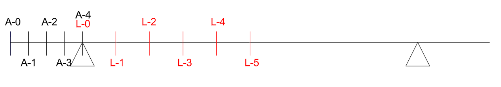

<!--Don't delete this script-->

<!--Don't delete this script-->

<h1>Fadiga</h1>

A fadiga pode ser definida como a alteração mecânica dos materiais sob o efeito de solicitações repetidas. As ações que causam fadiga são aquelas que produzem variações de solicitações com frequência relativamente alta. Dentre elas podem ser citadas: cargas móveis, ondas do mar, sismos, vento, variações de temperatura, congelamentos, etc. 

A fadiga é abordada pela NBR 6118 (ABNT, 2014) no item 23, com base nisso foram realizados os cálculos a seguir.

<ul>
  <li><i>M_{g}</i> = 1081,2 kN.m (Momento no meio do vão devido a carga permanente);</li>
  <li><i>M_{q,max}</i> = 2570,9 kN.m (Momento positivo no meio do vão devido a carga variável);</li>
  <li><i>M_{q,min}</i> = -156,9 kN.m (Momento negativo no meio do vão devido a carga variável);</li>
</ul>

Com base nesses momentos, foi realizada as combinações em serviço, adotando \psi_{1} = 0,5:

<table style = "width:100%">
    <tr>
        <td style="width: 80%;">\[ M_{sd,max} = M_{g} + M_{q,max} \cdot \psi_{1} = 2366,65 kN.m \]</td>
        <td style="width: 20%;">Combinação 1</td>  
    </tr>
    <tr>
        <td style="width: 80%;">\[ M_{sd,min} = M_{g} + M_{q,min} \cdot \psi_{1} = 1002,75 kN.m \]</td>
        <td style="width: 20%;">Combinação 2</td>        
    </tr>
</table>

Considerando a área de aço de 139 cm², conforme o dimensionamento de viga de seção T, pode-se realizar a verificação da fadiga.

Inicialmente calcula-se os coeficientes a_1, a_2 e a_3.

<table style = "width:100%">
    <tr>
        <td style="width: 80%;">\[ a_1 =  \frac{b_w}{2}= 0,225 \; m\]</td>
        <td style="width: 20%;"><b>a_1</b></td>
    </tr>
    <tr>
        <td style="width: 80%;">\[ a_2 = h_f \cdot (b_f - b_w) + \alpha_e - 1 \cdot \alpha_e \cdot A_s = 0,266 \; m²\]</td> 
        <td style="width: 20%;"><b>a_2</b></td>
    </tr>
    <tr>
        <td style="width: 80%;">\[ a_{g}:= -d^{\prime}\cdot(a_{g}-1)\cdot A_{s}^{\prime}-d\cdot a_{g}\cdot A_{s}-\frac{b_{f}}{2}\cdot(b_{f} b_{v})=-0.1386\,\mathrm{m}^{3} \]</td>
        <td style="width: 20%;"><b>a_3</b></td>
    </tr>
</table>

Logo é possível definir o carregamento permanente que atuará na ponte de concreto é de 54,41 kN/m.

<h1>Esforços</h1> 

Para determinação dos esforços será empregado o <i>software</i> Ftool. E neste lançamento estrutural serão definidas seções para determinação dos esforços. Será empregado uma divisão de <i>l/4</i> para os balanços e  <i>L/10</i> para o meio do vão.
  
Considerando o <i>fck</i> de 30 MPa e um agregado de granito o módulo de elasticidade secante do concreto (<i>Ec</i>). Os esforços finais são apresentados na <a href="#tab1">Tabela 1</a>. A <a href="#fig1">Figura 1</a> apresenta a distribuição das seções.

<b><a href="#fig1">Figura 1</a>.</b> Distribuição das seções da ponte.

 

<b><a href="#tab1">Tabela 1</a>.</b> Esforços de flexão simples para viga nas seções demarcadas.

<table style="width: 100%"><thead>
  <tr>
    <th>Seção</th>
    <th>x (m)</th>
    <th>Vg (kN)</th>
    <th>Mg (kN.m)</th>
  </tr></thead>
<tbody>
  <tr>
    <td>
A-0
</td>
    <td>
0
</td>
    <td>
0
</td>
    <td>
0
</td>
  </tr>
  <tr>
    <td>
A-1
</td>
    <td>
0,75
</td>
    <td>
-40,81
</td>
    <td>
-15,30
</td>
  </tr>
  <tr>
    <td>
A-2
</td>
    <td>
1,50
</td>
    <td>
-81,62
</td>
    <td>
-61,21
</td>
  </tr>
  <tr>
    <td>
A-3
</td>
    <td>
2,25
</td>
    <td>
-122,42
</td>
    <td>
-137,72
</td>
  </tr>
  <tr>
    <td>
A-4
</td>
    <td>
3,00
</td>
    <td>
-163,23
</td>
    <td>
-244,84
</td>
  </tr>
  <tr>
    <td>
L-0
</td>
    <td>
3,00
</td>
    <td>
380,87
</td>
    <td>
-244,84
</td>
  </tr>
  <tr>
    <td>
L-1
</td>
    <td>
4,40
</td>
    <td>
304,70
</td>
    <td>
235,05
</td>
  </tr>
  <tr>
    <td>
L-2
</td>
    <td>
5,80
</td>
    <td>
228,52
</td>
    <td>
608,30
</td>
  </tr>
  <tr>
    <td>
L-3
</td>
    <td>
7,20
</td>
    <td>
152,35
</td>
    <td>
874,91
</td>
  </tr>
  <tr>
    <td>
L-4
</td>
    <td>
8,60
</td>
    <td>
76,17
</td>
    <td>
1034,88
</td>
  </tr>
  <tr>
    <td>
L-5
</td>
    <td>
10,00
</td>
    <td>
0,00
</td>
    <td>
1088,20
</td>
  </tr>
</tbody>
</table>
