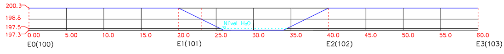
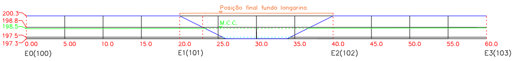

<!--Don't delete this script-->

<!--Don't delete this script-->

<h1>Determinação da máxima cheia e gabarito da ponte</h1> 

O primeiro passo na determinação do modelo estrutural é a confecção de um desenho geométrico em perfil longitudinal que contemple o estaqueamento e as suas cotas verticais. Isso permitirá que o projetista visualize o obstáculo a ser vencido e comece a efetuar o lançamento da ponte.
  
Para o caso deste projeto o perfil topográfico é dado conforme <a href="#fig1">Figura 1</a>.

<b><a href="#fig1">Figura 1</a>.</b> Perfil topográfico da estrada.

Considerando que a vazão de projeto é de 12,57 m²/s e o canal tem formato trapezoidal (conforme <a href="#fig2">Figura 2</a>) pode-se usar a formulação proposta nas equações <a href="#eq1">(1)</a> a <a href="#eq5">(5)</a>.

<b><a href="#fig2">Figura 2</a>.</b> Formato do canal em seção trapezoidal.

<table style = "width:100%">
    <tr>
        <td style="width: 80%;">\[ A = b \cdot h + m \cdot h^2 \]</td>
        <td style="width: 10%;">
(1)
</td>
    </tr>
    <tr>
        <td style="width: 90%;">\[ P = b + 2\cdot h  \cdot \sqrt{1+m^2} \]</td>
        <td style="width: 10%;">
(2)
</td>
    </tr>
    <tr>
        <td style="width: 90%;">\[ R = \frac{A}{P} \]</td>
        <td style="width: 10%;">
(3)
</td>
    </tr>
    <tr>
        <td style="width: 90%;">\[ V = \frac{1}{n} \cdot R^{2/3} \cdot J^{1/2} \]</td>
        <td style="width: 10%;">
(4)
</td>
    </tr>
    <tr>
        <td style="width: 90%;">\[ Q = V \cdot A \]</td>
        <td style="width: 10%;">
(5)
</td>
    </tr>
</table>

Onde:
  <ul>
    <li><i>A</i> é a área da seção transversal (m²);</li>
    <li><i>P</i> é o perímetro molhado (m);</li>
    <li><i>R</i> é o raio hidráulico (m);</li>
    <li><i>m</i> é a inclinação do talude do canal;</li>
    <li><i>n</i> é o coeficiente de rugosidade do canal;</li>
    <li><i>J</i> é a declividade do fundo do canal (m/m);</li>
    <li><i>V</i> é a velocidade no canal pelo modelo de Manning (m/s);</li>
    <li><i>Q</i> é a vazão no canal pelo modelo de Manning (m³/s).</li>
  </ul>

Aplicando a equação de Manning é possível obter a <a href="#tab1">Tabela 1</a> com algumas vazões em função da cota. No caso a declividade do talude do canal é de <i>m</i> = 2 m e a largura do canal é de <i>b</i> = 8 m.

<b><a href="#tab1">Tabela 1</a>.</b> Vazão no canal do exemplo.

<table style="width: 100%"><thead>
  <tr>
    <th>Cota (m)</th>
    <th>b (m)</th>
    <th>h (m)</th>
    <th>Área (m²)</th>
    <th>Perímetro molhado (m)</th>
    <th>Raio hidráulico (m)</th>
    <th>Velocidade (m/s)</th>
    <th>Vazão (m³/s)</th>
  </tr></thead>
<tbody>
  <tr>
    <td>
197,40
</td>
    <td>
8,00
</td>
    <td>
0,10
</td>
    <td>
\[ A = b \cdot h + m \cdot h^2 \;=\; 8 \cdot 0,10 + 2 \cdot 0,10^2 \;=\; 0,82 \]
</td>
    <td>
\[ P = b + 2 \cdot h  \cdot \sqrt{1+m^2} \;=\; 8 + 2 \cdot 0,10  \cdot \sqrt{1+2^2} \;=\;8,45 \]
</td>
    <td>
\[ R = \frac{A}{P} \;=\; \frac{0,82}{8,45} \;=\;0,097 \]
</td>
    <td>
\[ V = \frac{1}{n} \cdot R^{2/3} \cdot J^{1/2} \;=\; \frac{1}{0,03} \cdot 0,097^{2/3} \cdot 0,001^{1/2} \;=\; 0,22\]
</td>
    <td>
\[ Q = V \cdot A \;=\; 0,22 \cdot 0,82 \;=\; 0,18\]
</td>
  </tr>
  <tr>
    <td>
198,20
</td>
    <td>
8,00
</td>
    <td>
0,90
</td>
    <td>
8,82
</td>
    <td>
12,02
</td>
    <td>
0,73
</td>
    <td>
0,86
</td>
    <td>
7,56
</td>
  </tr>
  <tr>
    <td>
<b>198,50</b>
</td>
    <td>
<b>8,00</b>
</td>
    <td>
<b>1,20</b>
</td>
    <td>
<b>12,48</b>
</td>
    <td>
<b>13,37</b>
</td>
    <td>
<b>0,93</b>
</td>
    <td>
<b>1,01</b>
</td>
    <td>
<b>12,57</b>
</td>
  </tr>
  <tr>
    <td>
199,10
</td>
    <td>
8,00
</td>
    <td>
1,80
</td>
    <td>
20,88
</td>
    <td>
16,05
</td>
    <td>
1,3
</td>
    <td>
1,26
</td>
    <td>
26,23
</td>
  </tr>
</tbody>
</table>

Considerando o cálculo efetuado na <a href="#tab1">Tabela 1</a> é possível determinar as posições da cota do nível d'água para a Máxima Cheia Calculada (M.C.C.) e também determinar a altura mínima que respeitará o gabarito imposto pela concessionária que é de 2 metros. Com isso é possível construir a <a href="#fig2">Figura 2</a>.

<b><a href="#fig2">Figura 2</a>.</b> Perfil topográfico da estrada com a demarcação da posição da estrutura e nível d'água na Máxima Cheia Calculada.

Após a verificação da Máxima Cheia Calculada e então detalhamento do posicionamento da ponte é possível estabelecer que a ponte precisará vencer um vão de 20 metros.

