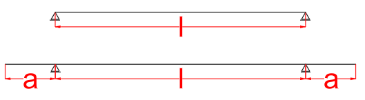
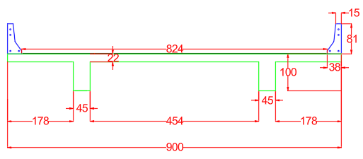

<!--Don't delete this script-->

<!--Don't delete this script-->

<h1>Longarina</h1> 

Determinado o vão da ponte é necessário estabelecer o sistema estrutura que será utilizado. Conforme estabelecido nas diretrizes do projeto o modelo será de uma ponte moldada no local com modelo estrutural isostático conforme <a href="#fig1">Figura 1</a>.

<b><a href="#fig1">Figura 1</a>.</b> Possíveis soluções estruturais para a longarina no projeto exemplo.

Para determinação das dimensões da superestrutura será empregada as recomendações do professor Areias Neto (1977) e pelo Manual de Projeto de Obras de Arte Especiais do extinto Departamento Nacional de Estradas de Rodagem (DNER, 1996). As equações <a href="#eq1">(1)</a> a <a href="#eq3">(3)</a> apresentam estes limites para determinação das dimensões do elemento de longarina.

<table style = "width:100%">
    <tr>
        <td style="width: 70%;">\[ \frac{l}{5} \leq  a \leq  \frac{l}{2} \]</td>
        <td style="width: 20%;">vão do elemento de balanço</td>
        <td style="width: 10%;">
(1)
</td>
    </tr>
    <tr>
        <td style="width: 70%;">\[ h \geq  \frac{l}{14} \]</td>
        <td style="width: 20%;">altura da longarina</td>        
        <td style="width: 10%;">
(2)
</td>
    </tr>
    <tr>
        <td style="width: 70%;">\[ \geq \begin{cases}
                                    & b_w = 25 cm\\
                                    & b_w = l/50 \;\; \text{item 15.10 NBR 6118}\\
                                    & b_w = 0.40 \cdot h \;\; \text{item 15.10 NBR 6118}
                                    \end{cases} \]</td>
        <td style="width: 20%;">largura da longarina</td>
        <td style="width: 10%;">
(3)
</td>
    </tr>
</table>

O modelo estrutural empregado será o de viga isostática com balanços. Portanto aplicando as equações <a href="#eq1">(1)</a> a <a href="#eq3">(3)</a> obtém-se as dimensões da longarina. No caso, para um vão de 20 m, o comprimento <i>a</i> do balanço será determinado conforme um processo iterativo:

<table style = "width:100%">
    <tr>
        <td style="width: 70%;">\[ \frac{18}{5} = 3,6 m \leq  1 m \leq \frac{18}{2} = 9 m \]</td>
        <td style="width: 30%;">tentativa 1 (<i>a</i> = 1 m; <i>l</i> = 18 m)</td>
    </tr>
    <tr>
        <td style="width: 70%;">\[ \frac{16}{5} = 3,2 m \leq  2 m \leq \frac{16}{2} = 8 m \]</td>
        <td style="width: 30%;">tentativa 2 (<i>a</i> = 2 m; <i>l</i> = 16 m)</td>        
    </tr>
    <tr>
        <td style="width: 70%;">\[ \frac{14}{5} = 2,8 m \leq  3 m \leq \frac{14}{2} = 7 m \]</td>
        <td style="width: 30%;">tentativa 3 (<i>a</i> = 3 m; <i>l</i> = 14 m)</td>
    </tr>
</table>

Para este valor de valor de vão a altura da longarina será de 1 m (<i>h</i>=14/14=1 m). A largura adotada será calculada conforme a seguir:

<table style = "width:100%">
    <tr>
        <td style="width: 70%;">\[ \geq \begin{cases}
                                    & b_w = 0.25 m\\
                                    & b_w = 14/50 = 0.28 m \;\; \text{item 15.10 NBR 6118}\\
                                    & b_w = 0.40 \cdot 1.00 = 0.40 m\;\; \text{item 15.10 NBR 6118}
                                    \end{cases} \]</td>
    </tr>
</table>

Portanto o valor adotado para largura será de 0,45 m ou 45 cm.

<h1>Seção completa</h1> 

A solução de duas longarinas apoiadas em pórticos de vigas e pilares de concreto armado será adotada neste projeto. A normativa do DNER (1996) define que a largura máximo entre duas longarinas pode variar de 7 a 8 m. 
  
Considerando a estrutura unifilar será adotado neste projeto um vão entre longarinas de 5 m e balanços de 2 m. Para estes valores a recomendação de altura do tabuleiro é de 0,22 m conforme informado no item 3.3.5.3 do manual DNER (1996). A <a href="#fig2">Figura 2</a> apresenta a solução final nesta etapa.

<b><a href="#fig2">Figura 2</a>.</b> Solução para seção transversal da ponte sem a transversina.

Conforme o item 14.6.2.4 da ABNT NBR 6118 (2023) o vão efetivo de uma laje deverá ser o menor valor entre a soma do vão interno mais 2 vezes 30% da altura da laje ou a soma do vão interno mais 2 vezes 50% do elemento de apoio. Logo podemos afirmar que no ato do dimensionamento do elemento isolado tabuleiro será empregada um vão inferior a 5m. Portanto, reduziremos a altura da laje para 21 cm visto que o DNER (1996) recomenda 0,20 m para vão de 4 m. Logo o desenho pode ser atualizado para as seguintes dimensões: 

<b><a href="#fig3">Figura 3</a>.</b> Solução para seção transversal da ponte sem a transversina atualizada.

Para finalizar o esboço da seção transversal será posicionada três transversinas no projeto da ponte. Uma no meio do vão e as outras uma em cada apoio. Essas transversinas serão engastadas nas longarinas e desacopladas das lajes. Elas deverão possuir altura superior a <i>l/8=5/8=0,625 m≈0,65 m</i>. A largura padrão dessa viga seguirá o valor mínimo obtido anteriormente e será de 0,40 m.

<b><a href="#fig4">Figura 4</a>.</b> Detalhe da seção considerando a transversina de apoio.

