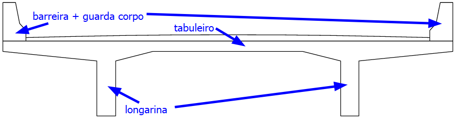

<!--Don't delete this script-->

<!--Don't delete this script-->

<h1>Longarina</h1> 

Determinado o vão da ponte é necessário estabelecer o sistema estrutura que será utilizado. Conforme estabelecido nas diretrizes do projeto o modelo será de uma ponte moldada no local e com modelo estrutural isostático conforme <a href="#fig1">Figura 1</a>.

<b><a href="#fig1">Figura 1</a>.</b> Possíveis soluções estruturais para a longarina no projeto exemplo.

Para determinação das dimensões da superestrutura será empregada as recomendações do professor Areias Neto e da normativa do DNIT. As equações <a href="#eq1">(1)</a> a <a href="#eq3">(3)</a> apresentam estes limites para determinação das dimensões do elemento de longarina.

<table style = "width:100%">
    <tr>
        <td style="width: 70%;">\[ \frac{l}{5} \leq  a \leq  \frac{l}{2} \]</td>
        <td style="width: 20%;">vão do elemento de balanço</td>
        <td style="width: 10%;">
(1)
</td>
    </tr>
    <tr>
        <td style="width: 70%;">\[ h \geq  \frac{l}{14} \]</td>
        <td style="width: 20%;">altura da longarina</td>        
        <td style="width: 10%;">
(2)
</td>
    </tr>
    <tr>
        <td style="width: 70%;">\[ b \geq  25 cm \]</td>
        <td style="width: 20%;">largura da longarina</td>
        <td style="width: 10%;">
(3)
</td>
    </tr>
</table>

O modelo estrutural empregado será o de viga isostática com balanços. Portanto aplicando as equações <a href="#eq1">(1)</a> a <a href="#eq3">(3)</a> obtém-se as dimensões da longarina. No caso, para um vão de 20 m, o comprimento <i>a</i> do balanço será determinado conforme um processo iterativo:

<table style = "width:100%">
    <tr>
        <td style="width: 70%;">\[ \frac{18}{5} = 3,6 m \leq  1 m \leq \frac{18}{2} = 9 m \]</td>
        <td style="width: 30%;">tentativa 1 (<i>a</i> = 1 m; <i>l</i> = 18 m)</td>
    </tr>
    <tr>
        <td style="width: 70%;">\[ \frac{16}{5} = 3,2 m \leq  2 m \leq \frac{16}{2} = 8 m \]</td>
        <td style="width: 30%;">tentativa 2 (<i>a</i> = 2 m; <i>l</i> = 16 m)</td>        
    </tr>
    <tr>
        <td style="width: 70%;">\[ \frac{14}{5} = 2,8 m \leq  3 m \leq \frac{14}{2} = 7 m \]</td>
        <td style="width: 30%;">tentativa 3 (<i>a</i> = 3 m; <i>l</i> = 14 m)</td>
    </tr>
</table>

A largura adotada será a mínima de 0,25 m e a altura será de 1,0 m visto que o vão central é de 14 metros \( \left( h=14/14 = 1 m \right) \).

<h1>Tabuleiro</h1> 

Agora para definir a seção da ponte será utilizada a solução de duas longarinas apoiadas em pórticos de vigas e pilares de concreto armado. A normativa do DNIT define que a largura máxima entre vigas é de 7,00 m. Para este projeto utilizaremos a proporção de cerca de 22% da largura da seção para balanços e 56% para o vão principal do tabuleiro. O formato deste tabuleiro é apresentado na <a href="#fig2">Figura 2</a>.

<b><a href="#fig2">Figura 2</a>.</b> Solução para seção transversal da ponte.

Empregando as proporções citadas anteriormente adotou-se um vão de 5,00 m entre longarinas e balanços de 2,00 m. Conforme manual do DNIT, para um vão de 5 m, considera-se uma espessura do tabuleiro de 0,22 m. A <a href="#fig3">Figura 3</a> detalha esta seção transversal em concreto armado.

<b><a href="#fig3">Figura 3</a>.</b> Detalhe com as dimensões da seção considerando os elementos de proteção.

<h1>Transversinas</h1> 

Serão adicionadas duas transversinas desconectadas da laje na região dos apoios e será adicionada uma tranversina no meio do vão central de forma a enrijecer a estrutura como um todo. Para um vão de 5 metros e utilizando os conceitos de estruturas de concreto armado a altura da viga será maior que <i>L/10</i>. No caso a altura da transversina será delimitada inicialmente em 0,60 m e com largura de 0,20 m conforme <a href="#fig4">Figura 4</a>.

<b><a href="#fig4">Figura 4</a>.</b> Detalhe da seção considerando a transversina de apoio.

