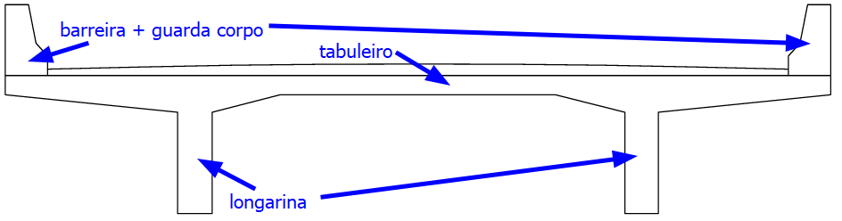

<!--Don't delete this script-->

<!--Don't delete this script-->

<h1>Longarina</h1> 

Determinado o vão da ponte é necessário estabelecer o sistema estrutura que será utilizado nesta ponte. Conforme estabelecido nas diretrizes do projeto o modelo será de uma ponte moldada no local e com uma estrutura isostática conforme <a href="#fig1">Figura 1b</a>.

(a) Solução isostática sem balanço

(b) Solução isostática com balanço

<b><a href="#fig1">Figura 1</a>.</b> Possíveis soluções estruturais para a longarina no projeto exmeplo.

Para determinação das dimensões da superestrutura será empregada as recomendações do professor Areas Neto e da normativa do DNIT. As equações <a href="#eq1">(1)</a> a <a href="#eq3">(3)</a> apresentam estes limites para determinação das dimensões do elemento de longarina.

<table style = "width:100%">
    <tr>
        <td style="width: 80%;">\[ ch_{a,k} = 0.50 \cdot p_{0,k}^{t} + 0.50 \cdot p_{1,k}^{t}\]</td>
        <td style="width: 10%;">vão do elemento de balanço</td>
        <td style="width: 10%;">
(1)
</td>
    </tr>
    <tr>
        <td style="width: 90%;">\[ ch_{b,k} = 1.50 \cdot p_{0,k}^{t} - 0.50 \cdot p_{1,k}^{t}\]</td>
        <td style="width: 10%;">altura da longarina</td>        
        <td style="width: 10%;">
(2)
</td>
    </tr>
    <tr>
        <td style="width: 90%;">\[ ch_{c,k} = -0.50 \cdot p_{0,k}^{t} + 1.50 \cdot p_{1,k}^{t}\]</td>
        <td style="width: 10%;">largura da longarina</td>
        <td style="width: 10%;">
(3)
</td>
    </tr>
</table>

Aplicando as equações <a href="#eq1">(1)</a> a <a href="#eq3">(3)</a> obtém-se as dimensões da longarina. No caso para o comprimento <i>a</i> do balanço será adotado um processo iterativo:

<table style = "width:100%">
    <tr>
        <td style="width: 80%;">\[ ch_{a,k} = 0.50 \cdot p_{0,k}^{t} + 0.50 \cdot p_{1,k}^{t}\]</td>
        <td style="width: 10%;">tentativa 1</td>
    </tr>
    <tr>
        <td style="width: 90%;">\[ ch_{b,k} = 1.50 \cdot p_{0,k}^{t} - 0.50 \cdot p_{1,k}^{t}\]</td>
        <td style="width: 10%;">tentativa 2</td>        
    </tr>
    <tr>
        <td style="width: 90%;">\[ ch_{c,k} = -0.50 \cdot p_{0,k}^{t} + 1.50 \cdot p_{1,k}^{t}\]</td>
        <td style="width: 10%;">tentativa 3</td>
    </tr>
</table>

A largura adotada será a mínima de 0,25 m e e então a altura será de 1,0 m \( \left( h=14/14 = 1 m \right) \).

<h1>Tabuleiro</h1> 

Agora para definir a seção da ponte será utilziada a solução de duas longarinas apoiadas em pórticos de pilares de concreto. A normativa do DNIT definie que a largura máxima entre vigas é de 7 m. Para este projeto utilziaremos a proporção de 40% da largura da seção para balanços e 60% para o vão principal do tabuleiro. O formato deste tabuleiro é apresentado na Figura <a href="#fig2">2</a>.

<b><a href="#fig2">Figura 2</a>.</b> Solução para seção transversal da ponte.

Empregando as porporções citadas anteriormente temos um vão de 5,40 m (60% de 9 m) entre vigas e balanços de 1,80 m. Com isso chegamos a seguinte seção transversal que considera uma largura de tabuleiro de 0,22 m. A Figura <a href="#fig3">3</a> detalha esta seção.

<b><a href="#fig3">Figura 3</a>.</b> Detalhe com as dimensões da seção.
