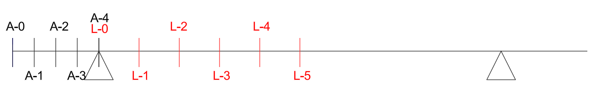
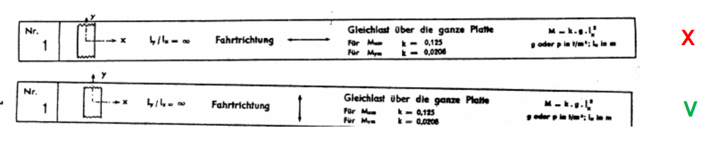
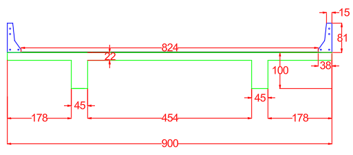
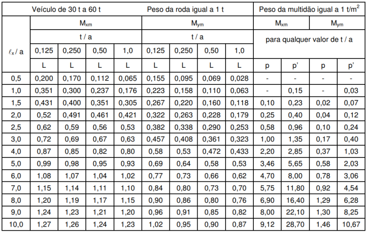

<!--Don't delete this script-->

<!--Don't delete this script-->

<h1>Determinação carregamento permanente</h1> 

O carregamento permanente advém da determinação da área da seção transversal dos elementos que compõem a seção da ponte. O carregamento permanente advém da determinação da área da seção transversal dos elementos que compõem a seção da ponte. 

As densidades dos materiais empregados para essa análise são:

<ul>
  <li><i>γc</i> = 25 kN/m³ para peças de concreto armado (aplica-se a barreira e seção da ponte);</li>
  <li><i>γpavto</i> = 24 kN/m³ para o pavimento flexível.</li>
</ul>

Áreas que compõem a seção:

<table style = "width:100%">
    <tr>
        <td style="width: 80%;">\[ A_c = 2 \cdot \left(1 \cdot 0,45\right) + 2 \cdot \left(1,78 \cdot 0,21\right) + 4,54 \cdot 0,21 = 2,60 m² \]</td>
        <td style="width: 20%;">Tabuleiro + longarina</td>
    </tr>
    <tr>
        <td style="width: 80%;">\[ A_{barreira} = 0,19 \; m² \]</td>
        <td style="width: 20%;">Barreira de concreto</td>        
    </tr>
    <tr>
        <td style="width: 80%;">\[ A_{pavto} = 8,24 \cdot 0,08 = 0,66 \; m² \]</td>
        <td style="width: 20%;">Pavimento flexível</td>
    </tr>
</table>

O valor total do carregamento atuante na seção é dado a seguir:

<table style = "width:100%">
    <tr>
        <td style="width: 80%;">\[ g_{pp} =  \frac{2,60}{2} \cdot 25 = 32,50 \; kN/m\]</td>
        <td style="width: 20%;">Longarina + tabuleiro</td>
    </tr>
    <tr>
        <td style="width: 80%;">\[ g_{barreira} = 0,19 \cdot 25 = 4,75 \; kN/m\]</td>
        <td style="width: 20%;">Barreira de concreto</td>        
    </tr>
    <tr>
        <td style="width: 80%;">\[ g_{pavto+recap} = \frac{0,66}{2} \cdot 24 + \frac{2 \cdot 8,24}{2} = 16,16 \; kN/m \]</td>
        <td style="width: 20%;">Pavimento flexível + recapeamento</td>
    </tr>
    <tr>
        <td style="width: 80%;">\[ g_{total} = g_{pp} + g_{barreira} + g_{pavto+recap} + g_{gcmetalico} = 32,50 + 4,75 + 16,16 + 1 = 54,41 \; kN/m\]</td>
        <td style="width: 20%;"><b>Carregamento total</b></td>
    </tr>
</table>

Logo é possível definir o carregamento permanente que atuará na ponte de concreto é de 54,41 kN/m.

<h1>Esforços</h1> 

Para determinação dos esforços será empregado o <i>software</i> Ftool. E neste lançamento estrutural serão definidas seções para determinação dos esforços. Será empregado uma divisão de <i>l/4</i> para os balanços e  <i>L/10</i> para o meio do vão.
  
Considerando o <i>fck</i> de 30 MPa e um agregado de granito o módulo de elasticidade secante do concreto (<i>Ec</i>). Os esforços finais são apresentados na <a href="#tab1">Tabela 1</a>. A <a href="#fig1">Figura 1</a> apresenta a distribuição das seções.

<b><a href="#fig1">Figura 1</a>.</b> Distribuição das seções da ponte.

 

<b><a href="#tab1">Tabela 1</a>.</b> Esforços de flexão simples para viga nas seções demarcadas.

<table style="width: 100%"><thead>
  <tr>
    <th>Seção</th>
    <th>x (m)</th>
    <th>Vg (kN)</th>
    <th>Mg (kN.m)</th>
  </tr></thead>
<tbody>
  <tr>
    <td>
A-0
</td>
    <td>
0
</td>
    <td>
0
</td>
    <td>
0
</td>
  </tr>
  <tr>
    <td>
A-1
</td>
    <td>
0,75
</td>
    <td>
-40,81
</td>
    <td>
-15,30
</td>
  </tr>
  <tr>
    <td>
A-2
</td>
    <td>
1,50
</td>
    <td>
-81,62
</td>
    <td>
-61,21
</td>
  </tr>
  <tr>
    <td>
A-3
</td>
    <td>
2,25
</td>
    <td>
-122,42
</td>
    <td>
-137,72
</td>
  </tr>
  <tr>
    <td>
A-4
</td>
    <td>
3,00
</td>
    <td>
-163,23
</td>
    <td>
-244,84
</td>
  </tr>
  <tr>
    <td>
L-0
</td>
    <td>
3,00
</td>
    <td>
380,87
</td>
    <td>
-244,84
</td>
  </tr>
  <tr>
    <td>
L-1
</td>
    <td>
4,40
</td>
    <td>
304,70
</td>
    <td>
235,05
</td>
  </tr>
  <tr>
    <td>
L-2
</td>
    <td>
5,80
</td>
    <td>
228,52
</td>
    <td>
608,30
</td>
  </tr>
  <tr>
    <td>
L-3
</td>
    <td>
7,20
</td>
    <td>
152,35
</td>
    <td>
874,91
</td>
  </tr>
  <tr>
    <td>
L-4
</td>
    <td>
8,60
</td>
    <td>
76,17
</td>
    <td>
1034,88
</td>
  </tr>
  <tr>
    <td>
L-5
</td>
    <td>
10,00
</td>
    <td>
0,00
</td>
    <td>
1088,20
</td>
  </tr>
</tbody>
</table>

Agora, para a determinação dos esforços variáveis, serão utilizadas as tabelas de Rüsch.

Inicialmente, devemos analisar alguns fatores sobre estas tabelas:

<ul>
  <li>O primeiro é a relação 𝑙𝑥/𝑎, que se refere à distância entre as rodas de um mesmo eixo. No caso do TB-450, esse valor é de 2 m;</li>
  <li>O segundo fator é a relação 𝑡/𝑎, onde 𝑡 é a largura de distribuição da pressão da roda.</li>
</ul>

A <a href="#fig2">Figura 2</a> apresenta os detalhes dos fatores mencionados.

  <b><a href="#fig2">Figura 2</a>.</b> Representação das variáveis 𝑏 e 𝑡 na planta da laje.

  

 

A largura 𝑡 é calculada a partir da seguinte equação:

\[ t_x \text{ ou } t_y = b + 2 \cdot h_{\text{pav}} + h_{\text{laje}} \]

Como a roda tem contato nas duas direções, é necessário obter o valor médio de 𝑡, dado pela equação abaixo:

\[ t_{\text{equivalente}} = \sqrt{t_x \cdot t_y} \]

Assim, substituindo pelos valores previamente calculados em outras seções do exemplo:

<table style="width:100%">
  <tr>
    <td style="width: 80%;">\[ t_x = 50 \, \text{cm} + 2 \cdot 8 \, \text{cm} + 21 \, \text{cm} = 87 \, \text{cm} \]</td>
    <td style="width: 20%;">Longitudinal (<em>hpav = 8 cm, hlaje = 21 cm</em>)</td>
  </tr>
  <tr>
    <td style="width: 80%;">\[ t_y = 20 \, \text{cm} + 2 \cdot 8 \, \text{cm} + 21 \, \text{cm} = 57 \, \text{cm} \]</td>
    <td style="width: 20%;">Transversal</td>
  </tr>
  <tr>
    <td style="width: 80%;">\[ t_{\text{equivalente}} = \sqrt{0,87 \cdot 0,57} = 0,70 \, \text{m} \]</td>
    <td style="width: 20%;">Largura equivalente</td>
  </tr>
</table>

O próximo passo é determinar os fatores de momento 𝑘, que são obtidos a partir da tabela, tendo como base apenas a direção de tráfego. No caso deste exemplo, o tráfego está na direção 𝑦, assim, os valores de 𝑘 utilizados devem ser deduzidos conforme a <a href="#fig3">Figura 3</a>.

  <b><a href="#fig3">Figura 3</a>.</b> Fator 𝑘 conforme direção de tráfego.

  

 

Assim, os valores de 𝑘 utilizados no exemplo são de 0,125 para 𝑥 e 0,0208 para 𝑦.

Agora, o último dado a ser determinado para, de fato, podermos aplicar a tabela é o 𝑙𝑥. Para facilitar, utilizaremos a <a href="#fig4">Figura 4</a>, que apresenta as dimensões previamente calculadas em outras seções deste exemplo.

  <b><a href="#fig4">Figura 4</a>.</b> Seções na transversal.

  

 

Portanto, a partir da imagem, podemos retirar os seguintes dados:

<ul>
  <li>Vão adotado: 4,54 m;</li>
  <li>Largura mínima da longarina: 45 cm.</li>
</ul>

Com estes dados, o valor de 𝑙𝑥 é facilmente calculado:

\[ l_x = Vão_{\text{adot}} + L_{\text{min,long}} \]

\[ l_x = 4{,}99\,\mathrm{m} \cong 5\,\mathrm{m} \]

Portanto, as relações calculadas são:

<table style="width:100%">
  <tr>
    <td style="width: 80%;">\[ \frac{t}{a} = \frac{0,70}{2,0} = 0,35 \]</td>
    <td style="width: 20%;">Relação de espalhamento</td>
  </tr>
  <tr>
    <td style="width: 80%;">\[ \frac{l_x}{a} = \frac{5,0}{2,0} = 2,5 \]</td>
    <td style="width: 20%;">Relação estrutural</td>
  </tr>
</table>

Com estes dados, devemos observar na tabela selecionada os valores obtidos e, em seguida, interpolar linearmente para a obtenção dos valores necessários. A tabela utilizada é ilustrada na <a href="#fig5">Figura 5</a>.

  <b><a href="#fig5">Figura 5</a>.</b> Tabela de Rüsch adotada.

  

 

Para nossas relações calculadas, os valores obtidos na tabela foram os seguintes:

<table style="width:100%">
  <tr>
    <td style="width: 80%;">\[ M_{\text{L,x}} = 0,59 \text{ e } 0,56 \]</td>
    <td style="width: 20%;">Colunas a serem interpoladas</td>
  </tr>
  <tr>
    <td style="width: 80%;">\[ M_{\text{L,y}} = 0,338 \text{ e } 0,290 \]</td>
    <td style="width: 20%;">Colunas a serem interpoladas</td>
  </tr>
</table>

Após a interpolação, os valores obtidos foram os seguintes:

<table style="width:100%">
  <tr>
    <td style="width: 80%;">\[ M_{\text{L,x}} = 0,58 \]</td>
    <td style="width: 20%;">Para Mxm</td>
  </tr>
  <tr>
    <td style="width: 80%;">\[ M_{\text{L,y}} = 0,319 \]</td>
    <td style="width: 20%;">Para Mym</td>
  </tr>
</table>

Agora podemos calcular os momentos fletores da carga permanente pela seguinte equação:

\[ M_g = k \cdot g \cdot l_x^2 \]

Onde o 𝑔 é dado pela espessura multiplicada pela densidade, conforme a equação:

\[ g = h \cdot \text{densidade} \]

\[ g = 0{,}21 \times 25 + 0{,}08 \times 24 = 7,17 \, \text{kN/m²} \]

Assim, os momentos calculados foram:

\[ M_{xm,g} = 0{,}125 \cdot 7{,}17 \cdot 5^2 = 22{,}41 \, \text{kNm/m} \]

\[ M_{ym,g} = 0{,}0208 \cdot 7{,}17 \cdot 5^2 = 3{,}73 \, \text{kNm/m} \]

Os passos finais são calcular os momentos fletores da carga móvel. Para isso, utilizaremos a seguinte equação:

\[ M_q = \Phi \cdot (Q \cdot M_L + q_1 \cdot M_P + q_2 \cdot M_{\text{P'}}) \]

Onde 𝑄 é a carga da roda do veículo tipo (75 kN para o TB-450) e q (1 e 2) são as cargas de multidão, previamente definidas como 5 kN/m². Segundo a NBR 7188, o valor de Φ é adotado como 1,35 para estruturas com vãos menores do que 10,0 m.

Quanto aos momentos \( M_{P} \) e \( M_{P'} \) da equação, eles são determinados a partir da tabela de Rüsch (<a href="#fig5">Figura 5</a>).

Assim,

\[ M_{xm,q} = 1{,}35 \cdot \left( 75 \cdot 0{,}58 + 5 \cdot 0{,}58 + 5 \cdot 0{,}96 \right) = 69{,}12 \, \text{kNm/m} \]

\[ M_{ym,q} = 1{,}35 \cdot \left( 75 \cdot 0{,}319 + 5 \cdot 0{,}10 + 5 \cdot 0{,}24 \right) = 34{,}59 \, \text{kNm/m} \]

